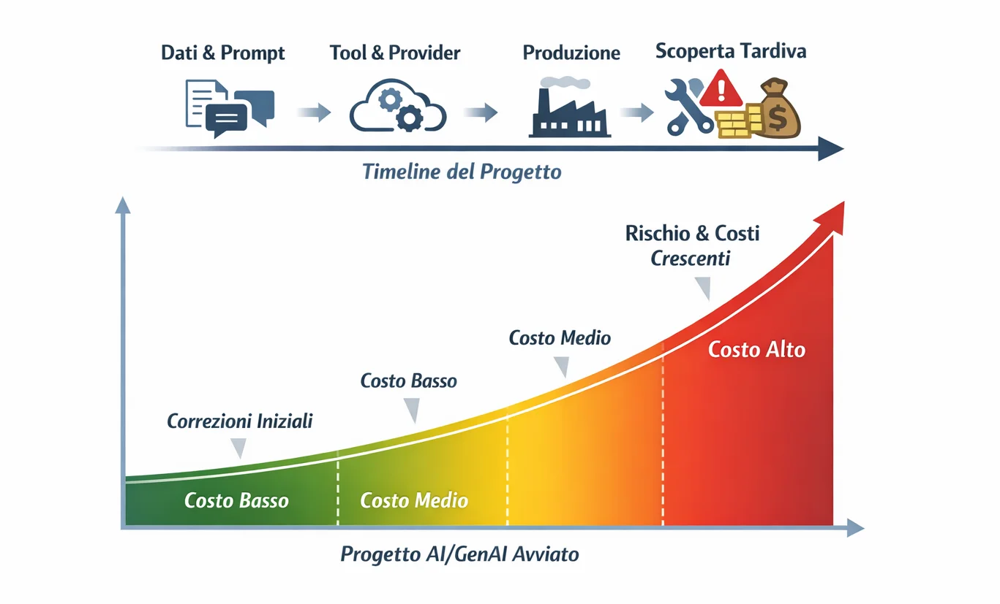
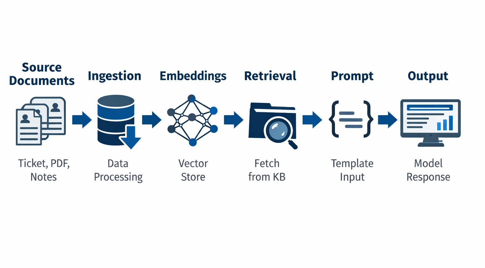
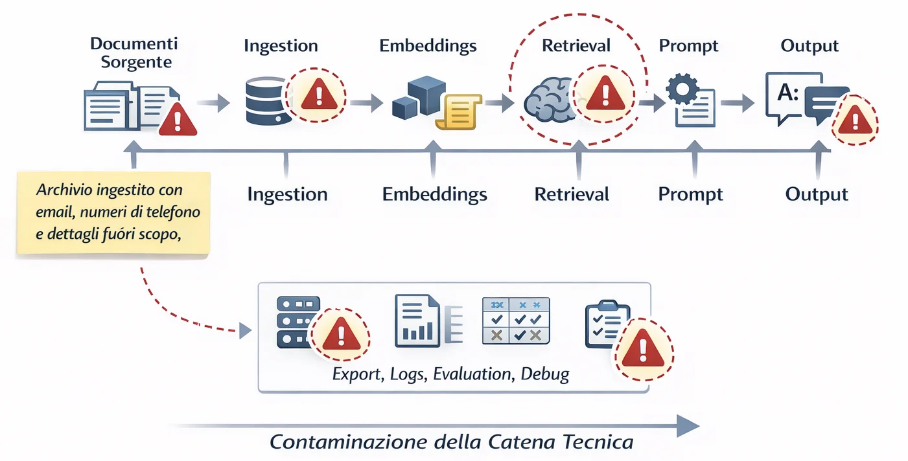
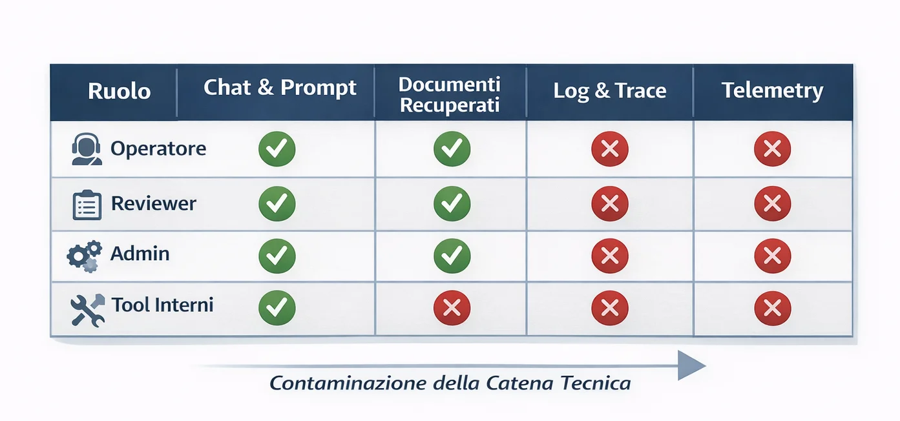
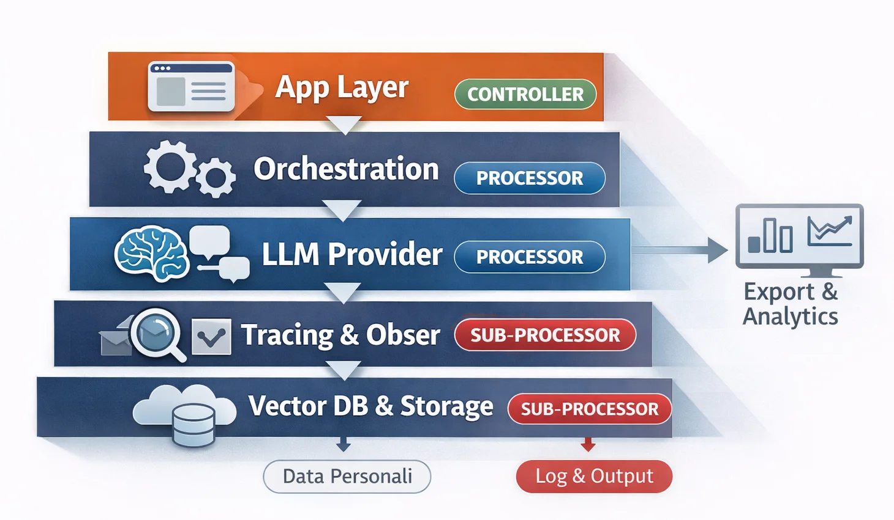
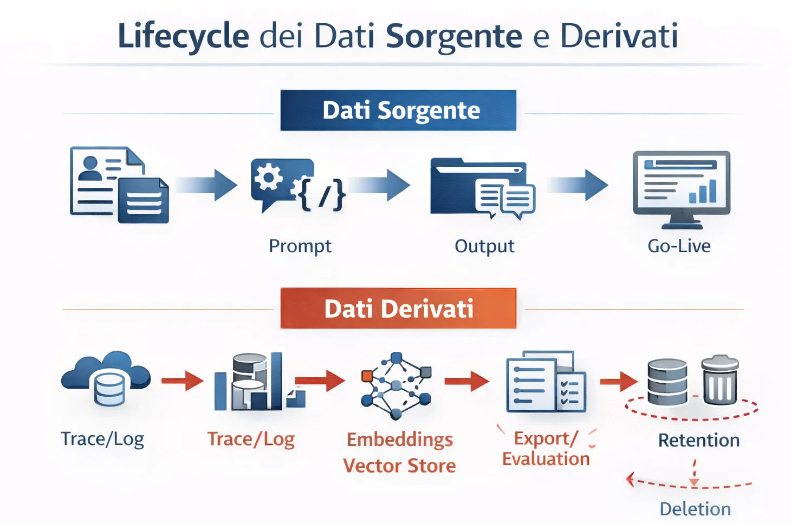

# GDPR nei sistemi AI: 5 errori iniziali che moltiplicano rework e costi

Il GDPR costa quando corpus, accessi, log e vendor si decidono tardi. Nei sistemi AI il rework nasce quasi sempre da cinque errori iniziali: ingestione troppo larga, permessi eccessivi, filiera vendor opaca, retention dei dati derivati non progettata e governance coinvolta dopo il pilot. Qui il focus è volutamente sul GDPR: l’AI Act aggiunge un altro livello, ma merita un approfondimento separato. [[1](#ref-1)]

Nei progetti AI il GDPR viene ancora trattato come un controllo finale. Prima si chiudono prompt, log, provider e knowledge base; poi si prova a sistemare la privacy. È qui che nasce il rework.

## Perché il GDPR fa esplodere i costi nei sistemi AI

Nei sistemi AI il GDPR tocca cinque aree tecniche: corpus, accessi, vendor, log e retention. Se le decidi tardi, il costo non emerge in audit: emerge nel rework. È qui che la privacy by design smette di essere teoria e diventa architettura.

Qui il nodo non è legale: è **architetturale**.

Non il costo della compliance in astratto, ma quello del **rework**: documenti ingestiti senza filtro e poi da ripulire, accessi da restringere quando reviewer e operatori si sono già abituati a vedere tutto, provider da rivalutare a integrazione pronta, log e retention da ripensare quando i dati sono già entrati nei flussi operativi. Il GDPR, del resto, non parla solo di documenti. Nei suoi principi di base chiede **minimizzazione**, **limitazione della conservazione** e **progettazione by design/by default**, cioè scelte prese presto, non tardi. [[2](#ref-2)]

Per questo, nei sistemi AI/GenAI, il GDPR non diventa costoso alla fine.

Diventa costoso **quando lo scopri troppo tardi**.

## 1. Indicizzare più dati del necessario

Il primo errore nasce da una scorciatoia comune: tenersi larghi “per sicurezza”.

Se un team ingestisce ticket, PDF e note libere senza filtraggio, il sistema sembra più ricco all’inizio ma diventa più costoso da ripulire dopo. Un progetto **RAG** carica ticket, PDF, note commerciali e FAQ senza ripulire davvero il contenuto. Un copilota customer-facing riceve in prompt più contesto del necessario “per migliorare la risposta”. Tutto questo, sul momento, sembra prudenza. Più dati, più contesto, più qualità. Il problema è che, in produzione, questa logica porta quasi sempre a ingestion più sporche, retrieval meno controllabile e costi di cleanup più alti. Su questo punto è utile il confronto con [Enterprise RAG Blueprint: Router-First + Hybrid Search](/learn/midway/rag-reference-architecture-2026-router-first-design).

### Decisione da prendere prima del pilot
Definisci quali campi servono davvero alla funzione del sistema, quali vanno mascherati e quali non devono entrare nel corpus.

Quel dato non resta dove nasce. Entra nell’**ingestion**, passa nel **retrieval**, finisce nei **prompt**, nei **log**, negli **export** e nei **dataset di valutazione**. A volte arriva anche nei materiali usati per il debugging umano. La dipendenza nasce prima: non stai più parlando di una variabile in più. Stai parlando di una **contaminazione della catena tecnica**.

Qui il principio di **minimizzazione** del GDPR è molto più utile di quanto sembri. Il Regolamento richiede che i dati personali siano *adeguati, pertinenti e limitati* a quanto necessario rispetto alla finalità del trattamento. Nei sistemi AI questa non è una nota legale laterale: è un **criterio di progettazione**. Se stai costruendo un sistema che risponde, recupera, sintetizza o classifica, la domanda non è solo “questo dato migliora il modello?”, ma anche “questo dato è davvero necessario per la funzione che voglio ottenere?”. [[2](#ref-2)] In termini pratici, significa ridurre il contesto a ciò che serve davvero alla funzione del sistema.

Prendiamo un caso molto comune: chatbot interno per supporto al customer care, alimentato da ticket storici. All’inizio, il team fa ingest dell’intero archivio: descrizioni, email, numeri di telefono, note libere, dettagli non essenziali. Il motivo è comprensibile: più materiale c’è, più il sistema sembra “sapere”. Ma se più avanti emerge che parte di quei dati non andava trattata in quel modo o non era necessaria rispetto alla finalità, correggere non significa cancellare due righe.

> Un caso classico è il RAG costruito su ticket storici. Il corpus iniziale contiene email, numeri di telefono e note libere perché “tanto servono per dare più contesto”. Quando il team si accorge che quella base documentale andava filtrata meglio, la correzione non è cosmetica: bisogna ripulire il corpus, rifare l’ingestion e rigenerare gli embeddings. Se stai progettando un’architettura di retrieval seria, qui conviene fermarsi e confrontarsi con [Enterprise RAG Blueprint: Router-First + Hybrid Search](/learn/midway/rag-reference-architecture-2026-router-first-design).

Da lì il costo sale: non perché esiste una regola, ma perché quella regola è stata ignorata nel punto in cui sarebbe stata più economica da applicare.

Nei progetti AI questo non genera solo rischio privacy. Produce anche cinque effetti operativi molto concreti: architetture più sporche, debugging più opaco, evaluation meno pulita, delete path più complicati e più rework quando bisogna fare pulizia.

La domanda utile, quindi, non è “possiamo usare anche questo?”.
È: **“se tra sei mesi dovessimo spiegare, limitare, ripulire o rimuovere questo dato, il valore che ci dà oggi giustificherebbe davvero il costo?”**

Molto spesso, la risposta è no.

## 2. Dare accessi troppo larghi a operatori, agenti, back office o tool

Il secondo errore riguarda gli accessi. Ed è subdolo, perché spesso nasce da una buona intenzione: far lavorare tutti meglio.

Nel software tradizionale il problema era già noto: back office troppo aperti, ruoli poco granulari, permessi dati “per comodità”. Nei sistemi AI/GenAI la questione si allarga, perché non ci sono solo utenti e admin. Ci sono **operatori umani**, **team di supporto**, **reviewer**, **annotatori**, persone che fanno QA sugli output, figure che guardano i **trace**, team che gestiscono la **knowledge base**, strumenti interni che mostrano conversazioni, log, prompt e documenti recuperati. In questo tipo di superficie applicativa, il modo più utile per ragionare non è “chi può vedere cosa”, ma “quali guardrail servono davvero in produzione”, come mostra bene [GenAI Security Guardrails: Prevent Prompt Injection, Data Leakage & Unsafe Agents](/learn/midway/genai-security-guardrails-prompt-injection).

All’inizio, una visibilità ampia sembra efficiente. Il supporto vede tutto e risolve più velocemente. Il team AI vede prompt e output completi e fa debug meglio. I reviewer hanno accesso all’intera conversazione così “capiscono il contesto”. È la *logica classica del prototipo che poi diventa abitudine*.

Qui il rischio non è teorico: il GDPR, con la logica della **data protection by default**, va nella direzione opposta: i dati non dovrebbero essere accessibili per impostazione predefinita a un numero indefinito di persone. Questo non significa solo “mettere regole interne”. Significa che il modo in cui progetti accessi, console, viste e ruoli è già parte della **conformità sostanziale** del sistema. [[2](#ref-2)]

Nei sistemi AI questo pesa ancora di più, perché la superficie di visibilità è molto più ampia di quanto sembri. Una console di observability può esporre prompt e output completi. Un pannello di review può mostrare documenti recuperati dal RAG. Un export di conversazioni può finire in un team operativo che all’inizio non doveva neppure vederlo. Un admin tool interno può rendere disponibili chat history, fonti e telemetry a persone che non ne hanno davvero bisogno per il loro lavoro. Questo è esattamente il tipo di scenario in cui servono [guardrail di produzione, logging e permessi least-privilege](/learn/midway/genai-security-guardrails-prompt-injection), non solo policy scritte bene.

E quando questa struttura viene corretta tardi, il costo non è “aggiustare i permessi”.

Il costo non è solo nei permessi. Devi rifare interfacce, ruoli, workflow di review e scenari di test. Spesso devi anche cambiare training interno e modalità di collaborazione tra team. Stai correggendo un **operating model**.

> In molti sistemi GenAI il problema emerge nella console di observability o review. Il trace mostra prompt completi, output e documenti recuperati. Quando il team decide di restringere la visibilità, non deve solo cambiare i permessi: deve introdurre masking, ruoli più granulari e viste separate per operatori, reviewer e admin. È lo stesso passaggio da “tool utile” a “superficie da mettere in sicurezza” che ritrovi in [GenAI Security Guardrails](/learn/midway/genai-security-guardrails-prompt-injection).

È uno di quei problemi che si mangiano margine in silenzio. Perché il lavoro esiste, ma raramente viene percepito come una nuova feature. Sembra cleanup. Sembra rifinitura. Sembra qualcosa che “andava già incluso”. E intanto si accumulano sprint, revisioni, eccezioni e rilavorazioni.

La domanda che andrebbe fatta prima non è “chi potrebbe trovare utile vedere questo dato?”.
È: **“chi ne ha davvero bisogno per svolgere questa funzione?”**

Nei sistemi AI, questa differenza è molto più costosa di quanto sembri.

## 3. Scegliere provider e tool AI senza chiarire ruoli, sub-processor e flussi

Il terzo errore è tipico dei progetti AI perché la filiera tecnica è quasi sempre più lunga di quanto sembri.

L’applicazione finale magari è una sola. Ma sotto ci sono spesso più soggetti: **provider LLM**, servizi **speech-to-text**, strumenti di **moderation**, piattaforme di **observability**, **vector database** gestiti, orchestratori, sistemi di **analytics**, tool di supporto, storage cloud e magari altri sub-processor che entrano in gioco a valle. Dal punto di vista tecnico sembra normale. Dal punto di vista GDPR, invece, è il punto in cui una *decisione di stack* diventa anche una *decisione di governance*.

La guida EDPB per le PMI è molto chiara su questo: il **controller** decide finalità e mezzi del trattamento; il **processor** tratta dati personali per conto del controller. E quando c’è un processor, il rapporto deve essere disciplinato in modo appropriato, incluso l’uso di eventuali altri processor. [[3](#ref-3)]

Nei progetti AI questa distinzione è spesso sottovalutata per un motivo semplice: il team sceglie il provider prima di aver mappato davvero i flussi. Se il progetto nasce in modalità prototipo e poi si allarga, la mappatura di ruoli, flussi e sub-processor va fatta prima che lo stack diventi una dipendenza organizzativa.

“Usiamo questo modello, è più veloce.”
“Mettiamo quest’altro tool per tracciare i prompt.”
“Appoggiamoci a questo servizio per la trascrizione audio.”
“Per il vector DB scegliamo il managed, così andiamo in produzione prima.”

Tutte decisioni sensate, finché non arriva la domanda che doveva arrivare all’inizio: **quali dati personali stanno passando davvero da qui?** E, subito dopo: chi decide cosa succede a quei dati, chi li tratta per conto di chi, quali sub-processor entrano in gioco, dove stanno i log, cosa viene conservato, cosa viene disattivato, cosa viene esportato.

Quando queste domande emergono tardi, il danno non è solo documentale. Si riaprono contratti, architetture, payload condivisi, policy di logging, tempi di go-live e scelte di procurement. Un tool scelto per accelerare diventa il collo di bottiglia che rallenta tutto.

Questo vale moltissimo per i sistemi GenAI in produzione, perché una parte della governance viene di fatto **delegata allo stack**. Se non capisci bene la catena dei fornitori, rischi di accorgerti tardi che il sistema non fa solo quello che pensavi: conserva anche, espone anche, instrada anche, traccia anche.

> In uno stack apparentemente semplice possono convivere almeno tre livelli distinti di trattamento: provider speech-to-text, provider LLM e tool di tracing. Se questi ruoli vengono chiariti solo dopo il pilot, il costo si sposta su procurement, contratti, payload condivisi e ritardi di go-live.

La domanda giusta, quindi, non è solo “questo provider funziona bene?”.
È: **“abbiamo capito abbastanza bene il ruolo che avrà nel trattamento dei dati e l’effetto che avrà sui nostri flussi?”**

Se la risposta è vaga, il costo arriva quasi sempre dopo.

## 4. Non progettare retention di chat, log, embeddings, export e telemetry

Nei sistemi GenAI, retention e cancellazione non riguardano solo i dati originali. Riguardano soprattutto i **dati derivati** che il sistema produce mentre osserva, valuta e ottimizza se stesso.

> Nei sistemi AI il costo della retention non sta solo nei dati sorgente. Sta soprattutto nei dati derivati: **embeddings**, **trace**, **export**, **evaluation set**, snapshot usati per **QA**, **cache** e **analytics**.

Cancellare una chat dal frontend non basta. Quella chat può aver già generato:
- trace in observability,
- embeddings nel vector store,
- export per review,
- esempi nei dataset di valutazione,
- copie in cache o sistemi downstream.
Se non progetti il delete path prima, la cancellazione diventa un progetto a parte.

A quel punto, il problema non è più “cancellare un record”. Il problema è che il sistema è stato progettato per osservare e accumulare, ma non per lasciar andare i dati in modo coerente.

Da lì il nodo non è legale: è architetturale. Il lavoro si spezza in tanti fix piccoli: tracing, vector store, workflow di export, QA, backup, documentazione operativa. Presi uno per uno sembrano gestibili. Insieme diventano un progetto costoso. È lo stesso motivo per cui, nei sistemi LLM, conviene ragionare su costo, osservabilità e affidabilità come problemi di architettura e non solo di setup. Su questo si incastra bene [LLM costs aren’t a pricing problem: it’s architecture](/learn/expert/llm-costs-are-architectural-not-pricing).

La domanda da farsi prima è brutale ma utile:
**“se domani dovessimo spiegare dove stanno davvero chat, log, embeddings ed export di questo sistema, sapremmo rispondere senza aprire cinque tool e tre fogli diversi?”**

Se la risposta è no, hai già un problema di governance. E probabilmente anche un futuro problema di delivery.

## 5. Coinvolgere privacy e governance quando il sistema è già in sviluppo

L’ultimo errore non è tecnico. È di sequenza.

Molti team AI non portano privacy e governance nel progetto quando stanno scegliendo use case, dati, accessi e provider. Le portano dentro dopo: quando il prototipo funziona, quando il pilot è già avviato, quando il commerciale ha già promesso una data, quando l’architettura è abbastanza definita da sembrare “quasi pronta”. Il problema è che i progetti GenAI più solidi non trattano governance e controlli come un check finale, ma come parte del piano di rollout. Su questo, il miglior approfondimento interno è [GenAI Roadmap 2026: Enterprise Agents & Practical Playbook](/learn/midway/generative-ai-roadmap-2026-enterprise-playbook).

È una scelta comprensibile. Tutti vogliono velocità. Nessuno vuole sentirsi dire, all’inizio, che deve fermarsi a ragionare su qualcosa che sembra una frizione.

Nei sistemi AI succede questo: le misure adeguate vanno considerate **quando si determinano i mezzi del trattamento** e non solo dopo. In più, quando le operazioni di trattamento possono presentare rischi elevati, il GDPR prevede anche la logica della **valutazione preventiva dell’impatto**. Tradotto in linguaggio meno legale: ci sono decisioni che diventano costose proprio perché vengono prese prima che chi si occupa di governance possa influenzarle. [[2](#ref-2)]

Nei sistemi AI questo accade in continuazione.

Un copilota interno viene alimentato con una knowledge base aziendale prima che qualcuno si chieda davvero quali documenti avrebbero dovuto entrarci.
Un assistente customer-facing arriva in pilot prima che siano chiari accessi, log e tempi di conservazione.
Un sistema RAG viene connesso a più repository perché “così funziona meglio”, e solo dopo si capisce che i flussi documentali vanno ripensati.

La dipendenza nasce prima: privacy e governance non stanno più guidando il progetto. Stanno correggendo un sistema già avviato. E questo spiega perché, in tanti team, vengano percepite come un freno: non perché lo siano per natura, ma perché entrano troppo tardi per essere sterzo e finiscono per sembrare freno.

> Nei sistemi AI la governance pesa poco quando entra durante la scelta di corpus, accessi, provider e logging. Pesa moltissimo quando arriva dopo, perché a quel punto non guida più il design: corregge un sistema già avviato. È la stessa logica del playbook di rollout spiegata in [GenAI Roadmap 2026](/learn/midway/generative-ai-roadmap-2026-enterprise-playbook).

Qui c’è anche un punto organizzativo che conta molto. Quando governance arriva tardi: Product vede cambiare lo scope quando pensava di averlo chiuso. Engineering riceve nuovi vincoli a lavori iniziati. Sales teme di dover rimettere mano a promesse già fatte. In realtà il problema è che il progetto ha scelto di affrontarla quando il costo era già salito.

La frase da tenersi è semplice:
**se privacy e governance arrivano tardi, non governano il sistema. Lo riaprono.**

Ed è quasi sempre una **riapertura costosa**.

## Conclusione

Nei sistemi AI/GenAI, il GDPR raramente diventa costoso perché “arriva la compliance”. Diventa costoso quando arriva tardi, cioè quando dati, accessi, log, provider e retention hanno già preso forma dentro il sistema.

È questo il punto da tenere fermo: la privacy nei sistemi AI non funziona come controllo finale. Funziona solo se entra abbastanza presto da influenzare architettura, flussi dati, ruoli di accesso, scelta dei provider e lifecycle delle informazioni. Se arriva dopo, non governa il progetto: **lo riapre**.

E il costo non è quasi mai teorico. Si vede nel rework sulle pipeline, nei corpus da ripulire, nei vector store da rigenerare, nei log da rivedere, nei permessi da restringere, nei contratti da riaprire, nelle release che rallentano proprio quando il sistema sembrava pronto per andare in produzione. Per approfondire il cluster in cui questo articolo dovrebbe vivere, puoi chiudere con un rimando a [AI Security, Safety & Governance](/topics/llm-security).

Questo è uno dei motivi per cui, oggi, parlare di GDPR nei progetti AI ha senso solo se lo si colloca nel posto giusto: non come nota legale a margine, ma come parte della governance concreta di sistemi reali. L’AI Act aggiunge un altro livello, diverso, che riguarda il quadro specifico dei sistemi AI e che merita un articolo verticale dedicato. Qui, invece, il punto era più semplice e più operativo: **nei sistemi AI/GenAI, il GDPR non rallenta i progetti. Rallenta quelli che lo scoprono troppo tardi.** [[1](#ref-1)]

> Prima di andare in pilot, un sistema AI dovrebbe avere già deciso almeno cinque cose: quali dati entrano davvero, chi li vede, quali vendor li trattano, quanto restano e chi valida queste scelte. Se queste risposte arrivano dopo, il progetto non sta più governando la privacy: sta pagando il ritardo con rework.

### Artifact minimo da produrre prima del pilot

| Superficie | Dove vive | Contiene PII? | Retention | Owner |
|---|---|---:|---|---|
| Chat frontend | App | Sì | 30 giorni | Product |
| Trace | Observability tool | Sì | 14 giorni | Engineering |
| Embeddings | Vector DB | Possibile | 30 giorni | AI/Platform |
| Export review | Drive/BI | Sì | 7 giorni | Ops |

## Checklist pratica da usare prima del kickoff

Prima di portare un sistema AI in pilot o in produzione, il team deve poter rispondere con chiarezza a questi punti fondamentali:

- [ ] **Dato in ingresso**: Quali dati personali entrano in prompt, documenti, dataset e log?
- [ ] **Riduzione preventiva**: Quali dati possiamo escludere, mascherare o sintetizzare prima del processing?
- [ ] **Visibility model**: Chi può vedere chat, trace, fonti recuperate, log e output?
- [ ] **Vendor chain**: Quali provider e tool AI ricevono dati, e con quali sub-processor?
- [ ] **Retention map**: Dove restano chat, embeddings, export, trace e telemetry?
- [ ] **Delete path**: Come vengono cancellati i dati sorgente e i dati derivati?
- [ ] **Owner decisionale**: Chi valida questi punti prima del pilot?

---

## FAQ

  
<strong>Perché il GDPR è più complesso nei sistemi GenAI rispetto al software tradizionale?</strong>

  Nei sistemi GenAI i dati non sono solo passivi in un DB. Circolano tra orchestratori, provider LLM e strumenti di tracing, generando "dati derivati" (embeddings, log di prompt, snapshot di valutazione) che devono essere governati tanto quanto i dati sorgente.

  
<strong>Cosa si intende per "Sequencing Error" nella governance AI?</strong>

  È l'errore di coinvolgere privacy e legal quando l'architettura è già definita. Invece di guidare le scelte (sterzo), la governance si trova a doverle correggere a sistema quasi pronto (freno), causando rework.

  
<strong>Qual è il rischio di indicizzare un corpus troppo ampio in un sistema RAG?</strong>

  Oltre al rischio privacy, genera architetture sporche e evaluation meno pulite. Se emerge la necessità di rimuovere dati protetti, bisogna spesso rigenerare l'intero vector store, con costi operativi significativi.

  
<strong>Come influisce la catena dei sub-processor sulla delivery?</strong>

  Se i ruoli (Controller/Processor) non sono chiari per ogni tool (LLM, Tracing, Vector DB), il procurement e le review di sicurezza possono bloccare il go-live all'ultimo miglio.

---

## Riferimenti

1. [**AI Act | Shaping Europe's digital future - European Union**](https://digital-strategy.ec.europa.eu/en/policies/regulatory-framework-ai?utm_source=chatgpt.com)
2. [**REGULATION (EU) 2016 - EUR-Lex - European Union**](https://eur-lex.europa.eu/legal-content/EN/TXT/PDF/?uri=CELEX%3A32016R0679&utm_source=chatgpt.com)
3. [**Data controller or data processor - EDPB**](https://www.edpb.europa.eu/sme-data-protection-guide/data-controller-data-processor_en?utm_source=chatgpt.com)
