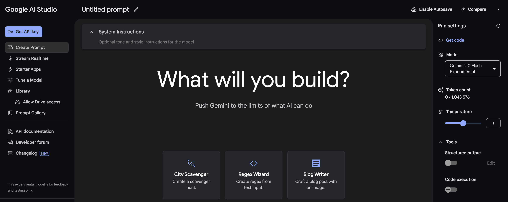
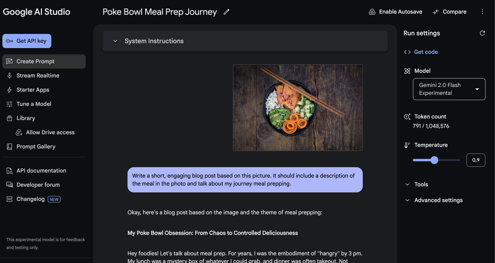

# Google AI Studio: A Practical Guide to Prototyping with the Gemini API

<p>
  
</p>

## Answer in 30 seconds

**Google AI Studio** is the fastest way to **prototype with Gemini**: you try prompts, tweak run + safety settings, enable built-in **tools** (Structured Output / Function Calling / Search grounding / Code Execution), then click **“Get code”** to ship via the Gemini Developer API. [[1](#ref-1)]

If you’re building anything serious for an organization (IAM, VPC, compliance, SLAs, tuning), the clean path is: **prototype in AI Studio → move to Vertex AI**. [[2](#ref-2)]
For a broader rollout framework, use this [enterprise roadmap for shipping GenAI safely](/learn/midway/generative-ai-roadmap-2026-enterprise-playbook).

---

## What Google AI Studio is (and what it isn’t)

### What it is

A web-based **prototyping cockpit** where you:

* test prompts quickly,
* configure generation + **safety settings**, [[3](#ref-3)]
* enable tools like **Structured Output**, **Function Calling**, **Search grounding**, and **Code Execution**.
  **Note:** Gemini 3 supports combining Structured Outputs with built-in tools, but mixing built-in tools with custom function calling may be limited. [[4](#ref-4)] [[16](#ref-16)]
* export code to integrate with the **Gemini API** (“Get code”). [[1](#ref-1)]

### What it isn’t

* Not a full MLOps/deployment platform with enterprise networking and governance baked in.
* Not where you should assume HIPAA/SOC2-style enterprise compliance out of the box (that’s a Vertex AI concern). [[2](#ref-2)]

---

## AI Studio vs Vertex AI in one decision table

| If you need…                              | Use AI Studio + Gemini Developer API | Use Vertex AI Gemini API            |
| ----------------------------------------- | ------------------------------------ | ----------------------------------- |
| Fast prototyping + “Get code”             | ✅                                    | ✅                                   |
| IAM auth, org controls, service accounts  | ❌                                    | ✅ [[2](#ref-2)] |
| VPC / private endpoints                   | ❌                                    | ✅ [[5](#ref-5)] |
| Compliance controls + governance features | ❌                                    | ✅ [[2](#ref-2)] |
| SLA for online inference                  | ❌                                    | ✅ [[6](#ref-6)]               |
| Supervised fine-tuning                    | ❌                                    | ✅ [[7](#ref-7)] |

If you’re a solo dev or early-stage team, **start in AI Studio**. When the app becomes “real” (users, privacy, incidents, compliance), **graduate to Vertex AI**. [[8](#ref-8)]

---

## The 4 features that make AI Studio “production-aware”

### 1) Structured Output (JSON Schema): stop parsing text with regex

<p>
  
</p>

If your app needs **reliable JSON**, use **Structured Output** with a JSON Schema. This forces the model to return something you can validate with Pydantic/Zod instead of guessing. [[4](#ref-4)]
See also [structured outputs, tokens, and reliability basics](/learn/midway/llm-practical-fundamentals-guide-ai-apps).

**Best for:**

* extraction (names, dates, entities),
* classification into fixed labels,
* tool-routing in agentic flows (and later, [MCP, tool calling and agent interoperability](/learn/midway/mcp-a2a-protocols-ai-agents-playbook)). [[4](#ref-4)]

### 2) Function Calling: connect Gemini to real actions

Function calling lets the model **return structured arguments** to call your tools/APIs (CRM lookup, pricing, database queries, ticket creation). [[9](#ref-9)]

**Why it matters:** it turns a “chat demo” into an app that can **do stuff** while staying auditable.
For production hardening, pair this with [prompt injection + untrusted tool inputs (guardrails)](/learn/midway/genai-security-guardrails-prompt-injection).

### 3) Grounding with Google Search: freshness + citations

If your use case includes “recent changes” (policies, news, docs), Search grounding grounds answers in real-time info and can provide **citations**. [[10](#ref-10)]
For drift-aware review habits, see [how to stay current (drift, snapshots, re-check workflows)](/learn/expert/imarena-ai-benchmarking-platform).

**Rule of thumb:** if your user could ask “is this up to date?”, grounding should be in your toolbox.

> **Pricing note:** Grounding availability and quotas are **model- and tier-dependent**. The pricing table lists Free Tier grounding caps (for example, up to 500 RPD), and Paid Tier can include a free daily allowance (for example, 1,500 RPD) before pay-per-grounded-prompt pricing applies. [[12](#ref-12)]

### 4) Safety settings: prototype guardrails early

AI Studio makes it easy to adjust safety thresholds while prototyping. Don’t leave it to “later”: safety settings affect user experience (false positives) and risk profile (false negatives). [[3](#ref-3)]

---

## Gemini 3 knobs in AI Studio (the 5 controls that actually matter)

If you’re prototyping with **Gemini 3** in AI Studio, these parameters matter more than “tune temperature like old models”.

### 1) `thinking_level`: your latency/cost dial

Gemini 3 uses internal “thinking” by default. Use `thinking_level` to cap how much it thinks:
- `low`: best for high-throughput chat, extraction, and routing
- higher levels: better for complex reasoning/coding, but slower and costlier

Use it as your main trade-off knob for **latency vs quality**. [[16](#ref-16)]

### 2) Temperature: keep it at **1.0** for Gemini 3

Docs recommend leaving Gemini 3 at the default `temperature = 1.0`. Lowering it can cause unexpected behavior (including degraded performance), especially on reasoning-heavy tasks. [[16](#ref-16)]

**Practical rule:** for determinism, prefer **schema/structured outputs**, constraints, and validation over temperature tweaks.

### 3) Thought signatures (when you need traceability)

Gemini 3 introduces thought signatures for workflows where you need more control/traceability around thinking behavior (useful in agentic/debug contexts). [[16](#ref-16)]

### 4) “Structured outputs with tools” is **preview-only**

Combining **Structured Output + built-in tools** (Search grounding, URL context, Code Execution, File Search) is available only on **Gemini 3 preview models**. [[4](#ref-4)] [[16](#ref-16)]

### 5) Grounding billing counts tool queries

With **Grounding with Google Search**, billing can count each unique search query the model executes inside a request. [[12](#ref-12)] [[10](#ref-10)]

> **Default setup for production-aware prototyping**
> - `thinking_level = low`
> - `temperature = 1.0`
> - Structured Output ON (JSON Schema) for machine-consumed responses
> - Enable grounding only when the user may ask “is this up to date?”

---

## 3 production-ready templates for AI Studio

Below are three “ready-to-ship” templates for common use cases: reliable extraction, grounded answers, and tool-based routing.

### Template 1 — Reliable Extractor with JSON Schema

**When to use:** Parsing tickets, emails, or CRM notes into validatable output (no regex required).

**In AI Studio (recommended toggles):**

* **Structured Output**: ON (JSON Schema) [[4](#ref-4)]
* **Gemini 3 (recommended):** keep **Temperature = 1.0** and control latency/cost with **thinking_level = low**. [[16](#ref-16)]
* *(Optional, older models):* low temperature can increase determinism, but prefer schema + validation over temperature tweaks. [[17](#ref-17)]
* **Max output tokens**: Low/Medium (since we only need JSON)

**Gemini 3 run settings (practical defaults):**

```json
{
  "temperature": 1.0,
  "thinkingConfig": { "thinkingLevel": "low" }
}
```

**System prompt:**

```text
You are a strict information extraction engine.
Rules:
- Output MUST be valid JSON that matches the provided schema.
- Do not include extra keys.
- If a field is not present in the input, set it to null.
- Never guess. Never fabricate.
- Keep strings short and factual.
```

**User prompt:**

```text
Extract the following information from the text.

TEXT:
"""
{{PASTE_RAW_TEXT_HERE}}
"""

Return JSON only.
```

**JSON Schema (Starter):**

> **Note:** Structured Output (JSON Schema) is supported by multiple Gemini models (including Gemini 2.5).
> **Preview note:** “Structured outputs with tools” is currently available only on **Gemini 3 series preview models** (per docs). [[4](#ref-4)] [[16](#ref-16)]

```json
{
  "type": "object",
  "required": ["customer_name", "request_type", "urgency", "summary", "action_items"],
  "properties": {
    "customer_name": { "type": ["string", "null"] },
    "request_type": { "type": ["string", "null"], "enum": ["bug", "billing", "feature_request", "account", "other", null] },
    "urgency": { "type": ["string", "null"], "enum": ["low", "medium", "high", "critical", null] },
    "summary": { "type": ["string", "null"], "maxLength": 240 },
    "action_items": {
      "type": "array",
      "items": { "type": "string", "maxLength": 120 },
      "maxItems": 8
    }
  },
  "additionalProperties": false
}
```

**Why it works:** Structured Output guarantees output that you can **validate** or fail deterministically, preventing the need for fragile string parsing.

**Mini-eval (suggested):**
Test with 10 real inputs (no sensitive data) and measure: `% Valid JSON`, `% Correct Fields`, `False Positives`, and `Latency`.

---

### Template 2 — “Answer with Sources” (Search Grounding)

**When to use:** Tasks requiring fresh info, policy lookups, or “what changed” answers with citations.

**In AI Studio:**

* **Grounding with Google Search**: ON (for freshness + citations) [[10](#ref-10)]
* **Structured Output**: Optional (ON only if using compatible preview models)

**Gemini 3 grounding gotcha (billing):**
With Gemini 3, billing counts **each search query** the model executes inside a request (multiple searches in one call can become multiple billable tool uses). Older models are billed **per prompt**. [[10](#ref-10)] [[16](#ref-16)]

**Gemini 3 run settings (practical defaults):**

```json
{
  "temperature": 1.0,
  "thinkingConfig": { "thinkingLevel": "low" }
}
```

**System prompt:**

```text
You are a production assistant.
Rules:
- Prefer grounded facts over memorized knowledge.
- If you cannot find grounded evidence, say: "Not enough grounded evidence."
- Keep the final answer short, then provide evidence bullets.
- Include citations when grounding is enabled.
```

**User prompt:**

```text
Question:
{{USER_QUESTION}}

Deliver:
1) Final answer (max 8 sentences)
2) Evidence bullets (3–6 bullets)
3) If there are trade-offs or uncertainty, add "Caveats" (max 3 bullets)
```

**If you need machine-readable output (Gemini 3 Preview / Compatible models):**

```json
{
  "type": "object",
  "required": ["final_answer", "evidence", "caveats"],
  "properties": {
    "final_answer": { "type": "string", "maxLength": 1200 },
    "evidence": {
      "type": "array",
      "items": { "type": "string", "maxLength": 200 },
      "minItems": 2,
      "maxItems": 8
    },
    "caveats": {
      "type": "array",
      "items": { "type": "string", "maxLength": 180 },
      "maxItems": 5
    }
  },
  "additionalProperties": false
}
```

**Evergreen Note:** Grounding with Search is explicitly designed for **real-time content** and to provide **verifiable citations**—essential for trust.

---

### Template 3 — Ticket Router (Function Calling)

**When to use:** Routing requests, creating tickets, fetching customer context, or building agentic workflows.

**In AI Studio:**

* **Function calling**: ON [[9](#ref-9)]
* **Structured Output**: ON (often useful for the “final response schema” on the last turn)

**Gemini 3 run settings (practical defaults):**

```json
{
  "temperature": 1.0,
  "thinkingConfig": { "thinkingLevel": "low" }
}
```

> **Gemini 3 limitation (important):** combining **built-in tools** (Search/URL/Code/File Search) with **custom function calling** in the same request is not yet supported. If you need both, use a **two-step flow** (for example: grounded retrieval call -> function-calling call). [[16](#ref-16)]

**Tool Declarations:**

> **Concept:** Use **Function Calling** when the model needs to _call external systems_, and **Structured Output** when you just want the _final result_ to follow a specific shape.

```json
[
  {
    "name": "fetch_customer_context",
    "description": "Retrieve customer context from CRM.",
    "parameters": {
      "type": "object",
      "required": ["customer_id"],
      "properties": {
        "customer_id": { "type": "string" }
      }
    }
  },
  {
    "name": "create_ticket",
    "description": "Create a support ticket in the ticketing system.",
    "parameters": {
      "type": "object",
      "required": ["team", "priority", "subject", "summary", "tags"],
      "properties": {
        "team": { "type": "string", "enum": ["billing", "support", "engineering", "security"] },
        "priority": { "type": "string", "enum": ["low", "medium", "high", "critical"] },
        "subject": { "type": "string", "maxLength": 120 },
        "summary": { "type": "string", "maxLength": 500 },
        "customer_id": { "type": ["string", "null"] },
        "tags": { "type": "array", "items": { "type": "string", "maxLength": 30 }, "maxItems": 8 }
      }
    }
  }
]
```

**System prompt:**

```text
You are a routing assistant for a product team.
Rules:
- Use tools when needed to complete the task.
- Never invent customer context or ticket IDs.
- Ask one clarifying question only if missing critical info.
- After tool calls, produce a short final response for the user + a structured routing summary.
```

**User prompt (example):**

```text
Customer says:
"My invoices doubled this month. Also, the API started returning 429 errors since yesterday.
Customer ID: C-18402"

Task:
1) Route to the right team(s)
2) Create a ticket with an actionable summary
3) Return what you did
```

**Why it is production-ready:** The official flow is well-defined: define function declarations → call model → execute function with args → return result to model. [[9](#ref-9)]

---

### Cheat Sheet: Structured Output vs Function Calling

| Feature | Best For... |
| :--- | :--- |
| **Structured Output** [[4](#ref-4)] | Getting the **final response** in a specific schema (e.g., for UI rendering, parsing, automation). |
| **Function Calling** [[9](#ref-9)] | Letting the model take an **intermediate step** to interact with external tools/APIs (e.g., database lookup, API action). |

## Pricing, free tier, and the two gotchas people miss

### 1) “AI Studio is free” ≠ “your app is free”

AI Studio can remain free **unless you link a paid API key** to access paid features; when a paid key is linked, AI Studio usage for that key becomes billable. [[11](#ref-11)]
But your production costs are still driven by:

* Gemini API pricing tiers,
* token usage,
* features like grounding. [[12](#ref-12)]
* architecture choices (routing, retries, fallback design), as explained in [cost is mostly architecture (not token price)](/learn/expert/llm-costs-are-architectural-not-pricing).

### 2) Free-tier data usage policy differs from paid

The official pricing page distinguishes data usage:

* Free tier: “Used to improve our products: **Yes**”
* Paid tier: “Used to improve our products: **No**” [[12](#ref-12)]

**Practical takeaway:** free tier is great for experimentation, but treat it as **not suitable for sensitive prompts**.

### Rate limits change—check inside AI Studio

Rate limits depend on tier and account status and can be viewed directly in AI Studio. [[13](#ref-13)]

---

## AI Studio → Vertex AI migration path

This is the path for scaling from prototype to enterprise application. Knowing *when* to switch is as important as knowing how.

### Step 0 — Prototype in AI Studio

*   Test prompts, tune settings, and validate ideas.
*   Click **“Get code”** to export snippets and integrate via the Gemini API. [[1](#ref-1)]
*   **Privacy check:** Keep sensitive production data out of Free Tier prompts.

### Step 1 — Ship via Gemini Developer API (Baseline Production)

*   Integrate the exported code into your repo.
*   Add prompt versioning, a test set, logging, and retry/backoff logic.
*   Monitor your **rate limits** directly in AI Studio. [[13](#ref-13)]

### Step 2 — Pricing & Privacy Gate

*   The pricing page makes a critical distinction:
    *   **Free Tier**: "Content used to improve our products: **Yes**"
    *   **Paid Tier**: "Content used to improve our products: **No**" [[12](#ref-12)]
*   To enable the privacy guarantees of the Paid Tier, use the official **“Set up billing”** flow in AI Studio. [[11](#ref-11)]

### Step 3 — Decide when to move to Vertex AI

Move to Vertex AI when you need:

1.  **Enterprise Controls:** IAM, service accounts, organization-level governance. [[8](#ref-8)]
2.  **Private Connectivity:** VPC, Private Endpoints, or Private Service Connect. [[5](#ref-5)]
3.  **SLAs:** Guaranteed uptime (e.g., for online inference). [[6](#ref-6)]
4.  **Advanced Tuning:** Supervised fine-tuning via Vertex AI. [[7](#ref-7)]

### Step 4 — Migration Mechanics (Zero Drama)

Migration is simplified by the unified **Google GenAI SDK**:
1.  **Prototype** fast in AI Studio.
2.  **Ship** using the unified SDK.
3.  **Switch backend** to Vertex AI by changing initialization usage (from API key to Vertex AI auth) when you need enterprise controls. [[8](#ref-8)]

---

## Production checklist (the “boring” part that saves launches)

1. **Make outputs machine-checkable**
   Use Structured Output for any response your code consumes. [[4](#ref-4)]

2. **Plan for freshness and citations**
   If correctness matters, use grounding and show sources. [[10](#ref-10)]

3. **Log tool calls and failure modes**
   When you use function calling, log:

* tool name,
* arguments,
* tool result,
* model retry decisions.

4. **Threat model prompt injection**
   If you’re doing RAG / web / docs:

* treat retrieved text as untrusted,
* separate “data” from “instructions” in your system design,
* adopt a [RAG reference architecture (router-first) for production](/learn/midway/rag-reference-architecture-2026-router-first-design) and [prompt injection + untrusted tool inputs (guardrails)](/learn/midway/genai-security-guardrails-prompt-injection).

5. **Graduate to Vertex AI when risk rises**
   If you need enterprise controls (IAM, VPC, compliance, SLAs), Vertex AI is the right surface. [[2](#ref-2)]

---

## FAQ

<details>
  <summary><strong>Is Google AI Studio free?</strong></summary>

AI Studio can stay free for prototyping, but usage becomes billable when you connect and use paid-tier API keys/features, according to Google’s billing docs. [[11](#ref-11)]
However, paid usage applies when you use paid-tier API keys/features, and Gemini API usage/features depend on model tier and pricing. [[11](#ref-11)] [[12](#ref-12)]

</details>

<details>
  <summary><strong>Can I fine-tune Gemini in Google AI Studio?</strong></summary>

Not via the Gemini API right now: Google states there’s currently no model available for fine-tuning in the Gemini API (after a May 2025 deprecation). [[14](#ref-14)]
Fine-tuning is supported in Vertex AI via supervised tuning. [[7](#ref-7)]

</details>

<details>
  <summary><strong>What’s the difference between AI Studio and Vertex AI?</strong></summary>

AI Studio is the fastest way to prototype with Gemini and export code. [[1](#ref-1)]
Vertex AI adds enterprise controls (IAM, VPC/private endpoints, compliance/governance, SLAs) and supports tuning. [[2](#ref-2)]

</details>

<details>
  <summary><strong>Where do I see my rate limits?</strong></summary>

Google’s rate-limit docs say limits vary by tier/account status and can be viewed in Google AI Studio. [[13](#ref-13)]

</details>

1. <a id="ref-1"></a>[**Google AI Studio quickstart | Gemini API**](https://ai.google.dev/gemini-api/docs/ai-studio-quickstart)
2. <a id="ref-2"></a>[**Migrate from Google AI Studio to Vertex AI**](https://docs.cloud.google.com/vertex-ai/generative-ai/docs/migrate/migrate-google-ai)
3. <a id="ref-3"></a>[**Safety settings | Gemini API - Google AI for Developers**](https://ai.google.dev/gemini-api/docs/safety-settings)
4. <a id="ref-4"></a>[**Structured outputs | Gemini API - Google AI for Developers**](https://ai.google.dev/gemini-api/docs/structured-output)
5. <a id="ref-5"></a>[**Use private services access endpoints for online inference**](https://docs.cloud.google.com/vertex-ai/docs/predictions/using-private-endpoints)
6. <a id="ref-6"></a>[**Gemini On Vertex Service Level Agreement Sla**](https://cloud.google.com/vertex-ai/generative-ai/sla)
7. <a id="ref-7"></a>[**Tune Gemini models by using supervised fine-tuning**](https://docs.cloud.google.com/vertex-ai/generative-ai/docs/models/gemini-use-supervised-tuning)
8. <a id="ref-8"></a>[**Gemini Developer API v.s. Vertex AI**](https://ai.google.dev/gemini-api/docs/migrate-to-cloud)
9. <a id="ref-9"></a>[**Function calling with the Gemini API | Google AI for Developers**](https://ai.google.dev/gemini-api/docs/function-calling)
10. <a id="ref-10"></a>[**Grounding with Google Search | Gemini API**](https://ai.google.dev/gemini-api/docs/google-search)
11. <a id="ref-11"></a>[**Billing | Gemini API - Google AI for Developers**](https://ai.google.dev/gemini-api/docs/billing)
12. <a id="ref-12"></a>[**Gemini Developer API pricing**](https://ai.google.dev/gemini-api/docs/pricing)
13. <a id="ref-13"></a>[**Rate limits | Gemini API - Google AI for Developers**](https://ai.google.dev/gemini-api/docs/rate-limits)
14. <a id="ref-14"></a>[**Fine-tuning with the Gemini API - Google AI for Developers**](https://ai.google.dev/gemini-api/docs/model-tuning)
15. <a id="ref-15"></a>[**Using Tools & Agents with Gemini API**](https://ai.google.dev/gemini-api/docs/tools)
16. <a id="ref-16"></a>[**Gemini 3 Developer Guide (thinking_level, tool limitations, temperature guidance)**](https://ai.google.dev/gemini-api/docs/gemini-3)
17. <a id="ref-17"></a>[**Text generation (Gemini 3 temperature: keep default 1.0)**](https://ai.google.dev/gemini-api/docs/text-generation)
