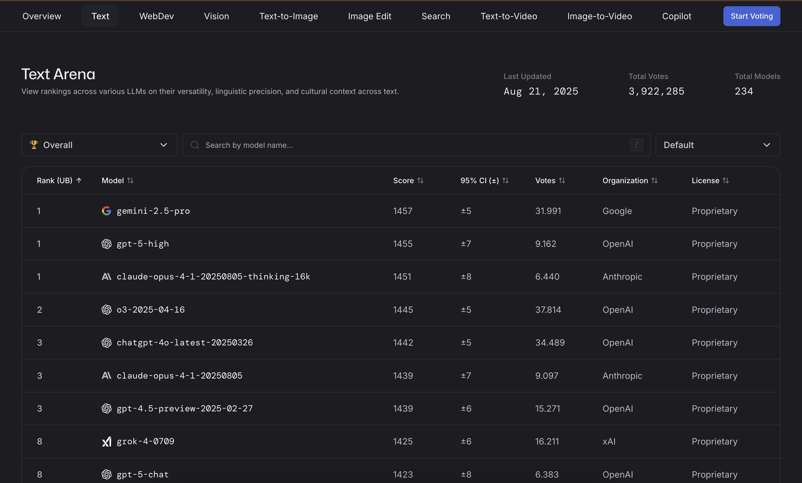
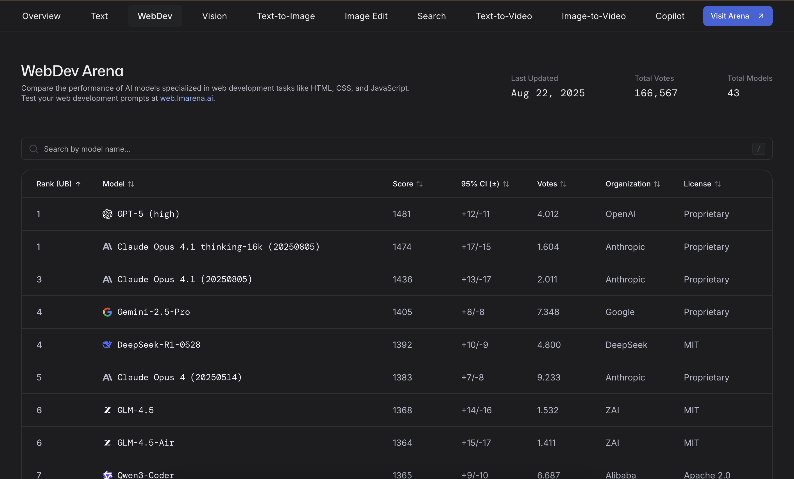
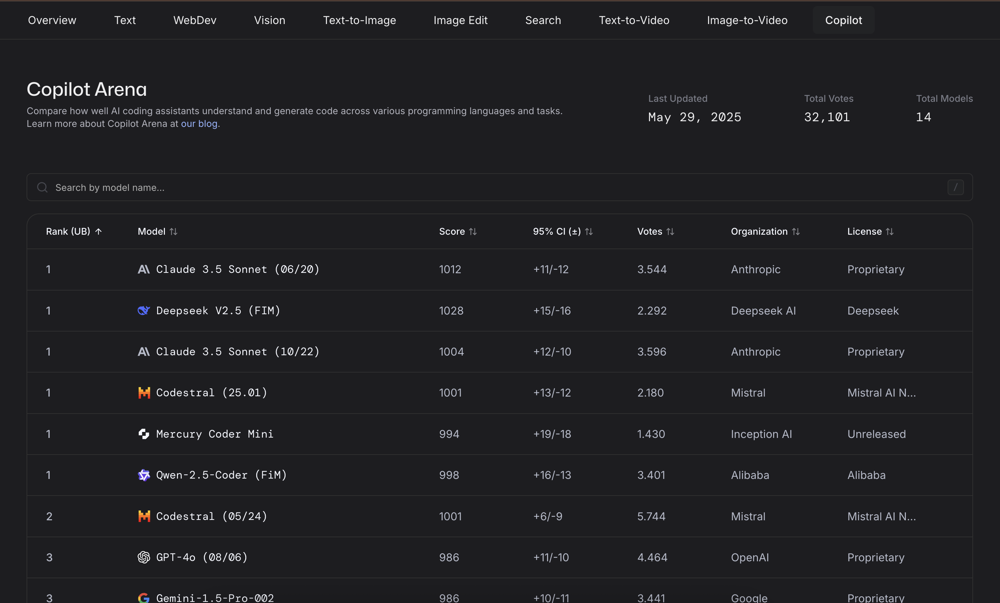
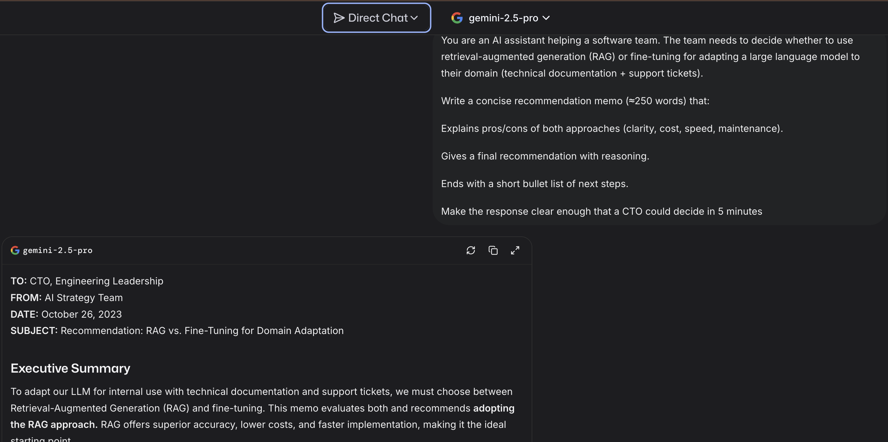
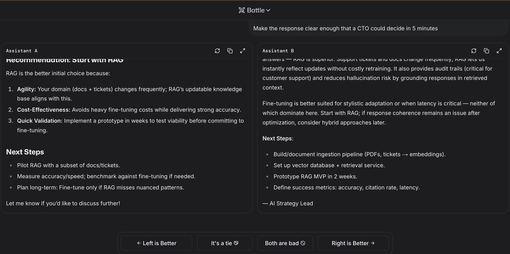
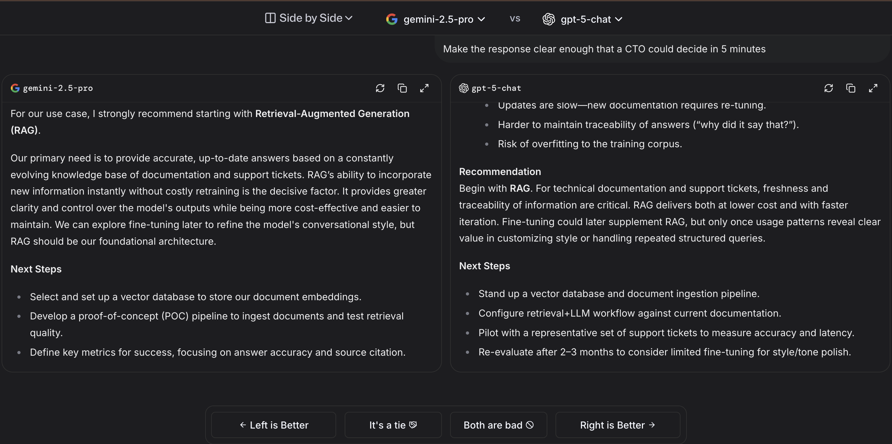

> **It’s 6:40 p.m. and your release train leaves tomorrow.**
> Two models are neck-and-neck—but one crushes long prompts while the other shines on code diffs. You open **LMArena**, run 20 real prompts across **Overall → Coding → Longer Query**, then try your repo in **RepoChat**. By **7:15 p.m.**, the pattern is obvious: **route by task**, note the trade-offs, and ship with confidence.

---

## What LMArena is (in 60 seconds)

**LMArena** (ex–Chatbot Arena) is a public leaderboard where people compare LLM answers **head-to-head**. Each anonymous vote updates an **Elo-style** rating. It’s ideal when you need to **choose a model for a task** (coding, web dev, long prompts, etc.) and want a **human-preference** signal—not just static benchmarks.

**How it works (1-minute version)**

* **Anonymous battles:** two models answer the same prompt; you vote *before* names reveal.
* **Arena Elo:** votes update ratings; leaderboard also shows **MT-Bench** and **MMLU** panels to triangulate quality.
* **Only battles move Elo:** **Side-by-Side** is for labeled comparison; it doesn’t affect scores.

---

## Snapshot: who’s on top today

> Scores shift frequently. Treat tiny gaps as noise and re-check if you’re publishing.

### Text Arena — Aug 21, 2025

| Rank | Model                                 | Score |
| ---: | ------------------------------------- | ----: |
|    1 | gemini-2.5-pro                        |  1457 |
|    1 | gpt-5-high                            |  1455 |
|    1 | claude-opus-4.1-20250805-thinking-16k |  1451 |
|    2 | o3-2025-04-16                         |  1445 |
|    3 | chatgpt-4o-latest-20250326            |  1442 |
|    3 | claude-opus-4.1-20250805              |  1439 |
|    3 | gpt-4.5-preview-2025-02-27            |  1439 |

* **Gemini 2.5 Pro’s rise (Text & WebDev).** Google announced **Gemini 2.5 Pro** with stronger reasoning/coding in March 2025 and rolled it into Google AI Studio/Vertex AI by early summer.

### WebDev Arena — Aug 22, 2025

| Rank | Model                                   | Score |
| ---: | --------------------------------------- | ----: |
|    1 | GPT-5 (high)                            |  1481 |
|    1 | Claude Opus 4.1 thinking-16k (20250805) |  1474 |
|    3 | Claude Opus 4.1 (20250805)              |  1436 |
|    4 | Gemini-2.5-Pro                          |  1405 |
|    4 | DeepSeek-R1-0528                        |  1392 |

* **“GPT-5 (high)” label in WebDev.** LMArena’s **WebDev** tab currently lists a model labeled **GPT-5 (high)** at #1 with a tight confidence interval—useful for shortlisting. Details beyond the label aren’t formally blog-announced by the vendor, so treat the leaderboard entry as an *observed* performance tag rather than a marketing name.

### Copilot Arena (coding assistants) — May 29, 2025

| Rank | Model                     | Score |
| ---: | ------------------------- | ----: |
|    1 | Claude 3.5 Sonnet (06/20) |  1012 |
|    1 | Deepseek V2.5 (FiM)       |  1028 |
|    1 | Claude 3.5 Sonnet (10/22) |  1004 |
|    1 | Codestral (25.01)         |  1001 |
|    1 | Mercury Coder Mini        |   994 |
|    1 | Qwen-2.5-Coder (FiM)      |   998 |

* **DeepSeek’s momentum.** DeepSeek’s **R1** (Jan 2025) and its **May update** focused on reducing false outputs and improving complex reasoning. That dovetails with appearances like **DeepSeek-R1-0528** in WebDev leaderboard slots and **DeepSeek V2.5 (FiM)** surfacing in **Copilot Arena**. Media coverage also noted its cost/performance story driving broad adoption interest

* **Claude Opus 4.1 (Aug 2025) and “thinking-16k.”** Anthropic’s **Opus 4.1** release on Aug 5 highlights upgrades for agentic tasks and real-world coding; the **thinking-16k** variant showing at the very top of **WebDev Arena** matches that narrative. Expect stronger multi-step reasoning and long-context edits to keep it competitive.

> **Takeaway:** Recent model releases (Gemini 2.5 Pro, Opus 4.1) and updates (DeepSeek R1-0528) explain much of the movement near the top. Use the news to form hypotheses—then **battle** on your prompts to validate before you route in production.

> **Read this before you over-index on tiny gaps**
>
> * A **±5–15** Elo difference near the top is often noise—break ties with **your** prompts.
> * **Category flips happen:** a top-3 overall model can drop on **Coding** or **Longer Query**.
> * **Opponent effects:** who you fight changes Elo; don’t treat it like an absolute IQ score.

---

## Three ways to use LMArena (hands-on)

### 1) Direct Chat — fast single-model sanity check

Use when you want one good draft quickly (tone/style, first pass).

**Paste this prompt to try:**

> You are an AI assistant helping a software team. The team needs to decide whether to use retrieval-augmented generation (RAG) or fine-tuning for adapting a large language model to their domain (technical documentation + support tickets).
> Write a concise **recommendation memo (\~250 words)** that:
>
> 1. explains pros/cons of both (clarity, cost, speed, maintenance),
> 2. gives a **final recommendation** with reasoning,
> 3. ends with **Next steps** bullets.
>    Make it clear enough that a CTO could decide in 5 minutes.

**What to look for:** structure, trade-off clarity, actionable next steps.

---

### 2) Battle — anonymous A vs B (you vote after reading)

Best when you’re deciding between two candidates and want **blind** judgment.

**How to run a good battle**

1. Paste a **real** prompt from your backlog.
2. Read both answers **before** names reveal.
3. Vote for the one you’d ship to a user today.

**Quick rubric:** correctness → reasoning → instruction-following → conciseness → citations (if any).

---

### 3) Side-by-Side — explicit model vs model

Pick two finalists (e.g., *gemini-2.5-pro* vs *gpt-5-chat*) for a labeled comparison.

**Tips**

* Keep the **same prompt** across runs to compare apples to apples.
* Do **5–10 prompts** per task (long spec, coding bug, data wrangling).
* Note failure modes: latency spikes, hallucinations, messy formatting.

---

## How to read the leaderboard without overfitting

* **Start with the right tab.** If you ship front-end code, **WebDev** matters more than Text “Overall”.
* **Triangulate.** Elo is human preference; cross-check the **MT-Bench/MMLU** panels shown next to rows.
* **Beware tiny gaps.** A few points at the top are often noise—use **battles on your prompts** to decide.

---

## A 20-minute evaluation recipe (teams)

1. **Collect 6–8 real prompts** (2 coding, 2 long-form, 2 domain-specific).
2. **Shortlist 3 models** from the relevant tab.
3. Run **10 battles** total (shuffle pairs).
4. Record winners + notes (reasoning, latency, formatting).
5. Pick **per-task winners**; route in prod by task if needed.

### Lightweight monthly health-check

* 6 prompts × 3 categories (Coding, Longer Query, Your Domain)
* 6–10 battles per category vs last month’s winner
* Log: win rate, latency, formatting, citation quality
* Update your **router** only if deltas persist across two checks

---

## Curiosity bites

* **Side-by-Side ≠ Elo:** SxS is labeled for audits; only **anonymous battles** change ratings.
* **Repo-aware surprises:** average overall models can **win** in **RepoChat** on your codebase.
* **Latency matters:** ask raters to flag when answers are “**too slow to be useful**.”

---

## Caveats & privacy

* **Human preference ≠ ground truth.** Treat Elo as one signal; verify with your tests/benchmarks.
* **Small Elo deltas are noisy.** Break ties with your own prompts.
* **Privacy:** treat LMArena as **public**—don’t paste sensitive data.

---

## Don’t pick a single winner—pick a routing plan

Run **10–20 arena battles per task type**, compare **Overall + Category Elo** with **MT-Bench/MMLU**, and keep a lightweight rubric (correctness, latency, citations/tool-use). If the top two are close, prefer the one that wins **your failure cases**. **Re-check monthly**; model drift is real.

---

## FAQ

> **Tip:** Each question below expands to a concise, production-oriented answer.

  
<strong>What exactly is LMArena?</strong>

A public, **anonymous, pairwise** arena where humans vote on better answers; an **Elo-style** system turns those votes into a live leaderboard.

  
<strong>Is Elo just “who sounds nicer”?</strong>

It’s a **preference** signal. Use it with **MT-Bench/MMLU** and **category filters** to avoid style-over-substance traps.

  
<strong>Which model is #1 right now?</strong>

It changes. Check **Overall**, then your **category**; small Elo gaps are noise—**validate on your prompts**.

  
<strong>Are my prompts private?</strong>

Treat them as **not private**; don’t paste sensitive data.

  
<strong>Why do teams use LMArena?</strong>

To **de-risk launches**, **route by task**, **detect regressions**, **tune prompts/guardrails**, and validate **cost–performance** trade-offs on real prompts.

  
<strong>Is Elo reliable on its own?</strong>

It captures **human preference**, not ground truth. **Triangulate** with MT-Bench, MMLU, and **category leaderboards**, and validate on **your** prompts.

  
<strong>How do I add my model?</strong>

Follow **FastChat**’s *How to add a new model* (host your own/3rd-party API or request LMSYS hosting).

  
<strong>Is there recent open data I can analyze?</strong>

Yes—**July 2025** release of **140k** recent text-arena battles, plus **Chatbot Arena Conversations** (33k) and **LMSYS-Chat-1M** (1M).

