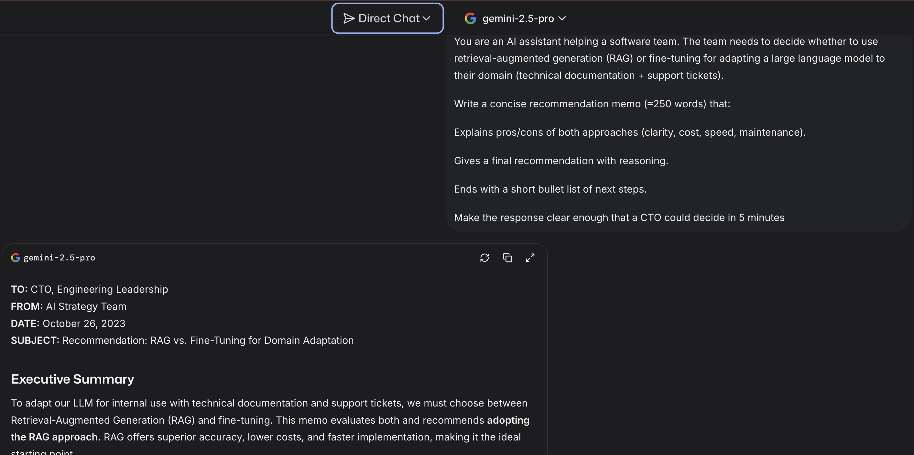
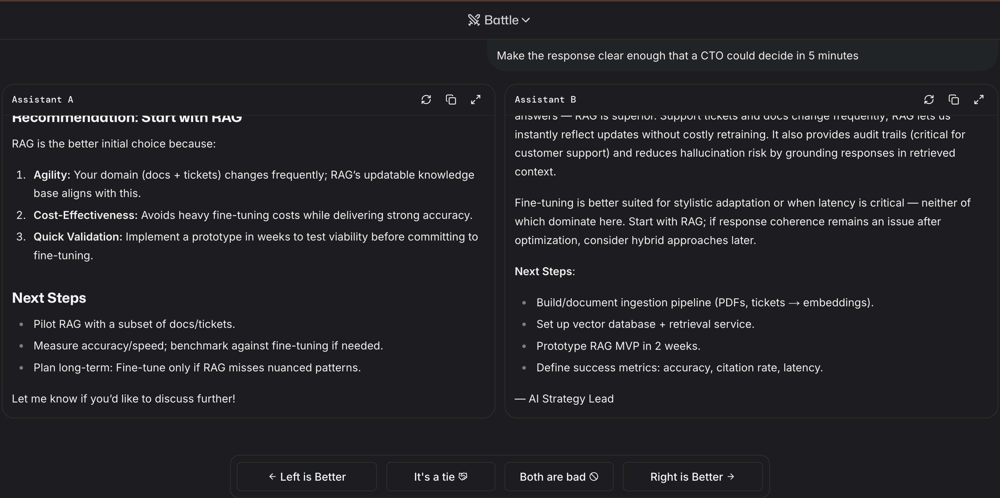
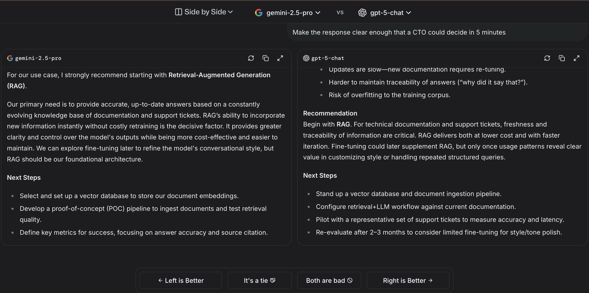
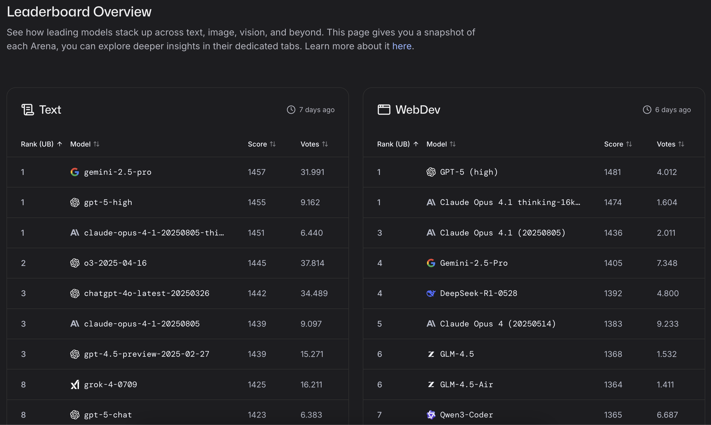

> **It’s 6:40 p.m. and your release train leaves tomorrow.**
> Two models are neck-and-neck—but one crushes long prompts while the other shines on code diffs. You open **LMArena**, run 20 real prompts across **Overall → Coding → Longer Query**, then try your repo in **RepoChat** using [repo-aware code assistants (why "agentic" is not the same as "coding")](/learn/midway/modern-ai-code-assistant). By **7:15 p.m.**, the pattern is obvious: **route by task**, note the trade-offs, and ship with confidence.

---

## Answer in 30 seconds

If you need a fast, **human-preference** signal to shortlist LLMs, use **LMArena**: run **anonymous battles** with your real prompts, interpret small Elo gaps as **noise** (use the confidence interval), and pick **per-task winners** instead of a single global #1. Build a [router-first blueprint for production routing](/learn/midway/rag-reference-architecture-2026-router-first-design), then re-check periodically because leaderboards and models drift.


## What LMArena is (in 60 seconds)

**LMArena** (ex–Chatbot Arena) is a public leaderboard where people compare LLM answers **head-to-head**. Each anonymous vote updates an **Elo-style** rating. It’s ideal when you need to **choose a model for a task** (coding, web dev, long prompts, etc.) and want a **human-preference** signal—not just static benchmarks.

**How it works (1-minute version)**

* **Anonymous battles:** two models answer the same prompt; you vote *before* names reveal.
* **Arena Elo:** votes update ratings; leaderboard also shows **MT-Bench** and **MMLU** panels to triangulate quality.
* **Only anonymous battles move Elo:** **Side-by-Side** is for labeled comparison; it doesn’t affect scores (see: [[1](#ref-1)], [[2](#ref-2)], and the official [[3](#ref-3)]).

---

## Snapshot (as observed on Feb 19–21, 2026)

> Rankings drift. Treat tables as snapshots, and re-check the live leaderboards before you ship: [[4](#ref-4)], [[5](#ref-5)], [[6](#ref-6)].
> If you want to track changes without re-reading this guide, follow the official changelog: [[7](#ref-7)].

### Text Arena — Overall (as of Feb 21, 2026)

| Rank | Model | Score |
| ---: | --- | ---: |
| 1 | `claude-opus-4-6-thinking` | 1505±8 |
| 2 | `claude-opus-4-6` | 1505±8 |
| 3 | `gemini-3.1-pro-preview` | 1500±9 (preliminary) |
| 4 | `gemini-3-pro` | 1486±4 |
| 5 | `gpt-5.2-chat-latest-20260210` | 1478±12 |
| 6 | `dola-seed-2.0-preview` | 1474±10 (preliminary) |
| 7 | `gemini-3-flash` | 1474±5 |
| 8 | `grok-4.1-thinking` | 1473±4 |
| 9 | `claude-opus-4-5-20251101-thinking-32k` | 1472±4 |
| 10 | `claude-opus-4-5-20251101` | 1467±4 |

> Treat “Model” strings as leaderboard labels. Small gaps near the top are often noise unless confidence intervals separate.

### WebDev Arena (Code Arena | WebDev) — snapshot (as of Feb 19, 2026)

Top signals:
- `claude-opus-4-6` leads with 1561 (+14/-14)
- `claude-opus-4-6-thinking` follows at 1551 (+16/-16)
- `claude-sonnet-4-6` is #3 at 1524 (+20/-20)
- Several models cluster tightly behind, with overlapping CIs.

### Code Arena (WebDev) — as of Feb 19, 2026

| Rank | Model | Score |
| ---: | --- | ---: |
| 1 | `claude-opus-4-6` | 1561 +14/-14 |
| 2 | `claude-opus-4-6-thinking` | 1551 +16/-16 |
| 3 | `claude-sonnet-4-6` | 1524 +20/-20 |
| 4 | `claude-opus-4-5-20251101-thinking-32k` | 1501 +8/-8 |
| 5 | `gpt-5.2-high` | 1471 +16/-16 |

> Editorial note: today’s top cluster spans multiple vendors (e.g., Google, OpenAI, Anthropic, xAI), which is exactly why “route by task” beats “pick a global #1” (see this [case study on specialization vs a single global winner](/learn/expert/ai-specialization-gemini-gpt-lmarena-dec-2025)).

---

## What changed since 2025 (how to keep this guide current)

LMArena evolves fast: new models enter, arenas change, and methodology updates get logged publicly.

**My rule:** treat leaderboard tables as *snapshots* and track changes via:
1) the live leaderboards,
2) the Leaderboard Changelog (methodology + additions),
3) periodic re-checks on your prompt set.

Notable recent examples include new model additions to the Code leaderboard and broader evaluation updates logged in the official changelog: [[7](#ref-7)]. For product experiments that can affect how people use the Arena, see: [[8](#ref-8)].

---

## Under the hood: Elo in 90 seconds

**Mental model:** LMArena is doing **pairwise ranking** at massive scale. Instead of asking people to score models on an absolute 1–10 scale, it asks a simpler question: “Which answer wins?” That tends to reduce rater variance and produces a more stable ordering.

* **Elo is relative.** A model’s rating is updated by wins/losses vs opponents on the prompts it actually faced.
* **Confidence intervals (CI) matter.** When two models’ 95% CIs overlap, a small gap (e.g., **+5–15 Elo**) is often indistinguishable from noise.
* **Selection bias is real.** If a model mostly fights certain opponents or prompt types, its Elo reflects that mixture—not a universal “IQ” (see [LLM evaluation: Goodhart, regression tests, and eval pitfalls](/topics/llm-evaluation)).

```text
Big gap + non-overlapping CI  → likely real difference
Tiny gap + overlapping CI     → treat as a tie; break with your prompts
```

---

## Three ways to use LMArena (hands-on)

### 1) Direct Chat — fast single-model sanity check

Use when you want one good draft quickly (tone/style, first pass).

**Paste this prompt to try:**

> You are an AI assistant helping a software team. The team needs to decide whether to use retrieval-augmented generation (RAG) or fine-tuning for adapting a large language model to their domain (technical documentation + support tickets).
> Write a concise **recommendation memo (\~250 words)** that:
>
> 1. explains pros/cons of both (clarity, cost, speed, maintenance),
> 2. gives a **final recommendation** with reasoning,
> 3. ends with **Next steps** bullets.
>    Make it clear enough that a CTO could decide in 5 minutes.

**What to look for:** structure, trade-off clarity, actionable next steps.



---

### 2) Battle — anonymous A vs B (you vote after reading)

Best when you’re deciding between two candidates and want **blind** judgment.

**How to run a good battle**

1. Paste a **real** prompt from your backlog.
2. Read both answers **before** names reveal.
3. Vote for the one you’d ship to a user today.

**Quick rubric:** correctness → reasoning → instruction-following → conciseness → citations (if any).



---

### 3) Side-by-Side — explicit model vs model

Pick two finalists (e.g., `gemini-2.5-pro` vs `claude-opus-4.1-20250805-thinking-16k`) for a labeled comparison.

**Tips**

* Keep the **same prompt** across runs to compare apples to apples.
* Do **5–10 prompts** per task (long spec, coding bug, data wrangling).
* Note failure modes: latency spikes, hallucinations, messy formatting.



---

## How to read the leaderboard without overfitting

* **Start with the right tab.** If you ship front-end code, **WebDev** matters more than Text “Overall”.
* **Triangulate.** Elo is human preference; cross-check the **MT-Bench/MMLU** panels shown next to rows.
* **Beware tiny gaps.** A few points at the top are often noise—use **battles on your prompts** to decide, and keep your grounding solid with [IR basics (keyword vs semantic retrieval)](/learn/expert/introduction-to-information-retrieval-systems).



## Key takeaways (for production teams)

* Treat Elo as a **shortlist signal**, not a final decision.
* Break near-ties with **your prompts**, **latency**, and **failure-case** tests.
* Prefer **routing by task** (coding vs long context vs domain QA) over a single “best model”.
* Re-check monthly (or before major launches): model updates and leaderboard drift are normal.

---

## A 20-minute evaluation recipe (teams)

1. **Collect 6–8 real prompts** (2 coding, 2 long-form, 2 domain-specific).
2. **Shortlist 3 models** from the relevant tab.
3. Run **10 battles** total (shuffle pairs).
4. Record winners + notes (reasoning, latency, formatting).
5. Pick **per-task winners**; route in prod by task if needed.

### Lightweight monthly health-check

* 6 prompts × 3 categories (Coding, Longer Query, Your Domain)
* 6–10 battles per category vs last month’s winner
* Log: win rate, latency, formatting, citation quality
* Update your **router** only if deltas persist across two checks (use this guide on [how to route queries: CAG vs RAG](/learn/expert/cag-vs-rag))

### Related reading (internal)

* Retrieval basics: `/learn/expert/introduction-to-information-retrieval-systems`
* RAG architecture & trade-offs: `/learn/expert/cag-vs-rag`
* RAG & context engineering hub: `/topics/rag`
* Production fundamentals (context/tokens/tool use): `/learn/midway/llm-practical-fundamentals-guide-ai-apps`
* 2026 enterprise playbook (agents, evaluation, governance): `/learn/midway/generative-ai-roadmap-2026-enterprise-playbook`

---

## Curiosity bites

* **Side-by-Side ≠ Elo:** SxS is labeled for audits; only **anonymous battles** change ratings (see: [[2](#ref-2)], plus the official [[3](#ref-3)]).
* **Repo-aware surprises:** average overall models can **win** in **RepoChat** on your codebase (especially if your workflow depends on [repo-aware code assistants](/learn/midway/modern-ai-code-assistant)).
* **Latency matters:** ask raters to flag when answers are “**too slow to be useful**.”

---

## Caveats & privacy

* **Human preference ≠ ground truth.** Treat Elo as one signal; verify with your tests/benchmarks.
* **Small Elo deltas are noisy.** Break ties with your own prompts.
* **Privacy:** treat LMArena as **public**—don’t paste sensitive data, and review [why inputs should be treated as untrusted (and effectively public)](/learn/midway/genai-security-guardrails-prompt-injection).

---

## Failure modes & Goodhart (how to not get fooled)

* **Prompt-style bias:** “polished” writing can beat correct-but-dry answers in preference voting.
* **Verbosity bias:** longer answers often “feel” better—even when they’re less precise.
* **Rater variance:** skill, patience, and domain knowledge vary wildly across voters.
* **Domain mismatch:** a model that wins general prompts can lose badly on your niche format, jargon, or constraints.
* **Post-training artifacts:** alignment, memorization, and “benchmark behavior” can move rankings without improving real-world reliability.

---

## Don’t pick a single winner—pick a routing plan

Run **10–20 arena battles per task type**, compare **Overall + Category Elo** with **MT-Bench/MMLU**, and keep a lightweight rubric (correctness, latency, citations/tool-use). If the top two are close, prefer the one that wins **your failure cases**. Then formalize the decision with a [router-first blueprint for production routing](/learn/midway/rag-reference-architecture-2026-router-first-design). **Re-check monthly**; model drift is real.

---

## Mini-template: 20-minute LMArena eval (copy/paste)

```md
Goal
- Task(s):
- Constraints (latency, format, citations, tools):

Prompt set (6–8)
1.
2.
3.

Shortlist
- Model A:
- Model B:
- Model C:

Battles (10–20)
- Prompt #1: winner, why (notes)
- Prompt #2: winner, why (notes)

Operational notes
- Latency: (p50/p95 impressions)
- Formatting issues:
- Failure modes observed:

Ship decision
- Winner per task:
- Router rules (if any):
- Recheck date:
```

---

## FAQ

> **Tip:** Each question below expands to a concise, production-oriented answer.

<details>
  <summary><strong>What exactly is LMArena?</strong></summary>

A public, **anonymous, pairwise** arena where humans vote on better answers; an **Elo-style** system turns those votes into a live leaderboard.
</details>

<details>
  <summary><strong>Is Elo just “who sounds nicer”?</strong></summary>

It’s a **preference** signal. Use it with **MT-Bench/MMLU** and **category filters** to avoid style-over-substance traps.
</details>

<details>
  <summary><strong>Which model is #1 right now?</strong></summary>

It changes. Check **Overall**, then your **category**; small Elo gaps are noise—**validate on your prompts**.
</details>

<details>
  <summary><strong>Are my prompts private?</strong></summary>

Treat them as **not private**; don’t paste sensitive data.
</details>

<details>
  <summary><strong>Why do teams use LMArena?</strong></summary>

To **de-risk launches**, **route by task**, **detect regressions**, **tune prompts/guardrails**, and validate **cost–performance** trade-offs on real prompts.
</details>

<details>
  <summary><strong>Is Elo reliable on its own?</strong></summary>

It captures **human preference**, not ground truth. **Triangulate** with MT-Bench, MMLU, and **category leaderboards**, and validate on **your** prompts.
</details>

<details>
  <summary><strong>How do I add my model?</strong></summary>

Follow **FastChat**’s *How to add a new model* (host your own/3rd-party API or request LMSYS hosting).
</details>

<details>
  <summary><strong>Is there recent open data I can analyze?</strong></summary>

Yes—LMArena/LMSYS periodically releases open datasets. Starting points:

* **Chatbot Arena Conversations (33k):** [[9](#ref-9)].
* **Arena Human Preference (≈140k):** [[10](#ref-10)].
* **LMSYS-Chat-1M (1M):** [[11](#ref-11)].

</details>

1. <a id="ref-1"></a>[**How it works**](https://lmarena.ai/how-it-works)
2. <a id="ref-2"></a>[**Battle Mode help**](https://help.lmarena.ai/articles/4489017547-how-to-use-battle-mode)
3. <a id="ref-3"></a>[**FAQ**](https://lmarena.ai/faq)
4. <a id="ref-4"></a>[**Text Leaderboard (Overall)**](https://arena.ai/leaderboard/text)
5. <a id="ref-5"></a>[**Text Leaderboard (Coding)**](https://arena.ai/leaderboard/text/coding)
6. <a id="ref-6"></a>[**Code Arena (WebDev)**](https://arena.ai/leaderboard/code)
7. <a id="ref-7"></a>[**Leaderboard Changelog**](https://lmarena.ai/blog/leaderboard-changelog/)
8. <a id="ref-8"></a>[**Auto-Modality Experiments**](https://help.lmarena.ai/articles/1350607902-lmarena-experiments-auto-modality)
9. <a id="ref-9"></a>[**Chatbot Arena Conversations (33k) | Hugging Face**](https://huggingface.co/datasets/lmsys/chatbot_arena_conversations)
10. <a id="ref-10"></a>[**Arena Human Preference (≈140k) | Hugging Face**](https://huggingface.co/datasets/lmarena-ai/arena-human-preference-140k)
11. <a id="ref-11"></a>[**LMSYS-Chat-1M (1M) | Hugging Face**](https://huggingface.co/datasets/lmsys/lmsys-chat-1m)
