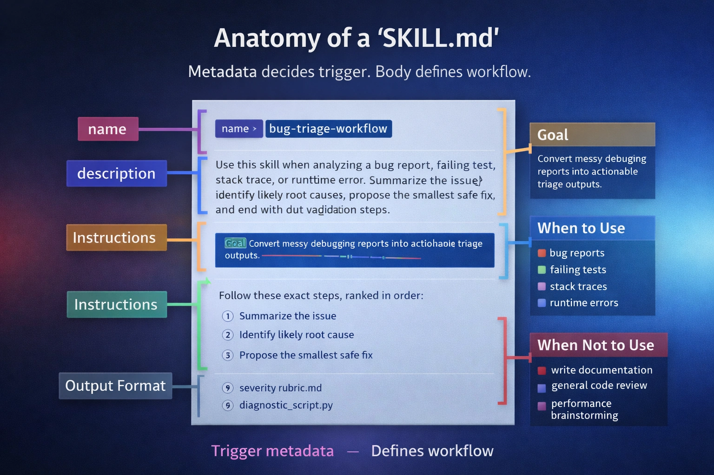
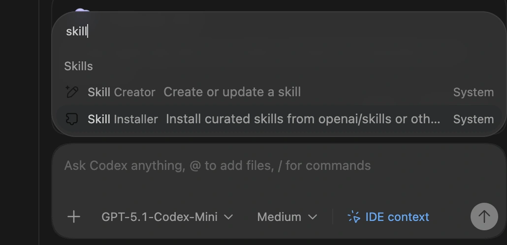
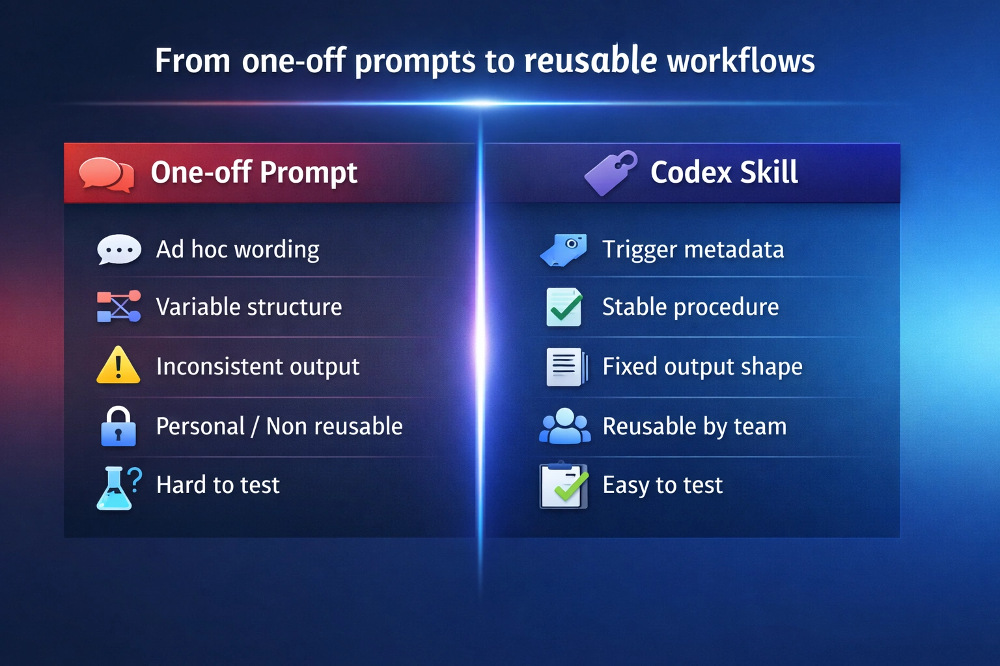
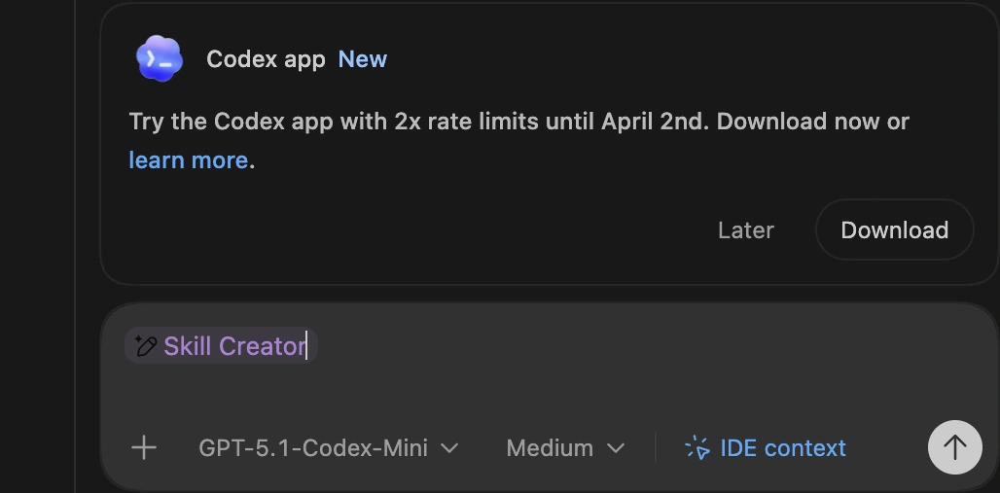
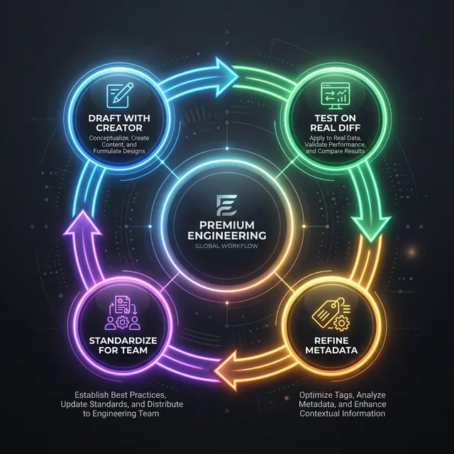

# OpenAI Codex Skills: Build Repeatable Agent Workflows

If you use Codex often, the first bottleneck is not model quality. **It is workflow repetition.**

One code review prompt gives you a solid result, the next one changes structure. One bug triage run ends with a safe fix plan, then the next run turns into a vague debugging essay. **The problem is not that Codex cannot do the work. The problem is that repeated tasks stay trapped inside one-off prompts.**

**Codex Skills solve that by turning recurring tasks into reusable workflows** with strong trigger metadata, stable instructions, and fixed output formats. In OpenAI docs, these are also referred to as Agent Skills. [[1](#ref-1)]

You can create a skill by **writing `SKILL.md` yourself**, or by asking Codex to scaffold one with **`$skill-creator`** and then refining it against real prompts. Before getting into the mechanics, it helps to understand what Skills actually unlock and why they change how Codex is used in practice.

---

## Why Skills matter before you build one

A prompt gives Codex instructions for one run. **A Skill gives Codex a reusable workflow for many runs.**

That difference matters more than it sounds. Without Skills, repeated work stays trapped inside chat prompts: the wording changes, the structure drifts, and each result depends too much on how the request was phrased that time. Codex may still do good work, but the workflow itself stays fragile and hard to reuse.

Skills change that by **turning a repeated task into an operational unit**. Instead of asking for “a good answer” every time, you give Codex a clearer trigger, a stable procedure, and a predictable output format. That makes the system easier to trust, easier to test, and easier to reuse across a team. [[1](#ref-1)]

In practice, that unlocks four things:

1. **Consistency across runs**
   Repeated tasks follow the same structure and standard instead of drifting from prompt to prompt.

2. **Better routing**
   Codex can match a specific workflow to a specific context instead of treating everything like generic coding help.

3. **Reusable output contracts**
   Review comments, triage reports, release notes, and checklists become stable enough to plug into real team workflows.

4. **Shared operational memory**
   Rules, rubrics, and procedures stop living in private prompts and become reusable assets inside the repo or user environment.

This is the real shift. **You are not just saving a prompt. You are packaging a repeated engineering procedure so Codex can apply it more reliably over time.**

Once that value is clear, the mechanics of a Skill make a lot more sense.

---

## 1. What is a Codex Skill?



A Codex Skill is a **modular unit of agentic workflow**. Instead of reinventing a workflow every time, you bundle instructions, templates, and scripts into a container that Codex can run consistently across the CLI, IDE extension, and app [[1](#ref-1)].

### The folder tree

A Codex skill is usually a **folder** containing:
* **`SKILL.md`**: the required file that contains **YAML front matter (name, description)** plus the Markdown instructions Codex loads after skill selection.
* **Templates/Assets**: Optional reference files (checklists, severity rubrics).
* **Scripts**: For deterministic behavior (e.g., a python script to parse a specific log format).

### The hard truth: trigger vs. body

*The image above shows the Codex selection interface in the IDE. When you start a task, Codex scans your available skills and presents those that match your intent. This confirms why strong **metadata** (name and description) is the only way to ensure the right workflow is triggered at the right time.*

**Skill discovery starts from metadata—especially `name` and `description`—not from the full instruction body.** If a skill doesn’t fire, fix those first. The rest of `SKILL.md` is only loaded **after** the skill has been selected for use. **Most teams over-invest in the body and under-invest in the description**, but this separation keeps agent context clean: you can maintain a library of 100 skills without bloating every single interaction. [[1](#ref-1)]

---

## 2. When to create a Skill (Decision Rules)

Not every prompt deserves to be a skill. Use this practical rule of thumb to decide when to automate.

**Create a Skill if:**
1. **Recurring Frequency**: You repeat the same request **2–3+ times per week** (e.g., standardized Code Review).
2. **Fixed Standard**: The output must follow a **team policy or format** (e.g., automated release notes).
3. **Multi-Step complexity**: The task requires a **specific sequence** to be useful.

**Stick with a one-off prompt if:**
* It is a one-time exploratory task or brainstorming session.
* The standard or "good" changes every run.

> [!IMPORTANT]
> A skill is a **focused workflow**, not a generic helper. If you can't define "done" for a task, you're not ready for a skill. Keep skills narrow to ensure [security guardrails](/learn/midway/genai-security-guardrails-prompt-injection) remain effective. **If your first skill spans three workflows, it is already too broad.**

---

## 3. Triggering: the metadata formula

Codex uses the **name** and **description** to decide relevance. Vague metadata leads to “Swiss Army Knife” skills that trigger loosely or not at all.

### The formula: Context + Action + Output


A strong description follows this template:
**"Use this skill when [context]. It should [actions]. Return [output shape]."**

| Part | Weak | Strong |
| :--- | :--- | :--- |
| **Name** | `review-helper` | `code-review-checklist` |
| **Context** | "helps with code" | "for pull requests, diffs, and patches" |
| **Action** | "analyze bugs" | "summarize issue, find root cause, propose fix" |
| **Output** | "write a report" | "group findings by severity, suggest tests" |



### Anti-Patterns to avoid
1. **The Hidden Trigger**: Putting the "When to Use" rules only inside the body of `SKILL.md`. Codex won't see them during the routing phase. [[3](#ref-3)]
2. **The "Everything" Skill**: A single skill for review, docs, and releases. Codex confuses the trigger signals.
3. **Verbosity**: Long descriptions that don't name specific repo artifacts (PRs, logs, stack traces).

### What advanced users usually miss

Once you understand the basic trigger mechanism, the real leverage comes from understanding where skills live and how they are invoked:

* **Location Matters**: Team repo skills live in **`.codex/skills`**, while personal skills live in **`~/.codex/skills`**. [[1](#ref-1)]
* **Optional Configuration**: Advanced skill setups can include extra interface metadata, but most skills should start with a well-written `SKILL.md` and only add extra configuration when a real need appears. [[3](#ref-3)]
* **Invocation Rules**: **Every skill should be tested twice: once with explicit invocation (`$skill-name`) and once through natural-language (implicit) triggering.** Implicit triggering is configurable and depends heavily on the description quality.

---

## 4. How to build a Skill: by hand or with Skill Creator

You can build a Codex Skill in two ways: write it directly as a folder with `SKILL.md`, or start with **`$skill-creator`** and refine the result. Both paths lead to the same goal: a narrow workflow with clear trigger metadata and a stable output shape.

### Option 1: Write the skill by hand

This is the simplest model. Create a skill folder, add a `SKILL.md` file, write a sharp `name` and `description`, then define the workflow and output format. This path works best when you already know exactly what the skill should do.

### Option 2: Use `$skill-creator`


*This screenshot demonstrates the **$skill-creator** in action. By simply describing the repeatable task you want to automate, the system skill scaffolds the entire folder structure and the initial `SKILL.md` file, saving you from manual boilerplate and ensuring consistency with official standards.*

If the workflow is clear but you do not want to scaffold the file manually, use **`$skill-creator`**. Codex ships with built-in system skills including `$skill-creator` and `$skill-installer`, so you can generate a first draft and then tighten it against real prompts. [[1](#ref-1)] [[3](#ref-3)]

### Building it out
1. **Identify**: Pick one **repeated task** (e.g., PR reviews or bug triage). Don't start with "I want a general engineering skill".
2. **Prompt Skill Creator**: Be specific about **context and output**.
   ```text
   $skill-creator Create a skill for triaging failing tests and stack traces.
   Check root causes, propose the smallest safe fix, and suggest validation steps.
   Output must follow our team's severity rubric.
   ```
3. **Refine**: **Tighten the resulting description** based on real-world prompts. Add assets only if they improve **repeatability**.

---

## 5. Structured Workflows in Practice

To make this practical, here is how you move from a vague idea to a shared team workflow for two common tasks.

### Code Review

Engineers want review comments to be consistent, but one-off prompts produce different priorities every time.

1. **Define success**: It must activate on PRs/diffs, check edge cases, return findings grouped by severity, and suggest follow-up tests.
2. **Use strong metadata**:
   ```text
   name: code-review-checklist
   description: Use this skill when reviewing a pull request, diff, or patch. Check correctness, edge cases, readability, missing tests, and regression risk. Return findings grouped by severity, then suggest follow-up tests.
   ```
3. **Test on real PRs**: Force the skill using prompts like "Review this diff for missing tests." If it triggers too often, narrow the description context.
4. **Add light assets**: Include a review output template or a severity rubric to guarantee a stable format.

### Bug Triage

Debugging is repetitive in structure but messy in inputs. The symptom changes, but the workflow shouldn't.

1. **Define success**: It must activate on stack traces and failing tests, identify likely causes, propose safe fixes, and end with validation steps.
2. **Use strong metadata**:
   ```text
   name: bug-triage-workflow
   description: Use this skill when analyzing a bug report, stack trace, failing test, or runtime error. Summarize the issue, identify likely root causes, propose the smallest safe fix, and end with validation steps.
   ```
3. **Lock down the output structure** in `SKILL.md`:
   - 1. Issue summary
   - 2. Likely root cause
   - 3. Smallest safe fix
   - 4. Validation steps

By standardizing these two skills, you give your engineering team a shared debugging standard.

---

## 6. What a `SKILL.md` actually looks like

At this point, the missing piece is usually not the concept but the file itself. Here is what a finished `SKILL.md` can look like for two common workflows.

### Mini contrast: Weak vs. Strong Metadata

The difference between a skill that works and one that misses is trigger clarity.

**Weak metadata:**
```md
---
name: engineering-helper
description: Helps with bugs and code problems.
---
```

**Strong metadata:**
```md
---
name: bug-triage-workflow
description: Use this skill when analyzing a bug report, failing test, stack trace, or runtime error. Summarize the issue, identify likely root causes, propose the smallest safe fix, and end with validation steps.
---
```
***The difference is not style. It is trigger clarity.** A good description tells Codex when to load the skill, what job it should perform, and what kind of result it should return.*

### Example: Bug Triage Workflow

This is a complete file. It shows the value of a skill on a messy task: returning a stable structure from chaotic inputs.

```md
---
name: bug-triage-workflow
description: Use this skill when analyzing a bug report, failing test, stack trace, or runtime error. Summarize the issue, identify likely root causes, propose the smallest safe fix, and end with validation steps.
---

**Bug Triage Workflow**

**Goal**
Turn a messy debugging input into a structured triage result with a likely cause, a minimal fix, and a validation plan.

**Use this skill for**
- bug reports
- failing tests
- stack traces
- runtime errors
- CI failures with a concrete error signal

**Do not use this skill for**
- general code review
- feature design
- performance tuning without a clear incident
- broad refactors with no identified failure

**Instructions**
1. Read the report, stack trace, failing test, or runtime error carefully.
2. Summarize the issue in plain language in 1–3 sentences.
3. Identify the most likely root cause.
4. If more than one cause is plausible, rank them by likelihood and explain the evidence briefly.
5. Propose the smallest safe fix first.
6. Avoid jumping to a broad rewrite unless the local fix would clearly be unsafe.
7. End with concrete validation steps that confirm the fix and reduce regression risk.
8. If the evidence is incomplete, say what should be checked next instead of overstating confidence.

**Output format**
Return exactly these sections:

**Issue summary**
What is failing, where, and under what condition.

**Likely root cause**
The most probable cause, with short supporting evidence.

**Smallest safe fix**
The minimum change worth trying first.

**Validation steps**
Tests, repro steps, logs, or checks that confirm the fix.

**Triage rules**
- Separate likely causes from confirmed causes.
- Prefer reversible fixes over broad changes.
- Do not present speculation as certainty.
- Keep the workflow focused on diagnosis and safe next steps.
```

### Example: Code Review (Metadata Only)

You don't always need a massive file. The same pattern applies across workflows: **narrow trigger, clear procedure, fixed output shape.**

```md
---
name: code-review-checklist
description: Use this skill when reviewing a pull request, diff, or patch. Check correctness, edge cases, readability, missing tests, regression risk, and obvious security concerns. Return findings grouped by severity, then suggest follow-up tests.
---
```

---

## 7. Test & troubleshoot

Skills fail on **scope**, not on clever instructions. To build [reliable AI applications](/learn/midway/llm-practical-fundamentals-guide-ai-apps), you must move beyond vibes and into concrete evaluation [[2](#ref-2)]. **A negative control catches more real failures than a prettier instruction block.**

### The 5-Prompt Test Set
Use this 5-prompt starter set to catch obvious trigger failures early, then grow it into a 10–20 prompt eval set as you find real misses.

| Test Type | Prompt | Should Trigger? | Expected Heading Output |
| :--- | :--- | :--- | :--- |
| **Direct Match** | "Review this diff for missing tests." | **Yes** | Severity, Tests, Findings |
| **Direct Match** | "Triage this stack trace." | **Yes** | Root Cause, Safe Fix, Validation |
| **Partial Match** | "Look at this PR for regressions." | **Yes** | Regression Risk, Style, Fix |
| **Negative Control**| "Write a README for this repo." | **No** | (Skill should stay dormant) |
| **Direct Force** | `$my-skill Review this file.` | **Yes** | (Forced activation) |



*Negative controls matter because most bad skills fail through over-triggering, not under-triggering.*

### Troubleshooting Table

| Problem | Root Cause | Fix |
| :--- | :--- | :--- |
| **Doesn't Appear** | Path or install error | Reinstall + restart Codex. |
| **Doesn't Trigger** | Vague Name/Description | Add specific artifact names (PR, Diff). |
| **Triggers Too Much**| Overlapping Description | Narrow the "Use this when..." context. |
| **Inconsistent Output**| Specification Problem | Add an explicit return structure (e.g., 1. Cause 2. Fix). |
| **Feels "Confused"** | Too many jobs | Split into narrower skills (e.g., review vs. release notes). |

> **TIP**
> Use this checklist to predict whether a skill will **trigger** and whether the output will be **reusable**.
> * [x] Tested against a direct match (Real PR).
> * [x] Verified it doesn't fire on a Negative Control.
> * [x] Output headings match the team template.
>
> If you fail any item, fix **metadata first**, then tighten the output shape. Understanding [LLM costs as architectural decisions](/learn/expert/llm-costs-are-architectural-not-pricing) reinforces why avoiding over-triggering is crucial for production scale.

---

## FAQ

<details>
  <summary><strong>What if the skill doesn’t appear after installation?</strong></summary>
  Confirm the install path and restart Codex. If you are using a GitHub URL, ensure the folder structure is correct. [[3](#ref-3)]
</details>

<details>
  <summary><strong>Why do I need a separate description?</strong></summary>
  Because Codex is a router before it is an agent. It needs to know which file to load *without* reading every file in your library.
</details>

<details>
  <summary><strong>Why does my skill trigger too often?</strong></summary>
  This usually means the description uses generic verbs like "help" or "analyze". Narrow the context: instead of "helps with code", use "use this skill only when reviewing unit tests".
</details>

---

## References

1. <a id="ref-1"></a>[**OpenAI Agent Skills Developer Guide**](https://developers.openai.com/codex/skills/)
2. <a id="ref-2"></a>[**OpenAI Blog Testing Agent Skills Systematically with Evals**](https://developers.openai.com/blog/eval-skills/)
3. <a id="ref-3"></a>[**GitHub OpenAI Skills Repository**](https://github.com/openai/skills)
