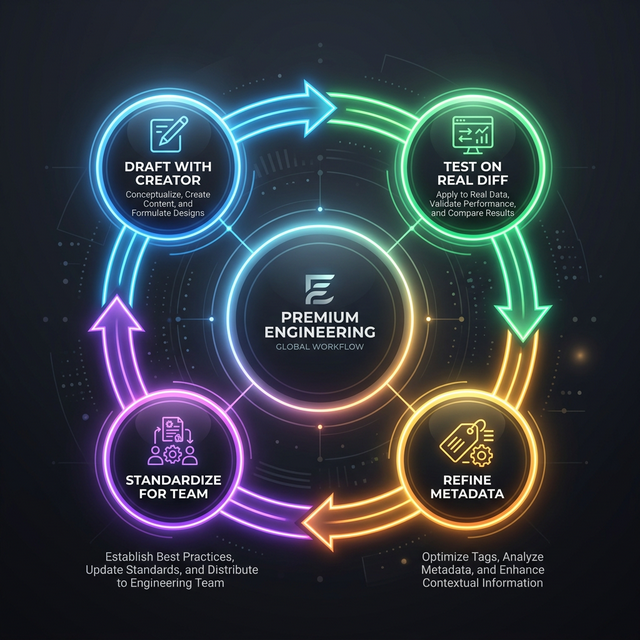

If you use Codex for writing or changing code, you hit a ceiling pretty quickly: you keep **repeating the same prompts** (“do a code review using our rules”, “write release notes in this format”, “prepare a PR with these checks”…).

**Agent Skills** solve that by turning a recurring prompt into a **reusable procedure**. This design shift is central to [how modern AI code assistants really work](/learn/midway/modern-ai-code-assistant), moving from simple completions to autonomous collaboration. Think of a skill as a small “bundle” that can include:

* **Instructions** (the steps Codex should follow)
* **Resources** (templates, checklists, examples)
* **Optional scripts/assets** (when you want to automate repetitive bits)

## Codex Skills in 40 seconds

> **Codex Skills are the operating procedures for your AI agent.**
>
> - **Metadata-Driven:** They activate based on their name and description, not their content.
> - **Modular:** They bundle instructions (`SKILL.md`), scripts, and templates into one folder.
> - **Context-Aware:** They trigger when Codex detects a matching task in your repo or chat.

---

## Section 1 — What Codex Skills are (and why they make you faster)

That way Codex can run a workflow **consistently**, instead of reinventing it every time. Skills can be used across **Codex CLI, IDE extension, and the Codex app**.

### Skill vs. prompt: when should you create a skill?

Use this practical rule of thumb:

**Create a skill if…**

1. you repeat the same request **2–3+ times per week**
2. the output must follow a **fixed standard** (style, policy, checklist, format)
3. the task has **multiple steps** and you want them done in a stable sequence

**Stick with a one-off prompt if…**

* it’s a one-time task
* the standard changes every run
* you’re exploring/brainstorming more than executing a procedure

### Two things to understand early (they’ll save you hours)

* Whether Codex uses a skill depends heavily on the skill’s **name and description**. Writing those well is half the battle.
* The “full” instructions are typically applied **when the skill is activated**, so you can maintain a library of skills without constantly bloating every interaction.


## Section 2 — How a Codex skill works under the hood


A Codex skill is usually a **folder with a `SKILL.md` file** and, when needed, extra files like templates, scripts, or reference material. OpenAI’s current skills guidance emphasizes a few recurring rules: keep each skill focused on one job, prefer instructions over scripts unless you need deterministic behavior, write imperative steps with clear inputs and outputs, and test prompts against the description to verify trigger behavior. [[1](#ref-1)]

The practical takeaway is simple: a skill is not “just a saved prompt.” It is closer to a **reusable operating procedure** for the agent, following the same architectural patterns as [AI agents and tool use](/learn/midway/mcp-a2a-protocols-ai-agents-playbook) in production systems. That is why skills work well for recurring workflows like **Code Review** and **Bug Triage**: they bundle the workflow, the expected output shape, and any reusable assets into one place. [[1](#ref-1)]

### The minimum structure

At minimum, you should think in terms of:

* a **skill folder**
* a **`SKILL.md`** file describing what the skill does
* optional **assets** such as templates, examples, or scripts

OpenAI’s skill-creation material also shows that the creation flow is designed around concrete examples first, then reusable contents, then initializing the skill directory, which is a strong hint that the best skills are built from real tasks rather than abstract descriptions. [[3](#ref-3)]

### Why name and description matter so much

The part most people underestimate is **triggering**. In practice, whether Codex applies a skill depends heavily on how clearly the skill is framed, especially in its name and description. OpenAI’s best-practice guidance explicitly recommends testing prompts against the skill description to confirm the right trigger behavior, and their evals guidance is built around systematically checking whether a skill activates when it should. [[1](#ref-1)]

That means this:

* a vague skill name like **“helper”** is weak
* a specific skill name like **“code-review-checklist”** is much stronger
* a vague description like **“helps with engineering tasks”** is weak
* a specific description like **“reviews code changes for correctness, edge cases, test gaps, and style issues, then returns a structured review summary”** is much stronger

### Running example 1: Code Review

A good Code Review skill should tell Codex:

* when to use it
* what to inspect
* what output format to return

A practical version might be scoped like this:

**Name:** `code-review-checklist`
**Description:** Use this skill when reviewing a diff, PR, or patch. Check correctness, edge cases, readability, test coverage, regressions, and obvious security concerns. Return findings grouped by severity, then suggest follow-up tests.

Why this works better than a generic description:

* it names the input context: **diff, PR, patch**
* it defines the evaluation dimensions
* it defines the output shape

That kind of specificity makes activation more reliable and the result more consistent. [[1](#ref-1)]

### Running example 2: Bug Triage

A Bug Triage skill should do the same thing for debugging-oriented work.

**Name:** `bug-triage-workflow`
**Description:** Use this skill when analyzing a reported bug, failing test, or runtime error. Summarize the issue, identify likely root causes, list reproduction steps, propose the smallest safe fix, and suggest validation tests.

Why this is stronger:

* it covers the common triggers: **reported bug, failing test, runtime error**
* it tells Codex to move from symptom to cause
* it forces a useful output structure: summary, root cause, fix, validation

That is exactly the sort of repeated workflow skills are meant to capture. [[1](#ref-1)]

### When to add files beyond `SKILL.md`

Start with instructions only. Add extra files only when they clearly improve repeatability.

For example:

* a **Code Review** skill might include a review template
* a **Bug Triage** skill might include a root-cause worksheet
* a release-related skill might include a changelog template

This matches OpenAI’s current guidance to prefer instructions first and only add scripts when you truly need deterministic behavior or external tooling. [[1](#ref-1)]

### The mistake that breaks most first skills

Most bad first skills fail because they are **too broad**.

Bad:

* “software-engineering-helper”
* “helps with code and bugs and documentation and releases”

Better:

* “code-review-checklist”
* “bug-triage-workflow”

If a skill tries to cover five different jobs, Codex has a harder time knowing when to use it and what “good” looks like. OpenAI’s documented best practices point in the opposite direction: **one focused job per skill**. [[1](#ref-1)]

---

### Quick checklist

* [ ] The skill does one job, not five
* [ ] The name is specific and action-oriented
* [ ] The description says when to use it
* [ ] The description says what to check or produce
* [ ] The output format is implied or explicit
* [ ] Extra files are included only if they improve repeatability

---

### Takeaway

If you remember one thing from this section, make it this: **a Codex skill is a reusable workflow, not a generic saved prompt**. The clearer the scope, name, and description, the easier it is for Codex to trigger the skill at the right time and return something consistently useful. [[1](#ref-1)]

---


## Section 3 — Skill Creator: build your first skill step by step

If Skill Installer is the fastest way to **start using** skills—providing the [fastest path from need to usable workflow](/learn/midway/google-ai-studio-guide)—then **`$skill-creator`** is the fastest way to **start making your own**. OpenAI currently ships Codex with built-in system skills, including **`$skill-creator`** and **`$skill-installer`**, and the Codex app, CLI, and IDE all support the same core skills model. [[1](#ref-1)]

The practical value of Skill Creator is that it helps you turn a messy recurring workflow into a focused, reusable skill. OpenAI’s own Skill Creator guidance frames it as the tool to use when you want to create a new skill or update an existing one that extends Codex with specialized knowledge, workflows, or integrations. [[3](#ref-3)]

### What Skill Creator is actually good at

Use **`$skill-creator`** when you already know the workflow you want, but you do not want to handcraft the skill structure from scratch. The official examples and guidance point toward a concrete process: start from real examples, extract the reusable instructions, then initialize the skill directory and contents. That is why Skill Creator works especially well for workflows like **Code Review** and **Bug Triage**. [[3](#ref-3)]

In other words, do not start with “I want a brilliant general engineering skill.” Start with something narrower and operational, such as:

* “Create a skill for reviewing pull requests in our backend repo”
* “Create a skill for triaging failing CI runs”
* “Update my bug triage skill so it always proposes validation tests”

That approach aligns with OpenAI’s broader skill guidance: keep each skill focused, define clear steps, and prefer one job per skill. [[1](#ref-1)]

### Your first Skill Creator prompt

Here is the right mental model: **be specific about the job, the context, and the output**.

For a **Code Review** skill, a strong request would be:

```text
$skill-creator Create a new skill for reviewing code changes in this repository.
It should check correctness, edge cases, readability, test gaps, and regression risk.
Return findings grouped by severity, then suggest follow-up tests.
Keep the scope limited to pull requests, diffs, and patches.
```

For a **Bug Triage** skill, a strong request would be:

```text
$skill-creator Create a new skill for triaging reported bugs, failing tests, and runtime errors.
It should summarize the issue, identify likely root causes, propose the smallest safe fix,
and end with validation steps.
Keep the output structured and concise.
```

These examples follow the same pattern encouraged by OpenAI’s skills documentation: imperative instructions, explicit scope, and clear outputs. [[3](#ref-3)]

### Why specificity matters

Skill Creator can only produce a strong skill if your request is concrete enough. OpenAI’s current guidance and evals material both reinforce the same idea: the **trigger quality** of a skill depends heavily on how clearly its purpose is described, especially through name, description, and usage framing. A vague skill tends to trigger badly or become too broad to be useful. [[3](#ref-3)]

Bad request:

```text
$skill-creator Make a software engineering helper skill
```

Better request:

```text
$skill-creator Create a bug triage skill for Python services in this repo.
Use it for stack traces, failing tests, and issue reports.
Always produce: summary, likely cause, smallest safe fix, and validation plan.
```

The second version gives Codex something operational to build around. It also makes it easier for the resulting skill to activate at the right time later. [[3](#ref-3)]

### A practical workflow that works

For most teams, the most reliable workflow looks like this:

#### 1. Start from one repeated task

Pick a task you already repeat manually, such as PR reviews or bug triage. OpenAI’s skill-creation guidance explicitly recommends grounding the skill in real examples first instead of designing it in the abstract. [[3](#ref-3)]

#### 2. Ask Skill Creator to build the first version

Use **`$skill-creator`** with a narrow prompt like the ones above. If you are using an app-server style integration, OpenAI also documents direct examples such as “Add a new skill for triaging flaky CI and include step-by-step usage.” [[1](#ref-1)]

#### 3. Test it manually

Trigger the skill on a real diff, PR, error log, or failing test. OpenAI’s skill guidance recommends testing prompts against the skill description to check whether it activates and behaves the way you expect. [[1](#ref-1)]

#### 4. Tighten the scope

If the skill activates too often, narrow the description. If it misses obvious cases, add the exact contexts where it should be used. This is directly in line with OpenAI’s advice to improve skills by evaluating trigger behavior systematically. [[2](#ref-2)]

#### 5. Add assets only if they improve repeatability

A review template or triage worksheet can help. But OpenAI’s current guidance is to prefer instructions first, and only add scripts or extra assets when they materially improve reliability or determinism. [[1](#ref-1)]

### Example: turn Code Review into a usable first skill

A practical first pass might aim for something like this:

* **Purpose:** review pull requests and diffs
* **Checks:** correctness, edge cases, readability, missing tests, regression risk
* **Output:** critical issues first, then medium/low issues, then suggested tests

That gives Skill Creator enough signal to produce something useful without making the skill too broad. It also maps naturally to recurring engineering workflows, which is exactly where OpenAI positions skills as most valuable. [[3](#ref-3)]

### Example: turn Bug Triage into a reusable workflow

A first Bug Triage skill should be equally constrained:

* **Purpose:** analyze a reported bug, stack trace, or failing test
* **Checks:** reproduction clues, likely root cause, smallest safe fix
* **Output:** issue summary, diagnosis, fix plan, validation steps

This structure is strong because it forces Codex to move from symptoms to action, instead of dumping a vague debugging narrative. That matches the “clear steps, clear outputs” style recommended in the skills docs. [[1](#ref-1)]

### Three rules for getting better results from Skill Creator

#### 1. Name the trigger context

Say **when** the skill should be used: PRs, diffs, bug reports, stack traces, failing CI, runtime errors. This improves trigger clarity. [[1](#ref-1)]

#### 2. Define the output shape

Ask for a stable output structure: grouped findings, root-cause summary, validation plan, follow-up tests. Stable outputs make skills more reusable across teammates and projects. [[1](#ref-1)]

#### 3. Keep the first version narrow

OpenAI’s skills guidance consistently favors focused skills over all-purpose ones. A narrow first version is easier to test, easier to trigger correctly, and easier to improve later. [[1](#ref-1)]

### Common mistakes

The most common mistake is asking Skill Creator to build something too broad, such as a single skill that handles code review, debugging, documentation, architecture advice, and release notes. That usually weakens triggering and makes outputs inconsistent, which is the opposite of what skills are for. [[1](#ref-1)]

Another common mistake is stopping after the first draft. OpenAI’s evals guidance is useful here: treat the first version as a baseline, then test and refine trigger behavior over time. [[2](#ref-2)]

---

### Quick checklist

* [ ] I picked one repeated workflow
* [ ] My Skill Creator request says when the skill should be used
* [ ] My request defines what the skill should check or produce
* [ ] My first version is narrow, not “general engineering”
* [ ] I tested it on a real PR, diff, or bug report
* [ ] I refined the wording after the first run

---

### Takeaway

The best way to use **`$skill-creator`** is not to ask for a clever skill. It is to ask for a **specific reusable workflow**. Start with one repeated task, define the trigger context, define the output shape, test it on a real example, and tighten the wording until the skill becomes dependable. That is how you go from “interesting feature” to something your team will actually use. [[3](#ref-3)]


## Section 4 — Make skills trigger reliably: naming, descriptions, and testing


This is where most skills either become genuinely useful or quietly fail.

A Codex skill does **not** trigger because the body of `SKILL.md` is beautifully written. It triggers because Codex first sees the skill’s **metadata** — especially the **name** and **description** — and uses that to decide whether the skill is relevant. OpenAI’s current guidance is explicit about this: the model is exposed to each skill’s **name, description, and path**, and the **description is the primary triggering mechanism**. The full body of `SKILL.md` is loaded only after the skill has been selected. [[3](#ref-3)]

That one detail explains most trigger problems.

If your skill is not activating, the issue is often not the workflow itself. It is usually that the name is too generic, the description does not clearly say **when** to use the skill, or the skill is trying to cover too many jobs at once. OpenAI’s eval guidance recommends manually triggering the skill early specifically to uncover these hidden assumptions. [[2](#ref-2)]

### The core rule: put “when to use” in the description

One of the most important current recommendations from OpenAI’s Skill Creator material is this: put the **trigger contexts** in the description, not in the body. The reason is practical: Codex uses the description to decide whether to load the skill, while the body is only available after that decision has already been made. [[3](#ref-3)]

So this is weak:

```text
name: engineering-helper
description: Helps with software tasks
```

And this is much stronger:

```text
name: code-review-checklist
description: Use this skill when reviewing a pull request, diff, or patch. Check correctness, edge cases, readability, missing tests, regression risk, and obvious security concerns. Return findings grouped by severity and end with suggested follow-up tests.
```

The second version works better because it tells Codex:

* **when** to use the skill
* **what** to inspect
* **what kind of output** to produce

That is exactly the kind of metadata the model needs at trigger time. [[3](#ref-3)]

### Naming: what good names look like

A good skill name should be:

* **specific**
* **task-oriented**
* **narrow enough to imply one job**

Bad names:

* `helper`
* `engineering-skill`
* `dev-workflow`

Better names:

* `code-review-checklist`
* `bug-triage-workflow`
* `flaky-test-triage`
* `release-notes-generator`

These better names are easier for Codex to match against actual requests because they map to recognizable workflow categories. This aligns with OpenAI’s recommendation to keep skills focused and to define success clearly before writing the skill. [[2](#ref-2)]

### Descriptions: the practical formula

A strong skill description usually contains three things:

1. **Trigger context** — when should this skill be used?
2. **Core actions** — what should it check or do?
3. **Output shape** — what should the result look like?

That gives you a practical formula:

**Use this skill when [context]. It should [actions]. Return [output shape].**

Here is a reliable **Code Review** example:

```text
name: code-review-checklist
description: Use this skill when reviewing a pull request, diff, or patch. Check correctness, edge cases, readability, test gaps, regression risk, and obvious security issues. Return findings grouped by severity, then suggest follow-up tests.
```

And here is a reliable **Bug Triage** example:

```text
name: bug-triage-workflow
description: Use this skill when analyzing a bug report, stack trace, failing test, or runtime error. Summarize the issue, identify likely root causes, propose the smallest safe fix, and end with validation steps.
```

Both examples follow the current OpenAI advice to include all “when to use” information in the description itself. [[3](#ref-3)]

### The most common trigger mistakes

#### 1. The skill is too broad

If one skill tries to handle code review, bug triage, docs, architecture, and release work, Codex has a harder time deciding when it applies. OpenAI’s skills guidance favors focused, single-purpose skills over all-purpose ones. [[2](#ref-2)]

#### 2. The trigger context is missing

If the description says what the skill does but not when to use it, activation becomes unreliable. For example, “helps debug problems” is weaker than “use this skill for failing tests, runtime errors, and stack traces.” [[3](#ref-3)]

#### 3. The output is undefined

If the skill does not specify the output shape, you get inconsistent results. Even a short instruction like “return findings grouped by severity” or “end with validation steps” makes the skill more reusable. [[1](#ref-1)]

#### 4. You hide key trigger details in the body

This is a subtle but common mistake. If the trigger logic lives only inside a “When to Use This Skill” section in the body of `SKILL.md`, Codex may never see it at decision time. OpenAI explicitly warns against relying on the body for trigger information. [[3](#ref-3)]

### Testing: how to know whether the skill is actually good

OpenAI’s current eval guidance recommends a very practical first step: **manually trigger the skill early**. Use the `$` prefix or the `/skills` command and run it against real examples so you can see where it breaks—reminding us that the best way to [test AI systems on real prompts](/learn/expert/imarena-ai-benchmarking-platform) is to move beyond vibes and into concrete evaluation. The goal is not polish at first. The goal is to surface hidden assumptions. [[2](#ref-2)]

That gives you a simple test loop:

#### Step 1: Force the skill on real inputs

Test it on actual material:

* a real PR or diff for **Code Review**
* a real failing test or stack trace for **Bug Triage**

This helps you separate two different problems:

* the skill does not trigger
* the skill triggers, but the workflow is weak

OpenAI specifically recommends this manual-trigger phase because it reveals misses, over-triggering, and workflow drift. [[2](#ref-2)]

#### Step 2: Watch for three failure modes

**Failure mode 1: It never triggers**
Usually means the name/description is too vague, too generic, or too broad. [[2](#ref-2)]

**Failure mode 2: It triggers too often**
Usually means the description is too loose and overlaps with many unrelated tasks. Narrow the contexts. [[2](#ref-2)]

**Failure mode 3: It triggers, but the output is inconsistent**
Usually means the output format is not defined clearly enough, or the workflow is still too open-ended. [[1](#ref-1)]

### A practical rewrite process

When a skill behaves badly, do not rewrite everything. Tighten it in this order:

#### First, improve the name

Go from generic to specific.

* `review-helper` → `code-review-checklist`
* `debug-assistant` → `bug-triage-workflow`

#### Then, improve the trigger contexts

Add the exact situations where the skill should apply.

* “for code work” → “for pull requests, diffs, and patches”
* “for bugs” → “for bug reports, failing tests, stack traces, and runtime errors”

#### Then, improve the output shape

Tell Codex what good output looks like.

* “review the code” → “group findings by severity, then suggest tests”
* “triage the bug” → “return summary, likely cause, smallest safe fix, validation steps”

That sequence matches the current OpenAI mental model: first make the metadata easy to match, then make the workflow easy to execute. [[3](#ref-3)]

### A compact test card you can reuse

For every new skill, test these five prompts:

**For Code Review**

1. “Review this diff for correctness and missing tests.”
2. “Check this PR for regressions.”
3. “Look at this patch and call out risky changes.”

**For Bug Triage**
4. “Help me triage this failing test.”
5. “Analyze this stack trace and suggest the safest fix.”

If the skill misses obvious matches, tighten the description. If it activates on unrelated tasks, narrow the contexts. If the output varies too much, define the result format more explicitly. That manual refinement loop is exactly what OpenAI recommends before optimizing further with formal evals. [[2](#ref-2)]

### If you have a team: move from manual testing to evals

Once a skill is useful, OpenAI recommends moving beyond intuition and checking performance more systematically with evals. Their current guidance is to define success before writing the skill, manually trigger it to expose hidden assumptions, and then use a small, focused set of test cases to measure whether it activates and behaves correctly over time. [[2](#ref-2)]

That matters because trigger quality can regress quietly when you rename a skill, broaden the description, or add new instructions. A lightweight eval set is how you keep a good skill from drifting into an unreliable one. [[2](#ref-2)]

---

### Quick checklist

* [ ] The name is specific and single-purpose
* [ ] The description says exactly when to use the skill
* [ ] The description says what the skill should do
* [ ] The description hints at the output format
* [ ] Trigger details are in metadata, not hidden in the body
* [ ] I manually tested the skill on real examples
* [ ] I revised the wording after the first failures

---

### Takeaway

Reliable triggering is mostly a **metadata design problem**. If the name is sharp, the description clearly states the trigger context, and you test the skill on real examples early, Codex becomes much better at loading the right workflow at the right time. The body of the skill still matters, but it only matters **after** Codex has already decided to use it. [[2](#ref-2)]


## Section 6 — Two complete playbooks: Code Review and Bug Triage from first draft to team workflow



At this point, the goal is no longer to understand skills in theory. The goal is to make them **useful in daily work**.

OpenAI’s current skills guidance is a good fit for that mindset: keep each skill focused on one job, write clear imperative steps with explicit inputs and outputs, prefer instructions over scripts unless you need deterministic behavior, and test prompts against the skill description to confirm trigger behavior. Their evals guidance adds the missing operational piece: define success first, then manually trigger the skill on real examples to expose hidden assumptions. [[1](#ref-1)]

That combination gives you a practical path from “first draft” to “team-ready workflow.” The two best examples for this article are **Code Review** and **Bug Triage** because they are repeated often, they benefit from standardized outputs, and they are easy to test on real repository artifacts. [[1](#ref-1)]

### Playbook 1 — Code Review

A Code Review skill is valuable because it solves a common problem: engineers want review comments to be consistent, but one-off prompts produce different priorities and different output structures every time.

#### Step 1: Define success before you create anything

Before writing the skill, define what “good” means. OpenAI’s eval guidance explicitly recommends doing this first. For a Code Review skill, success might mean:

* it activates on pull requests, diffs, and patches
* it checks correctness, edge cases, readability, test gaps, regression risk, and obvious security concerns
* it returns findings in a stable structure
* it suggests follow-up tests instead of stopping at criticism alone

That sounds simple, but it prevents the most common mistake: building a skill that feels smart but has no clear standard for success. [[2](#ref-2)]

#### Step 2: Create a narrow first version

Your first version should be narrow and operational, not ambitious.

A strong Skill Creator prompt would look like this:

```text
$skill-creator Create a skill for reviewing pull requests, diffs, and patches in this repository.
It should check correctness, edge cases, readability, missing tests, regression risk, and obvious security concerns.
Return findings grouped by severity, then suggest follow-up tests.
Keep the scope limited to code review only.
```

This follows the current skills guidance closely: one job, explicit scope, explicit outputs. [[1](#ref-1)]

#### Step 3: Make the metadata do the trigger work

A practical first version of the skill should be framed around clear metadata.

```text
name: code-review-checklist
description: Use this skill when reviewing a pull request, diff, or patch. Check correctness, edge cases, readability, missing tests, regression risk, and obvious security concerns. Return findings grouped by severity, then suggest follow-up tests.
```

This works because the description includes the exact trigger contexts and expected output structure. OpenAI’s Skill Creator guidance is explicit that the description is the primary triggering mechanism, while the full body is loaded only after the skill has been selected. [[3](#ref-3)]

#### Step 4: Test it on a real review task

Now force the skill on real material. OpenAI recommends manually triggering skills early, either with the `$` prefix or `/skills`, specifically to surface misses and hidden assumptions. [[2](#ref-2)]

Use prompts like:

* “Review this diff for correctness and missing tests.”
* “Check this PR for regressions.”
* “Look at this patch and flag risky changes.”

Watch for three things:

* it fails to activate on obvious review prompts
* it activates on unrelated coding tasks
* it produces inconsistent review formats

Those are all classic early-stage issues in OpenAI’s eval workflow. [[2](#ref-2)]

#### Step 5: Tighten the skill after the first failures

Suppose the skill activates too broadly. Narrow the trigger contexts:

* “for code work” becomes “for pull requests, diffs, and patches”

Suppose the output is inconsistent. Tighten the result format:

* “review the code” becomes “group findings by severity, then suggest follow-up tests”

Suppose it misses risky database changes or config changes. Add them to the checks explicitly.

This is the part many teams skip, but it is the difference between a demo skill and a dependable one. OpenAI’s eval guidance is built around this loop of manual triggering, observing failures, and refining wording. [[2](#ref-2)]

#### Step 6: Add lightweight assets only if they help

Start with instructions. Add files only when they improve repeatability. OpenAI’s current skills docs recommend preferring instructions over scripts unless you need determinism or external tooling. [[1](#ref-1)]

For Code Review, useful optional assets might be:

* a review output template
* a severity rubric
* a short checklist for common regression areas

Do not add scripts just because you can. If the skill works with instructions and a template, keep it simple. [[1](#ref-1)]

#### Step 7: Move from personal helper to team workflow

Once the skill produces stable review output, turn it into a team asset to [evaluate modern AI code assistants](/learn/midway/modern-ai-code-assistant) as part of a standardized engineering workflow:

* agree on a shared severity model
* standardize the output headings
* keep the name and description narrow
* test it on representative PRs across the repo

This is where skills start acting like operating procedures for the team rather than private prompt tricks. That is also consistent with OpenAI’s framing of skills as reusable workflow bundles. [[1](#ref-1)]

#### Code Review quick checklist

* [ ] The skill only handles PRs, diffs, and patches
* [ ] The description includes review trigger contexts
* [ ] Findings are grouped by severity
* [ ] The output ends with suggested tests
* [ ] I tested it on real review examples
* [ ] I tightened the wording after early failures

---

### Playbook 2 — Bug Triage

Bug Triage is one of the best skill candidates because debugging work is repetitive in structure but messy in inputs. The symptom changes every time, but the workflow is surprisingly stable: summarize the issue, look for likely causes, propose the smallest safe fix, then define validation steps.

That is exactly the kind of repeated procedure skills handle well. OpenAI’s best practices favor narrow, explicit skills with clear outputs, which maps naturally to triage work. [[1](#ref-1)]

#### Step 1: Define success for triage

Before creating the skill, define the job clearly. A useful Bug Triage skill should:

* activate on bug reports, failing tests, stack traces, and runtime errors
* summarize the issue in plain language
* identify likely root causes
* propose the smallest safe fix
* suggest validation steps or follow-up tests

Again, the point is not elegance. The point is to make success measurable before you build the workflow. [[2](#ref-2)]

#### Step 2: Create the first version with Skill Creator

A strong initial prompt would be:

```text
$skill-creator Create a skill for triaging bug reports, failing tests, stack traces, and runtime errors.
It should summarize the issue, identify likely root causes, propose the smallest safe fix, and end with validation steps.
Keep the workflow concise and structured.
```

This prompt is strong because it defines context, actions, and output shape in one pass. That matches OpenAI’s skill-creation guidance well. [[1](#ref-1)]

#### Step 3: Use metadata that reflects actual triage situations

A practical metadata shape might look like this:

```text
name: bug-triage-workflow
description: Use this skill when analyzing a bug report, stack trace, failing test, or runtime error. Summarize the issue, identify likely root causes, propose the smallest safe fix, and end with validation steps.
```

This description is much stronger than something generic like “helps debug problems” because it names the exact moments when the skill should activate. OpenAI’s current trigger model makes that specificity crucial. [[3](#ref-3)]

#### Step 4: Test it on real failures, not made-up examples

Use actual failing tests, stack traces, issue reports, or logs. OpenAI recommends testing prompts against the description and manually triggering the skill early to expose hidden assumptions. [[1](#ref-1)]

Good test prompts include:

* “Help me triage this failing test.”
* “Analyze this stack trace and suggest the safest fix.”
* “Look at this bug report and identify likely root causes.”

Watch for these failure modes:

* it gives a long debugging essay instead of a structured triage result
* it jumps to a fix without clearly stating the likely cause
* it forgets to include validation steps
* it activates on generic coding requests that are not really triage

Those are exactly the kinds of misses OpenAI suggests surfacing early through manual testing. [[2](#ref-2)]

#### Step 5: Tighten the output structure

Bug Triage skills get better fast when the output shape is locked down.

A reliable structure is:

1. issue summary
2. likely root cause
3. smallest safe fix
4. validation steps

If the skill keeps drifting, make this structure explicit in the instructions. OpenAI’s skills docs emphasize explicit inputs and outputs for exactly this reason. [[1](#ref-1)]

#### Step 6: Add files only when they reduce ambiguity

For Bug Triage, useful optional assets could include:

* a triage worksheet template
* an example report format
* a validation checklist for common services

But again, keep the bar high. If the workflow is already stable with instructions only, resist adding scripts or extra files. OpenAI’s current recommendation is to prefer instructions unless determinism or external tooling really matters. [[1](#ref-1)]

#### Step 7: Make it team-ready

A team Bug Triage skill becomes much more useful when it standardizes the language of debugging:

* everyone uses the same issue summary format
* likely causes are separated from confirmed causes
* proposed fixes stay minimal and reversible
* validation always includes concrete checks

That gives engineering teams a shared debugging workflow instead of five different personal styles. [[1](#ref-1)]

#### Bug Triage quick checklist

* [ ] The skill triggers on bug reports, failing tests, stack traces, and runtime errors
* [ ] The output includes summary, cause, fix, and validation
* [ ] The first version is narrow and structured
* [ ] I tested it on real failures, not toy examples
* [ ] I revised the trigger wording after misses
* [ ] I only added extra assets if they reduced ambiguity

---

### The practical pattern behind both playbooks

Both playbooks follow the same operating model:

1. **Define success first**
2. **Create a narrow first draft**
3. **Use metadata to drive triggering**
4. **Manually test on real examples**
5. **Refine after the first failures**
6. **Add assets only when they improve repeatability**
7. **Standardize the workflow for team use**

That sequence is not just convenient. It is directly aligned with OpenAI’s current skills and eval recommendations. [[1](#ref-1)]

### Takeaway

The fastest way to get value from Codex skills is to stop thinking in terms of “smart prompts” and start thinking in terms of **repeatable workflows**. A good Code Review skill and a good Bug Triage skill are both built the same way: narrow scope, clear trigger contexts, explicit output shape, real-world testing, and small refinements after the first failures. [[1](#ref-1)]


## Section 7 — Troubleshooting: why a skill doesn’t appear, doesn’t trigger, or triggers too often

This is the section that saves the most time in real usage.

Most skill problems are not “Codex is broken” problems. They are usually one of three things:

1. the skill was installed but **doesn’t appear**
2. the skill exists but **doesn’t trigger**
3. the skill triggers, but **too often or too loosely**

OpenAI’s current docs and eval guidance make this pattern pretty clear: skill reliability depends heavily on installation flow, metadata quality, and early manual testing. The good news is that those are all fixable. [[3](#ref-3)]

### Problem 1 — The skill doesn’t appear after installation

Confirm how you installed it. For experimental skills, repo guidance is more explicit: specify the skill folder or use a GitHub URL. After installing, you may need to **restart Codex** for new skills to be picked up. [[3](#ref-3)]

### Problem 2 — The skill exists, but it doesn’t trigger

OpenAI’s eval guidance is explicit: skill invocation depends heavily on the **name** and **description** in `SKILL.md`. If those are vague, overworked, or missing the real trigger contexts, the skill will not trigger reliably. [[2](#ref-2)]

#### Fast fix

Rewrite the metadata in this order:

1. **sharpen the name**
   `helper` → `code-review-checklist`

2. **add trigger contexts to the description**
   “helps with bugs” → “use this skill for bug reports, failing tests, stack traces, and runtime errors”

### Problem 4 — The skill triggers, but the output is inconsistent

This is often misunderstood as a “reasoning” problem, but it is usually a **specification** problem. OpenAI’s skills guidance repeatedly emphasizes explicit steps, inputs, and outputs. If the skill does not define what a good result looks like, Codex has too much freedom and the output quality drifts from run to run. 

This is one of the simplest upgrades you can make, and it usually improves consistency immediately. It also follows OpenAI’s documented preference for concrete, testable skill instructions, a principle that is fundamental to building [reliable AI applications](/learn/midway/llm-practical-fundamentals-guide-ai-apps). [[2](#ref-2)]

#### Fast fix

Make the output shape explicit.

For **Code Review**:

```text
Return:
1. Critical issues
2. Medium/low issues
3. Follow-up tests
```

For **Bug Triage**:

```text
Return:
1. Issue summary
2. Likely root cause
3. Smallest safe fix
4. Validation steps
```

### Problem 5 — The skill is broad because you are using one skill for multiple workflows

OpenAI’s current guidance favors **focused** skills, not “all-purpose engineering assistants.” Split the workflows into separate, narrower skills like `code-review-checklist`, `bug-triage-workflow`, and `release-notes-generator`.

### Troubleshooting table

| Problem                    | Most likely cause                                        | Fastest fix                                                                    |
| -------------------------- | -------------------------------------------------------- | ------------------------------------------------------------------------------ |
| Skill doesn’t appear       | Install flow mismatch or session hasn’t picked it up yet | Reinstall correctly and restart Codex [[3](#ref-3)]                            |
| Skill doesn’t trigger      | Name/description too vague                               | Rewrite metadata around trigger contexts [[2](#ref-2)]              |
| Skill triggers too often   | Description too broad                                    | Narrow the contexts and scope [[2](#ref-2)]                         |
| Output is inconsistent     | Output shape not clearly defined                         | Add explicit return structure [[2](#ref-2)]                         |
| Skill feels “confused”     | Too many jobs inside one skill                           | Split into narrower skills [[2](#ref-2)]                            |
| Hard to tell what is wrong | Testing only via automatic triggering                    | Manually trigger first, then test implicit triggering [[2](#ref-2)] |

---

### Takeaway

Most skill failures are not mysterious. If a skill does not appear, restart and verify the install path. If it does not trigger, fix the metadata. If it triggers too often, narrow the description. If the output is inconsistent, define the output structure more clearly. OpenAI’s current skills guidance points to the same conclusion again and again: **reliable skills come from focused scope, strong metadata, and real-world testing early**. This is also the foundation of [AI agent security guardrails](/learn/midway/genai-security-guardrails-prompt-injection), ensuring that production agents behave predictably and safely. [[3](#ref-3)]

---

## Section 8 — Conclusion: final checklist and best practices

The real value of Codex skills is not that they let you save prompts. It is that they let you turn repeated engineering work into **repeatable workflows**.

That is the mindset shift that matters most.

A good skill is not “clever.” A good skill is **predictable**. It activates in the right situations, follows a clear procedure, and returns output in a format your team can actually reuse. OpenAI’s current documentation points in the same direction throughout: keep skills focused, make the description do the trigger work, prefer explicit inputs and outputs, and test early on real examples. This shift from vibes to engineering is what defines [reliable AI architecture](/learn/midway/rag-reference-architecture-2026-router-first-design) in 2026. [[1](#ref-1)]

That is also why **Skill Creator** and **Skill Installer** matter so much together.

* **`$skill-creator`** helps you turn a repeated internal workflow into a reusable skill
* **`$skill-installer`** helps you adopt existing skills quickly without building everything from scratch

Used well, they create a very practical loop:

1. identify a repeated workflow
2. check whether an installable skill already solves most of it
3. create a narrower custom skill when your team needs repo-specific behavior
4. refine the metadata until triggering becomes reliable
5. standardize the output so the workflow becomes reusable across the team [[3](#ref-3)]

### Final checklist

Before you call a skill “done,” make sure all of this is true:

* [ ] The skill solves one repeated workflow
* [ ] The name is specific and task-oriented
* [ ] The description says exactly when to use the skill
* [ ] The description says what the skill should check or produce
* [ ] The output format is explicit or strongly implied
* [ ] I tested the skill on real examples from my repo or workflow
* [ ] I revised the wording after the first failures
* [ ] I only added scripts or extra assets when they clearly improved repeatability
* [ ] I know whether this should stay personal or become a team standard

### Best practices in one sentence each

* Use **Skill Installer** when a good-enough workflow already exists. ([developers.openai.com](https://developers.openai.com/codex/skills/?utm_source=chatgpt.com))
* Use **Skill Creator** when your workflow needs custom rules, repo context, or a specific output format. ([github.com](https://github.com/openai/skills/blob/main/skills/.system/skill-creator/SKILL.md?utm_source=chatgpt.com))
* Fix weak triggering by rewriting the **description**, not by endlessly expanding the skill body. ([developers.openai.com](https://developers.openai.com/blog/eval-skills/?utm_source=chatgpt.com))
* Split broad skills into smaller ones before you try to “improve” them. ([developers.openai.com](https://developers.openai.com/blog/eval-skills/?utm_source=chatgpt.com))
* Treat every skill like a small operational system: scope, trigger, workflow, output, test. ([developers.openai.com](https://developers.openai.com/codex/skills/?utm_source=chatgpt.com))

### Closing thought

The best Codex users are not the ones writing the fanciest prompts. They are the ones who turn recurring work into **clear, reusable, testable procedures**.

That is what skills are for.

And that is why the combination of **Skill Creator**, **Skill Installer**, good metadata, and lightweight testing is so powerful: it turns Codex from a helpful coding assistant into something closer to a **repeatable engineering workflow engine**. ([developers.openai.com](https://developers.openai.com/codex/skills/?utm_source=chatgpt.com))


---

## FAQ

<details>
  <summary><strong>What if the skill doesn’t appear after installation?</strong></summary>

  Confirm how you installed it. For experimental skills, repo guidance is more explicit: specify the skill folder or use a GitHub URL. After installing, you may need to **restart Codex** for new skills to be picked up.
</details>

<details>
  <summary><strong>Why does my skill trigger too often?</strong></summary>

  This usually means the description uses generic verbs like "help" or "analyze". Narrow the context: instead of "helps with code", use "use this skill only when reviewing unit tests for Python services".
</details>

<details>
  <summary><strong>Should I use Skill Creator for every task?</strong></summary>

  No. Use **Skill Installer** when a good-enough workflow already exists. Use **Skill Creator** when your workflow needs custom rules, repo context, or a specific output format. This shift from vibes to engineering is what defines [reliable AI architecture](/learn/midway/rag-reference-architecture-2026-router-first-design) in 2026.
</details>

---

## References

1. <a id="ref-1"></a>[**OpenAI — Agent Skills Developer Guide**](https://developers.openai.com/codex/skills/)
2. <a id="ref-2"></a>[**OpenAI Blog — Testing Agent Skills Systematically with Evals**](https://developers.openai.com/blog/eval-skills/)
3. <a id="ref-3"></a>[**GitHub — OpenAI Skills Repository**](https://github.com/openai/skills)
