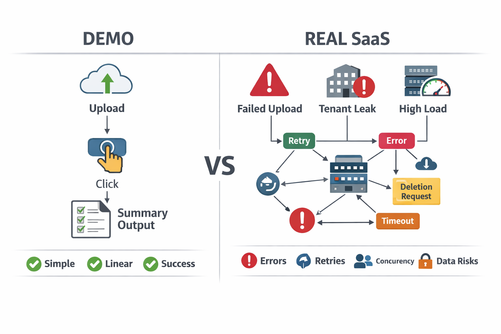
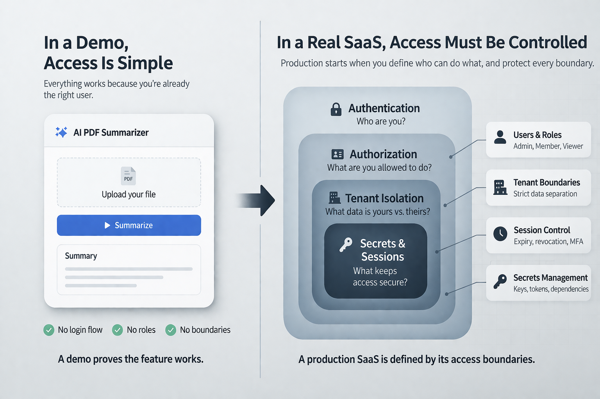

# Vibe coding gets you a demo, not a production SaaS

## A working demo is not a SaaS

**Vibe coding** is *prompt-driven software development*: you describe the outcome in natural language, and an AI tool generates code, configuration, or even a working prototype.

In the version this article is talking about, vibe coding is not structured software engineering assisted by AI. It is building through loosely specified prompts, fast iterations, and visible results, often without a clear model of the full system behind them.

That is where the risk begins. If a random or underspecified prompt can generate a feature that looks finished, it becomes easy to confuse output with architecture, and a working demo with a production-ready SaaS.

What feels production-ready in a demo, however, often hides the systems that make a real SaaS safe and reliable.

This article is not about disciplined AI-assisted development. It is about the moment prompting becomes a substitute for architecture, and visible output creates the illusion that the product is almost done.

This gap is especially dangerous for **people who can now assemble a working feature without yet knowing how the full system works end to end**. If you do not already think in terms of identity, state, failure modes, data flows, and operational boundaries, a successful demo can look much closer to a real SaaS than it actually is.

A demo proves a feature. A SaaS proves **reliability, control, and trust**.

Vibe coding can get you to a convincing feature fast. What it does not give you is the **layer that makes a SaaS real**: authentication, tenant isolation, billing enforcement, observability, support, and compliance.

If the product only works on the happy path, you do not have a SaaS yet. You have a **polished prototype**.

That is the **invisible gap** this article is about: the distance between *“it works once”* and *“it survives real users.”*

This article has a simple goal: to make that invisible gap visible.

The point is not to argue that vibe coding is useless, or that demos do not matter. The point is to show why a convincing demo can make people feel much closer to a production SaaS than they really are — especially when they can generate the visible product layer without yet understanding the full end-to-end system behind it.

Each section below isolates one layer that a demo usually hides: access control, data lifecycle, billing logic, reliability under load, and trust when the happy path breaks. If even one of those layers is still undefined, what you have is not an almost-finished SaaS. It is still a prototype.

This is not an anti-vibe-coding argument; it is the same tension we already see in [AI coding assistants](https://staituned.com/learn/midway/ai-coding-assistants/): speed is useful, but trust is what makes software deployable.

---

## What does a demo prove and what does it hide?

A demo proves that one clean flow works. A SaaS must survive **messy reality**.

Imagine an AI tool that summarizes uploaded PDFs. In a demo, it looks done: upload, click, summary returned.

What it hides is the **real product surface**: failed uploads, tenant leakage, prompt-log retention, deletion requests, retries, and concurrency spikes.

That is the gap.
The demo shows that the workflow works. It does not show whether the product survives contact with reality.

A working demo proves that something can work in a *controlled flow*. It does not prove that it can handle **real users, real load, real errors, real data, real payments, or real responsibility**.

### Before you call something a SaaS, there are five things the demo still hasn’t proved:

* **access control**
* **data lifecycle**
* **billing enforcement**
* **reliability under load**
* **recovery when flows fail**

If these five are still undefined, the product is **not production-ready yet**.

### Demo vs real SaaS

| In a demo              | In a real SaaS                           |
| ---------------------- | ---------------------------------------- |
| One clean flow         | Many unpredictable flows                 |
| One user action        | Hundreds of concurrent actions           |
| A successful output    | Consistent performance under load        |
| A polished interaction | Security, permissions, logging, recovery |
| A convincing feature   | Ongoing reliability and responsibility   |

> **The demo proves that a feature works once. It does not prove that the product survives reality.**

The rest of this article breaks that gap into the layers demos usually hide: security, data responsibility, billing logic, production reliability, and user trust under failure.

---

## Vibe coding makes the visible part feel like the whole product

That is why **vibe coding can be deceptive**.

It gives immediate feedback. You describe something, generate code, test a flow, and quickly get a result that feels tangible. The product starts to look real very early, and that changes how people judge progress.

The problem is that speed on the visible layer creates the **illusion of completeness**.

That illusion is strongest when prompting replaces specification. If the product is being shaped through loosely defined requests instead of explicit system design, the visible success of the feature can hide how much of the product is still missing.

That effect is even stronger when **the person building the product does not already know what sits behind the visible flow**. If you have never had to design tenant isolation, retention rules, entitlement logic, or observability, it is easy to mistake a polished interface for a nearly finished product.

If the interface works, the core action works, and the output looks good, it becomes easy to think the product is mostly there. When the UI already exists and the main workflow already works, people stop feeling like they are prototyping and start feeling like they are **almost done**. But what feels *“almost finished”* is often just the part that is easiest to show.

A SaaS is defined by **everything around that visible moment**: access, failure handling, performance, data responsibility, billing logic, and user trust. None of that is as satisfying to demo, which is exactly why it is so easy to underestimate.

### Vibe coding creates the illusion of speed, which is why it feels misleadingly complete:

* the **UI already exists**
* the **core action already works**
* the **output already looks convincing**
* progress suddenly feels **faster than the real complexity**

When the interface works, people stop feeling like they are prototyping and start feeling like they are almost done. But it is the **invisible layers** that define the product.

> **Speed on the visible layer creates the illusion of completeness.**

This is the real **psychological trap** behind vibe coding. It does not necessarily make people build the wrong thing. That is why teams confuse a *convincing feature* with *product readiness*.

---

## Security starts before the product feels “done”

One of the first things a demo hides is **identity**.

In a demo, access is simple. The right user is already logged in, the right file is already available, and the flow works exactly as expected. But in a real SaaS, one of the first hard questions is not *does it work?* It is ***who is allowed to do what?***

That is where things change fast.

A product can look finished and still fail on **invisible boundaries** like permissions, isolation, and [production guardrails](https://staituned.com/learn/midway/genai-security-guardrails-prompt-injection). [[1](#ref-1)] [[2](#ref-2)] The missing layer is not only authentication. It is also **secrets management, dependency validation, software supply chain control, and human review** before merge. The moment one company sees another company’s data, the feature stops being impressive and starts being **dangerous**.

This is why security is not something you add *after* the demo. It is part of what makes the product **real** in the first place.

### A demo can hide identity. To move to production, you must answer what it usually hides:

* who can access what
* how roles and permissions are enforced
* whether tenant data is properly isolated
* what happens when sessions expire
* how sensitive actions are restricted

If authorization is an afterthought, the system is technically functioning but structurally dangerous.

### Small demo, big risk

* one user sees another team’s file
* an expired session still allows actions
* admin rights are exposed too broadly
* a shared link reveals private data

> **A feature can work perfectly and still fail as a product.**

In a demo, the main interaction gets all the attention. In a SaaS, trust often depends on everything around that interaction.

---

## Data, privacy, and compliance appear the moment the product becomes real

A demo can treat data as a technical detail. A SaaS cannot.

The moment real users upload files, write prompts, generate outputs, or connect third-party tools, the product is no longer just processing inputs. It is **handling data** that may be sensitive, personal, confidential, or regulated.

That changes the **nature of the product**.

Once real users arrive, the question changes: *what data do you store, who can access it, how long do you keep it, and can you delete it on request?* [[3](#ref-3)] [[4](#ref-4)] [[5](#ref-5)] [[6](#ref-6)] And if the product includes AI, that hidden layer gets even bigger, because prompts, outputs, logs, and model interactions can all become part of the **compliance surface**.

This is where [**privacy by design**](https://staituned.com/learn/midway/gdpr-ai-rework-costs) stops being legal language and becomes **product architecture**: retention, logs, vendor flows, and deletion paths.

A demo does not show whether the company understands what data it is processing, whether that data includes personal information, or whether it can explain its own flows clearly enough to meet basic **accountability expectations**. It also does not show what happens when a customer asks for deletion and the team realizes it does not fully know where the data lives: in prompts, logs, storage, or third-party tools.

### The moment real users arrive, these new questions appear:

* **what data is being stored**
* **where that data goes**
* **who can access it**
* **how long it is retained**
* **whether prompts, outputs, or logs contain personal data**
* **what happens when a user asks for deletion**

Responsibility begins the moment the workflow becomes a **processing activity**.

> **The product may look finished. The responsibility around it has barely started.**

GDPR and the AI Act do not appear in the demo. They appear when the product becomes real. [[7](#ref-7)] [[8](#ref-8)]

---

## Billing is not a button, it is product logic

A demo can make monetization look simple. Add a pricing page, connect a payment provider, lock one feature behind a paywall, and it starts to feel like the business side is done.

But in a real SaaS, **billing is not just charging money**. It is managing rules, states, and expectations over time.

What happens if a payment fails but the account still has access for another week? What happens when a user upgrades in the middle of a billing cycle, cancels before renewal, or hits a usage limit earlier than expected? What happens when the plan shown in the UI does not match the plan enforced by the system?

None of that is obvious in a demo. Most demos skip it completely because the core feature is easier to show than the logic around **entitlement, renewal, restriction, and recovery**.
This is why pricing UI is the easy part. In production, the hard part is **control and enforcement** — often an [architecture, not pricing](https://staituned.com/learn/expert/llm-costs-are-architectural-not-pricing) problem, where billing stops being pricing and becomes **entitlement logic**. [[9](#ref-9)] [[10](#ref-10)] [[11](#ref-11)]

### Billing lifecycle is non-linear. It gets real when:

* a **payment fails** but access remains active
* a user **upgrades** in the middle of the cycle
* the **UI shows one plan** but the backend enforces another
* **usage limits** do not match the subscription state
* a **canceled account** keeps premium features longer than expected

If the system cannot enforce these states, it is a **feature, not a business**.

> **Connecting payments is easy. Enforcing business logic is not.**

A SaaS does not only need to create value. It needs to control access to that value in a way that is consistent, predictable, and economically real.

---
## Reliability starts when the happy path stops being exclusive

A demo can hide **uncertainty** because everything happens in a controlled moment. You know the flow, you know the input, and you are watching the product closely while it runs.

A SaaS does not work like that.

Once real users arrive, the question is no longer just whether the feature works. The question becomes whether the system keeps working **under pressure**, whether failures are visible, and whether anyone can understand what went wrong when something breaks.

That is where **observability** starts to matter.

If a request takes too long, if a provider fails, if responses become inconsistent, or if 100 users trigger the same action in parallel, the real problem is not only performance. A workflow that takes three seconds in a demo can become a **60-second queue** once real concurrency arrives — a classic [AI coding tools in production](https://staituned.com/topics/ai-coding) challenge. And when that happens, the real question is whether the team can **see the issue, trace it, explain it, and respond to it**.

A demo does not show that. It shows one successful moment.

### Reliability is measured under pressure. A production-ready app needs more than successful output: it needs observability, environment visibility across staging and production, and auditability when something breaks. A demo does not show:

* what happens **under load**
* whether **failures are visible**
* whether **issues can be traced**
* whether **slowdowns are detected early**
* whether the team can **explain what went wrong**

A workflow that takes three seconds in a demo can become a 60-second queue in production.

> **A demo shows one successful moment. Reliability is measured across repeated, imperfect ones. [[12](#ref-12)] [[13](#ref-13)] [[14](#ref-14)]**

That is why this layer stays **invisible** for so long: it does not make the product look impressive in a demo, but it becomes essential the moment the product is actually used like a SaaS.

---
## Support and trust begin where the happy path ends

A demo is built around success. A SaaS is judged by what happens when **success is interrupted**.

Users do not only evaluate the main feature. They also notice **confusion, delays, missing explanations, broken flows**, and how recoverable the product feels when something goes wrong. A tool can look impressive in a demo and still feel unreliable the moment a real customer gets stuck.

That is where **trust is built or lost**.

The user clicks again. Nothing happens. There is no explanation, no recovery path, and no clue whether the action failed or is still running. At that point, the issue is no longer just technical. It becomes part of the **customer experience**.

### Trust is built where the happy path ends. Users notice:

* **silent failures**
* **unclear messages**
* **broken recovery paths**
* **inconsistent account behavior**
* **lack of support** when something goes wrong

When success is interrupted, the **interface** is the only thing protecting the customer experience.

> **A SaaS is not only something people use. It is something they need to trust. [[15](#ref-15)] [[16](#ref-16)]**

This is another invisible layer that demos rarely expose. They show the moment the feature works, not the moments where the user needs clarity, reassurance, or support.

---

## The real gap is not idea to feature. It is feature to product.

That is the real misunderstanding behind many vibe-coded products.

The problem is not that the demo is fake. The problem is that it proves only one thing: that a feature can work in a *controlled moment*. It does not prove that the product can handle **access, load, failures, payments, sensitive data, compliance, or customer expectations**.

And that is exactly where a SaaS begins.

Vibe coding makes it easier than ever to build something visible. But the visible part is only **one layer** of the product. The rest is less exciting, less shareable, and much harder to show, which is why it is also much easier to underestimate.

### What a demo can prove

* the feature **works once**
* the flow **looks convincing**
* the output **feels real**
* the idea may be **worth exploring**

### What it cannot prove

* the product is **reliable under real usage**
* **access and permissions** are safe
* **billing logic** is consistent
* **data handling** is responsible
* the system is **ready for real customers**

> **The real gap is not between idea and feature. It is between feature and product.**

**Vibe coding** can compress prototyping. It does not compress operations, which is why the roadmap to [**engineered reliability**](https://staituned.com/learn/midway/generative-ai-roadmap-2026-enterprise-playbook) starts with **verifiable trust**.

Before calling a vibe-coded app a SaaS, ask **five questions**: who can access it, where the data goes, how billing is enforced, what happens under load, and which guardrails prevent unsafe changes from reaching production. If you cannot answer all five, you’re still building a demo.

This is especially true if you are using vibe coding to build software without a strong background in engineering systems. The feature may be real. The missing part is everything end to end that turns software into a product people can safely use and trust.

---

## Still not sure whether you have a demo or a real SaaS?

If you are building with AI coding assistants and you want a second pair of eyes on the product, write to me.

I can help you pressure-test the invisible layers that demos usually hide: access control, data handling, billing logic, reliability, and recovery paths. Sometimes the gap is small. Sometimes the product only looks close. Either way, it is better to see it early.

If you want feedback, a review, a strategic conversation, or to explore a collaboration, get in touch.

---

## References

1. **OWASP Cheat Sheet Series.** *Authorization Cheat Sheet*. - [https://cheatsheetseries.owasp.org/cheatsheets/Authorization_Cheat_Sheet.html](https://cheatsheetseries.owasp.org/cheatsheets/Authorization_Cheat_Sheet.html)
2. **OWASP Top 10 2025.** *A01: Broken Access Control*. - [https://owasp.org/Top10/2025/A01_2025-Broken_Access_Control/](https://owasp.org/Top10/2025/A01_2025-Broken_Access_Control/)
3. **European Commission.** *What data can we process and under which conditions?* - [https://commission.europa.eu/law/law-topic/data-protection/rules-business-and-organisations/principles-gdpr/overview-principles/what-data-can-we-process-and-under-which-conditions_en](https://commission.europa.eu/law/law-topic/data-protection/rules-business-and-organisations/principles-gdpr/overview-principles/what-data-can-we-process-and-under-which-conditions_en)
4. **European Commission.** *For how long can data be kept and is it necessary to update it?* - [https://commission.europa.eu/law/law-topic/data-protection/rules-business-and-organisations/principles-gdpr/how-long-can-data-be-kept-and-it-necessary-update-it_en](https://commission.europa.eu/law/law-topic/data-protection/rules-business-and-organisations/principles-gdpr/how-long-can-data-be-kept-and-it-necessary-update-it_en)
5. **European Commission.** *Information for individuals*. - [https://commission.europa.eu/law/law-topic/data-protection/information-individuals_en](https://commission.europa.eu/law/law-topic/data-protection/information-individuals_en)
6. **European Commission.** *How should requests from individuals exercising their data protection rights be dealt with?* - [https://commission.europa.eu/law/law-topic/data-protection/rules-business-and-organisations/dealing-citizens/how-should-requests-individuals-exercising-their-data-protection-rights-be-dealt_en](https://commission.europa.eu/law/law-topic/data-protection/rules-business-and-organisations/dealing-citizens/how-should-requests-individuals-exercising-their-data-protection-rights-be-dealt_en)
7. **EUR-Lex.** *Rules for trustworthy artificial intelligence in the EU*. - [https://eur-lex.europa.eu/EN/legal-content/summary/rules-for-trustworthy-artificial-intelligence-in-the-eu.html](https://eur-lex.europa.eu/EN/legal-content/summary/rules-for-trustworthy-artificial-intelligence-in-the-eu.html)
8. **European Commission.** *AI Act enters force*. - [https://commission.europa.eu/news-and-media/news/ai-act-enters-force-2024-08-01_en](https://commission.europa.eu/news-and-media/news/ai-act-enters-force-2024-08-01_en)
9. **Stripe Docs.** *How subscriptions work*. - [https://docs.stripe.com/billing/subscriptions/overview](https://docs.stripe.com/billing/subscriptions/overview)
10. **Stripe Docs.** *Entitlements*. - [https://docs.stripe.com/billing/entitlements](https://docs.stripe.com/billing/entitlements)
11. **Stripe Docs.** *Subscription schedules*. - [https://docs.stripe.com/billing/subscriptions/subscription-schedules](https://docs.stripe.com/billing/subscriptions/subscription-schedules)
12. **Google SRE Book.** *Monitoring Distributed Systems*. - [https://sre.google/sre-book/monitoring-distributed-systems/](https://sre.google/sre-book/monitoring-distributed-systems/)
13. **Google SRE Book.** *Service Level Objectives*. - [https://sre.google/sre-book/service-level-objectives/](https://sre.google/sre-book/service-level-objectives/)
14. **Google SRE Workbook.** *Monitoring*. - [https://sre.google/workbook/monitoring/](https://sre.google/workbook/monitoring/)
15. **Nielsen Norman Group.** *Visibility of System Status*. - [https://www.nngroup.com/articles/visibility-system-status/](https://www.nngroup.com/articles/visibility-system-status/)
16. **Nielsen Norman Group.** *10 Usability Heuristics*. - [https://www.nngroup.com/articles/ten-usability-heuristics/](https://www.nngroup.com/articles/ten-usability-heuristics/)

---

