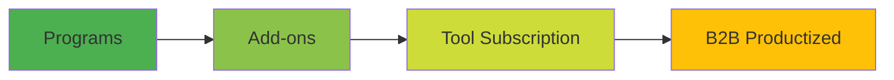

# stAItuned Career OS — Pitch Deck v2 (Streamlined)

---

## Brand Assets & Style Guide

### Logos

| Asset | File | Usage |
|-------|------|-------|
| **Primary Logo (SVG)** | [logo.svg](https://github.com/stAItuned/website/blob/main/public/assets/general/logo.svg) | Hero slides, presentations |
| **Logo Dark** | [logo-dark.png](https://github.com/stAItuned/website/blob/main/public/assets/general/logo-dark.png) | Light backgrounds |
| **Logo with Text** | [logo-text.png](https://github.com/stAItuned/website/blob/main/public/assets/general/logo-text.png) | Headers, footers |
| **Logo with Text (Dark)** | [logo-text-dark.png](https://github.com/stAItuned/website/blob/main/public/assets/general/logo-text-dark.png) | Light backgrounds |
| **Blue BG Logo** | [blue-bg-logo.png](https://github.com/stAItuned/website/blob/main/public/assets/general/blue-bg-logo.png) | Social, favicons |

### Color Palette

| Color | Light Mode | Dark Mode | Usage |
|-------|------------|-----------|-------|
| **Accent** | `#383F74` (Navy) | `#FFF272` (Gold) | CTAs, highlights, links |
| **Accent Strong** | `#FFF272` (Gold) | `#FFF272` (Gold) | Buttons, emphasis |
| **Background** | `#f4f6ff` | `#020412` | Page background |
| **Text** | `#0d1532` | `#f4f6ff` | Body text |
| **Text Muted** | `#5c668d` | `#9ca8d9` | Secondary text |
| **Border** | `rgba(26,30,59,0.12)` | `rgba(255,255,255,0.12)` | Dividers, cards |

### Typography

- **Font Family**: `Montserrat` (Google Fonts)
- **Weights**: 400 (regular), 500 (medium), 600 (semibold), 700 (bold)

### Visual Style

- **Glassmorphism**: Cards with `backdrop-blur` + subtle borders
- **Gradients**: Radial gradients with gold/blue glow effects
- **Animations**: Subtle float, fade-in, hover lift effects

### Presentation Guidelines

1. Use **dark mode** colors for pitch decks (more impactful)
2. Gold accent (`#FFF272`) for CTAs and key highlights
3. Navy (`#383F74`) for headers and secondary elements
4. Include logo on every slide (top-left or footer)
5. Use Montserrat font throughout

---

> **Navigation**: [Problem](#slide-2--the-problem) → [Gap](#slide-3--the-gap) → [Solution](#slide-4--solution) → [Proof Engine](#slide-5--proof-engine) → [Outcomes](#slide-6--outcomes) → [Positioning](#slide-7--positioning) → [Why Now](#slide-8--why-now) → [Moat](#slide-9--moat) → [Business Model](#slide-10--business-model) → [Roadmap](#slide-11--roadmap) → [Ask](#slide-12--the-ask)

---

## Slide 1 — Title

**stAItuned Career OS**

*The outcome-based career system for AI juniors — hire-ready fast, with proof that gets interviews.*

> "4 weeks: candidable. 8 weeks: credible."

**AI Expert Guidance** — Mentored by senior AI professionals who hire, build, and ship AI every day. Not theory. Real insider knowledge.

**Visual**: Clean hero with 3 icons → *Role Fit → Applications → Proof*

---

## Slide 2 — The Problem

**Headline**: AI careers are confusing — and the market punishes lack of proof.

### The Pain (3 bullets only)

1. **Role confusion**: AI Eng / ML Eng / GenAI Eng / DS / Data Analyst — juniors don't know what to target
2. **Weak applications**: Generic resumes + no narrative = low ATS match, no callbacks
3. **No proof**: No published content, no portfolio project, no credible story

### The Result

> Months of studying + hundreds of applications → **few interviews**

**Visual**: Funnel diagram showing dropoff: *Study → Apply → (gap) → Interview*

**Speaker cue**: "The problem isn't lack of learning. It's lack of *direction* and *credible evidence*."

---

## Slide 3 — The Gap

**Headline**: AI tools changed the game — proof is now the filter.

### What's different now

- Everyone can generate "good enough" resumes with ChatGPT
- Recruiters are overwhelmed with similar-looking applications
- **The new filter**: Who has *public proof* of competence?

### The market gap

| What exists | What's missing |
|-------------|----------------|
| Bootcamps teach skills | But take months, no personal proof |
| CV services polish resumes | But don't build credibility |
| AI tools generate content | But can't validate quality |

**Visual**: Signal vs Noise chart showing "proof" as differentiator

**Speaker cue**: "When everyone can fake competence, proof becomes currency."

---

## Slide 4 — Solution

**Headline**: stAItuned Career OS — outcome-based career system with a built-in Proof Engine.

### What it is

A guided system (1:1 → cohorts) that delivers:

1. **Role-fit decision** + personalized roadmap
2. **Hire-ready profile** + tailored applications
3. **Proof Engine**: published article + technical project

### Why we're different

> **🎯 AI Expert Guidance** — Learn from senior AI professionals who actually hire for these roles. Get insider knowledge on what really matters: which skills to prioritize, how to stand out, and what hiring managers look for. No theory, no fluff — just proven strategies from the field.

### The Promise

| Starter (4 weeks) | Pro (8 weeks) |
|-------------------|---------------|
| Role-fit + CV/LinkedIn | Everything in Starter + |
| 3 tailored JD applications | 10 tailored JD applications |
| Interview basics | Job targeting assistance |
| **1 published article on stAItuned** | **Portfolio-grade mini project** |

**Visual**: Timeline strip showing Week 1 → Week 4 → Week 8 with deliverables

**Speaker cue**: "We don't sell courses. We sell transformation with deliverables."

---

## Slide 5 — Proof Engine

**Headline**: Proof beats promises — we make proof the product.

### Two types of proof

| Public Proof | Technical Proof |
|--------------|-----------------|
| 1 article published on stAItuned | Mini-project with repo/demo |
| Role-aligned topic | Supervised "vibe coding" workflow |
| LinkedIn-ready, shareable | Clean, reproducible, portfolio-grade |
| **Included in Starter** | **Included in Pro** |

### Why this works

- **Increases trust**: Recruiters see real output, not just claims
- **Improves narrative**: "I published this" > "I learned this"
- **Compounds over time**: stAItuned library grows, visibility increases

### Quality gates

- Topic must align to target role
- Max 2 revision rounds (no scope creep)
- Publication only if QA passes

**Visual**: "Proof Stack" — Article (public layer) + Project (technical layer)

**Speaker cue**: "Every participant leaves with something to show, not just something to say."

---

## Slide 6 — Outcomes

**Headline**: Clear deliverables at every tier.

### Starter (€590) — 4 weeks

- ✅ Role-fit + 30/60/90 roadmap
- ✅ CV + LinkedIn optimization (rubric-scored)
- ✅ 3 JD personalizations (CV + cover letter)
- ✅ Interview basics (pitch + scripts)
- ✅ **1 published article on stAItuned**

### Pro (€1,190) — 8 weeks ⭐ Best Seller

- ✅ Everything in Starter
- ✅ 10 JD personalizations
- ✅ Job targeting assistance (role synonyms, keywords, search queries)
- ✅ **Mini-project (repo + demo + writeup)**
- ✅ Optional extra tool credits

### Elite (€1,990) — 8 weeks + 12 months

- ✅ Everything in Pro
- ✅ 12-month tool access (capped credits)
- ✅ Monthly office hours + priority review

**Visual**: 3-column comparison table with checkmarks

**Speaker cue**: "Pro is the best seller because it delivers both candidability and credibility."

---

## Slide 7 — Positioning

**Headline**: We're not a bootcamp. Not a CV service. Not just a tool.

### The 2×2 Map

```
                    HIGH OUTCOME CERTAINTY
                           ↑
                           |
    Bootcamps ──────────┐  |  ┌──────── stAItuned
    (slow, structured)  |  |  |        (fast, proven)
                        |  |  |
    ←───────────────────┼──┼──┼───────────────────→
       SLOW                 |              FAST
       TIME-TO-OUTCOME      |              TIME-TO-OUTCOME
                        |  |  |
    Self-learning ──────┘  |  └──────── Tools/CV services
    (endless loop)      ↓     (quick, low certainty)
                           |
                    LOW OUTCOME CERTAINTY
```

### One line to remember

> **"Faster than bootcamps. Deeper than CV services. Proof included."**

**Speaker cue**: "We compress hire-ready to 4 weeks and credible to 8 weeks via deliverables."

---

## Slide 8 — Why Now

**Headline**: The AI hiring market is shifting — and we're positioned for it.

### Three trends

1. **AI roles are exploding** — but role definitions are fragmented
2. **Signal quality is collapsing** — everyone can generate resumes with AI
3. **Proof becomes the filter** — recruiters look for verifiable evidence

### The window

- 2024-2026: Market is still fragmented, no dominant "AI career" player
- First-mover advantage to build proof library + community flywheel

**Visual**: Wave chart → "AI tools ↑" → "Signal noise ↑" → "Proof value ↑"

**Speaker cue**: "Juniors need a system that converts AI learning into proof and interviews — fast."

---

## Slide 9 — Moat

**Headline**: The moat is the system + proof network, not "AI tools."

### 6 Defensibility Layers

1. **AI Expert Guidance**
   - Senior AI professionals who hire for DS, ML Eng, AI Eng roles
   - Real insider knowledge: what works, what doesn't, what hiring managers actually want
   - Not career coaches — practitioners who live this every day

2. **Proprietary Playbook**
   - Role-fit framework, rubrics, SOPs, templates

3. **Publishing Platform Effect**
   - stAItuned as proof publisher → builds brand for us AND participants

4. **Data Advantage**
   - JD patterns, common gaps, winning narratives → improves over time

5. **Alumni/Community Flywheel**
   - Referrals + peer proof + case studies → compounds

6. **Talent Pipeline**
   - Top alumni → contributors (QA-gated) → hiring pool

### Why it's hard to copy

> Competitors can copy features. They can't copy a continuously improving system + growing proof library + active community.

**Visual**: Castle & moat diagram with 5 concentric layers

**Speaker cue**: "Every participant creates proof that attracts the next participant."

---

## Slide 10 — Business Model

**Headline**: Program revenue now; recurring tool revenue later.

### Revenue Streams (phased)



| Stream | Type | When |
|--------|------|------|
| Programs (Starter/Pro/Elite) | One-off / Installments | Now |
| Add-ons (JD packs, extra articles) | One-off upsell | Now |
| Tool credits / subscription | Recurring | Phase 2 |
| B2B productized | Recurring | Phase 3+ |

### Unit Economics Target

- **Hours per client (1:1)**: 5-7h (Starter), 7-10h (Pro)
- **€/hour target**: €80-100+
- **Scaling lever**: Cohorts reduce hours/person dramatically

**Speaker cue**: "Programs fund execution. Proof drives inbound. Tools create recurring revenue."

---

## Slide 11 — Roadmap

**Headline**: Stage-gated growth — validate before scaling.

### Execution Phases

| Phase | Focus | Gate to Pass |
|-------|-------|--------------|
| **0: Foundation** | 1:1 delivery (5-10 clients) | 10 completions + 2-3 case studies + SOPs ready |
| **1: Scale B2C** | Cohort-lite → cohorts | 2 cohorts completed + predictable acquisition |
| **2: Talent Pipeline** | Top alumni → contributors | 1-2 QA-gated contributors reducing workload |
| **3: B2B Pilots** | 1 process, 1 vertical | 3 clients with 80% same problem |
| **4: Product Company** | Standard products + recurring | Revenue mix: programs + tools + B2B |

### Current Status

> **Phase 0** — Building foundation, extracting playbook

### Guardrails (Anti-Agency Rules)

- ❌ No custom B2B until productizable
- ❌ No scope creep (strict included/excluded)
- ❌ No "job guaranteed" claims (deliverables only)

**Visual**: Stage-gate diagram with checkboxes

---

## Slide 12 — The Ask

**Headline**: What we're looking for.

### For Customers (B2C)

> "Apply for the next cohort — limited spots to maintain quality."

- Book a 15-minute Career Audit
- Early bird discount available

### For Partners (Universities / Communities)

> "Partner with us for a cohort for your community."

- Co-branded publishing
- Shared proof outcomes

### For Collaborators

> "We're building the playbook + tooling — looking for contributors under QA gates."

**Visual**: One clear CTA button + next cohort date placeholder

---

# Appendix (backup slides)

## A1 — Proof Examples

- Example article outline + QA checklist snapshot
- Example JD tailoring output snippet
- Example mini-project README template

## A2 — Competitor Deep Dive

*(Moved from main deck for reference)*


## A3 — Strategic Positioning & Pricing

### The "Price Corridor" Strategy

We position stAItuned between "cheap tools" and "expensive bootcamps":

1.  **Undercut Bootcamps (€2k-5k)**: We offer a similar *outcome* (hire-ready) for ~25-50% of the price and 20% of the time.
2.  **Premium over Tools (€50)**: We charge a premium because tools are *commodities* that don't provide strategy, feedback, or public proof.

| Category | Price Anchor | Value Gap | Our Strategy |
|----------|--------------|-----------|--------------|
| **CV Services** | €150 | No role strategy, no proof | **Sell the System** (not just the file) |
| **Tools** | €30/mo | No human guidance, no QA | **Sell the Outcome** (hire-ready status) |
| **Bootcamps** | €3,000+ | Slow time-to-value | **Sell Speed & Focus** (4-8 weeks) |

### Winning Formula

> **Outcome Speed** + **Public Proof** + **Expert Guidance** = High Willingness-to-Pay

We capture the value that tools miss (guidance/proof) without the overhead/time of bootcamps.

## A4 — Credit System

- 1 credit = 1 JD tailoring OR 1 review OR 1 article QA pass
- Packs: 5 / 10 / 20 credits
- Purpose: cost control + recurring revenue

## A5 — Objection Handling

| Objection | Response |
|-----------|----------|
| "Why not a bootcamp?" | "They teach skills over months. We make you candidable in weeks with proof." |
| "Why not just a CV service?" | "They polish. We transform: role-fit + strategy + published proof." |
| "Why not just ChatGPT?" | "AI generates. We validate, QA, and publish. Anyone can write; we help you prove." |

---

# Changelog from v1

| Change | Reason |
|--------|--------|
| Consolidated from 18 → 12 slides | Shorter, more impactful |
| Added "The Gap" slide (new) | Explains market timing better |
| Moved "Proof Engine" to slide 5 | Wedge needs spotlight earlier |
| Moved "Moat" to slide 9 | Defensibility should come before ask |
| Moved competitor table to appendix | Main deck should be memorable, not exhaustive |
| Added navigation header | Easier to follow structure |
| Simplified positioning visual | One memorable line over detailed matrix |
