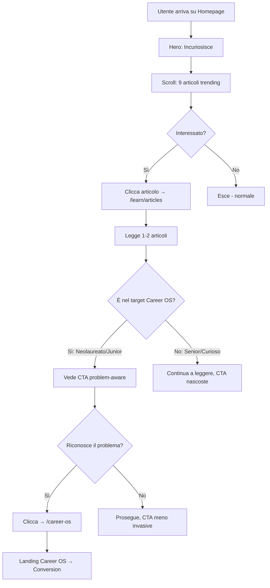

# Phase 0 Foundation — Brainstorming Decisionale

> **Obiettivo:** Definire le decisioni operative per i 4 pilastri della Phase 0, valutando trade-off, effort, e impatto sulla strategia.

---

## 🎯 I 4 Pilastri da Decidere

| # | Area | Domanda Chiave | Effort Stimato |
|:--|:-----|:---------------|:---------------|
| 1 | **Setup Sito** | Come posizionare blog (reader) vs Career OS (target)? | 1-2 giorni |
| 2 | **Sistema Pagamento** | Quale soluzione per incassare in modo semplice? | 2-4 ore |
| 3 | **Application Form** | Build custom vs tool esterno (Tally/Typeform)? | 0.5-4 ore |
| 4 | **Lead Magnet** | Quali contenuti free per catturare contatti? | 2-5 giorni |

---

# 1) Setup Sito stAItuned

## Filosofia di Design

> **Principio guida:** Il sito deve **attrarre e incuriosire** chi è interessato all'AI, **senza dare la sensazione di vendere**. L'utente deve scoprire Career OS naturalmente, non sentirselo spinto addosso.

### Il Problema da Evitare

```
❌ Approccio "Venditore Aggressivo"
┌────────────────────────────────────────────────────────────────┐
│  Utente arriva → BAM! Pop-up "Compra Career OS!"               │
│  Scrolls → Banner "Iscriviti subito!"                          │
│  Legge articolo → CTA enorme "Non perdere l'offerta!"          │
│                                                                │
│  Risultato: Utente scappa, brand percepito come spam           │
└────────────────────────────────────────────────────────────────┘
```

### L'Approccio Corretto: "Content-First, Problem-Aware"

```
✅ Approccio "Valore Prima, Vendita Dopo"
┌────────────────────────────────────────────────────────────────┐
│  Utente arriva → Contenuto interessante, zero pressione        │
│  Scrolls → Si incuriosisce, scopre articoli di qualità         │
│  Legge 2-3 articoli → Vede CTA sottili, problem-aware          │
│  Riconosce il problema → Clicca spontaneamente su Career OS    │
│                                                                │
│  Risultato: Utente convinto, non forzato                       │
└────────────────────────────────────────────────────────────────┘
```

---

## User Journey Strategico

### Il Funnel Visivo



---

## Struttura Homepage

### Layout Proposto

```
┌─────────────────────────────────────────────────────────────────┐
│                          HEADER                                  │
│  [Logo] | Learn | Career OS | Chi Siamo | [CTA: Inizia Gratis]  │
├─────────────────────────────────────────────────────────────────┤
│                                                                 │
│                    HERO SECTION (Pain + Mission)                │
│                                                                 │
│   🎯 "L'AI sta cambiando tutto.                                 │
│       Tu stai cambiando con lei?"                               │
│                                                                 │
│   Il mercato AI cerca genai engineers, ma il 90% dei            │
│   candidati non sa come posizionarsi.                           │
│                                                                 │
│   stAItuned: Impara l'AI da chi la costruisce ogni giorno.      │
│   Articoli, guide e tutorial per chi vuole capire davvero.      │
│                                                                 │
│   [Esplora gli articoli ↓]        [Scopri Career OS →]          │
│                                                                 │
├─────────────────────────────────────────────────────────────────┤
│                                                                 │
│                    ARTICLES SECTION (9)                         │
│                                                                 │
│   [🔥 Trending]  [🕐 Recent]  ← Toggle switch                   │
│                                                                 │
│   ┌─────────┐  ┌─────────┐  ┌─────────┐                        │
│   │ Art. 1  │  │ Art. 2  │  │ Art. 3  │                        │
│   └─────────┘  └─────────┘  └─────────┘                        │
│   ┌─────────┐  ┌─────────┐  ┌─────────┐                        │
│   │ Art. 4  │  │ Art. 5  │  │ Art. 6  │                        │
│   └─────────┘  └─────────┘  └─────────┘                        │
│   ┌─────────┐  ┌─────────┐  ┌─────────┐                        │
│   │ Art. 7  │  │ Art. 8  │  │ Art. 9  │                        │
│   └─────────┘  └─────────┘  └─────────┘                        │
│                                                                 │
│              [Vedi tutti gli articoli → /learn/articles]        │
│                                                                 │
├─────────────────────────────────────────────────────────────────┤
│                                                                 │
│              INTERMEZZO CTA (Solo utenti target)                │
│              + Lead Magnet opzionale                            │
│                                                                 │
│   ⚠️ Stai cercando lavoro nell'AI ma nessuno risponde?         │
│                                                                 │
│   Il problema non è il mercato. È come ti presenti.             │
│   [Scopri come posizionarti →]                                  │
│                                                                 │
│   ------- oppure -------                                        │
│                                                                 │
│   📥 Scarica la CV Rubric: la checklist per passare lo screening│
│   [Scarica Gratis →]                                            │
│                                                                 │
│   (Lead magnet come alternativa soft per chi non è pronto)      │
│                                                                 │
├─────────────────────────────────────────────────────────────────┤
│                                                                 │
│                         FOOTER                                  │
│                                                                 │
└─────────────────────────────────────────────────────────────────┘
```

---

## CTA Strategy: Pain-First Progressive Disclosure

### Il Principio

> **Il pain deve emergere SUBITO.** Non aspettare che leggano articoli. Chi arriva vede contenuto interessante E viene incuriosito dal problema che risolvi.

### Visibilità CTA: Chi Vede Cosa

| Utente | Vede CTA? | Tipo CTA | Note |
|:-------|:----------|:---------|:-----|
| Prima visita (sconosciuto) | ✅ Sì | Soft (problem-aware) | Incuriosisce senza vendere |
| Ha letto 2+ articoli | ✅ Sì | Strong (pain-focused) | Più diretto |
| Ha scaricato lead magnet | ✅ Sì | Strong + Audit CTA | Già qualificato |
| Ha cliccato "Non ora" | ❌ No per 30 giorni | Nessuna | Rispetto della scelta |

> **IMPORTANTE:** Anche alla prima visita, l'utente VEDE una CTA soft. Il pain è visibile fin da subito, non nascosto.

---

### Level 1: CTA Soft (Problem-Aware) — VISIBILE A TUTTI

**Quando appare:** Subito, per tutti gli utenti (anche prima visita).

**Dove:**
- Homepage: Intermezzo section
- Articoli: Banner in-article (dopo paragrafo 2-3)
- Sidebar/Footer

**CTA Example (Banner in-article):**
```
┌─────────────────────────────────────────────────────────────────┐
│  ⚠️ Ti riconosci?                                     [× Non ora]│
│                                                                 │
│  "50+ candidature AI, zero risposte"                            │
│  "Non so se sono DS, ML Eng o GenAI Eng"                        │
│  "Il mio CV dice 'AI enthusiast' ma non ho proof"               │
│                                                                 │
│  Se una di queste ti suona familiare, non sei solo.             │
│  [Scopri come uscirne →]                                        │
└─────────────────────────────────────────────────────────────────┘
```

**Caratteristiche:**
- **Pain subito visibile** (le frasi sono pain statements)
- Non dice "compra", dice "scopri"
- Ha bottone dismiss ("Non ora") → nasconde per 30 giorni
- Tono identificativo (il target si riconosce)

---

### Level 2: CTA Strong (Pain-Focused) — AFTER ENGAGEMENT

**Quando appare:** Dopo che l'utente ha:
- Visitato 2+ articoli
- **O** scaricato un lead magnet
- **O** tempo sul sito > 5 minuti

**CTA Example (Intermezzo section homepage):**
```
┌─────────────────────────────────────────────────────────────────┐
│                                                                 │
│   ⚠️ Il problema che nessuno ti dice                 [× Non ora]│
│                                                                 │
│   Puoi leggere tutti gli articoli AI del mondo.                 │
│   Ma se il tuo CV dice "AI Enthusiast" invece di                │
│   "GenAI Engineer", i recruiter non ti chiameranno mai.         │
│                                                                 │
│   Il mercato AI sta esplodendo.                                 │
│   La domanda è: tu sarai pronto quando busseranno?              │
│                                                                 │
│   [Fai il GenAI Role Fit Check gratuito →]                      │
│                                                                 │
└─────────────────────────────────────────────────────────────────┘
```

**Caratteristiche:**
- Enfatizza il **problema reale** (FOMO + urgenza)
- Tono diretto ma non aggressivo
- CTA è un "check" gratuito, non un acquisto
- Ha bottone dismiss → nasconde per 30 giorni

---

## Smart CTA Hiding: Non Infastidire Chi Non È Interessato

> **✅ DECISIONE:** Approccio semplificato. Tracking solo di chi clicca "Non mi interessa".

### Il Meccanismo (Semplificato)

Alcuni utenti **non sono nel target** Career OS:
- Senior AI professional (leggono per aggiornarsi)
- Curiosi/Manager (capiscono AI per il lavoro)
- Sviluppatori già impiegati (non cercano lavoro)

**Obiettivo:** Non fargli vedere CTA Career OS (li infastidisce e danneggia il brand).

### Unico Segnale Tracciato

| Segnale | Azione |
|:--------|:-------|
| Ha cliccato "Non mi interessa" / "X" su CTA | Nascondi CTA per 30 giorni |

> **Nota:** Per utenti che non danno consenso cookie, le CTA appaiono normalmente (non possiamo tracciare). È accettabile.

### Implementazione Tecnica

```typescript
// Logica CTA visibility (semplificata)

const CTA_DISMISSED_KEY = 'career_cta_dismissed';
const DISMISS_DURATION_DAYS = 30;

function shouldShowCareerCTA(): boolean {
  // Check localStorage (funziona anche senza cookie consent per preferenze UX)
  const dismissed = localStorage.getItem(CTA_DISMISSED_KEY);
  
  if (dismissed) {
    const dismissedDate = new Date(dismissed);
    const now = new Date();
    const daysSinceDismiss = (now - dismissedDate) / (1000 * 60 * 60 * 24);
    
    if (daysSinceDismiss < DISMISS_DURATION_DAYS) {
      return false; // Ancora nascosto
    }
  }
  
  return true; // Mostra CTA
}

function dismissCareerCTA(): void {
  localStorage.setItem(CTA_DISMISSED_KEY, new Date().toISOString());
  
  // Track su GA (se consenso dato)
  if (window.gtag) {
    gtag('event', 'cta_dismissed', {
      event_category: 'career_os',
      event_label: 'user_not_interested'
    });
  }
}
```

### CTA Dismissal UX

Ogni CTA ha un piccolo "× Non ora" che:
1. Nasconde la CTA immediatamente
2. Salva in localStorage (no cookie necessario)
3. **Non mostra più CTA Career OS per 30 giorni**
4. Traccia evento su GA (se consenso dato)
5. Mostra toast: "Ok, non ti mostreremo più questo per 30 giorni"

```
┌─────────────────────────────────────────────────────────────────┐
│  ⚠️ Ti riconosci in questo problema?                 [× Non ora]│
│  ...                                                            │
└─────────────────────────────────────────────────────────────────┘

↓ Click "Non ora"

┌─────────────────────────────────────────────────────────────────┐
│  ✓ Ok, non ti mostreremo più questo per 30 giorni              │
└─────────────────────────────────────────────────────────────────┘
```

### GA Tracking Events (da implementare)

| Evento | Trigger | Parametri |
|:-------|:--------|:----------|
| `cta_view` | CTA appare in viewport | `cta_type: soft/strong`, `location: homepage/article` |
| `cta_click` | Click su CTA | `cta_type`, `destination: career-os/audit` |
| `cta_dismissed` | Click su "X" / "Non ora" | `cta_type`, `location` |
| `article_view` | Visita articolo | `article_slug`, `category` |
| `scroll_depth` | 25/50/75/100% scroll | `depth`, `article_slug` |

---

## Route Structure

```
staituned.com/
├── /                        → Homepage (Hero + 9 trending + CTA smart)
├── /learn                   → Redirect a /learn/articles
├── /learn/articles          → Blog completo (tutti gli articoli, filtri, search)
├── /learn/articles/[slug]   → Singolo articolo (CTA in-article smart)
├── /career-os               → Landing page Career OS
├── /career-os/apply         → Form application (embedded o dedicato)
└── /chi-siamo               → About page
```

---

## Homepage: Effort e Priorità

| Componente | Stato Attuale | Effort | Priorità |
|:-----------|:--------------|:-------|:---------|
| Hero (nuovo copy) | 🔄 Revisionare | 2h | 🔴 Alta |
| Trending articles (9) | 🔄 Limit a 9 | 1h | 🔴 Alta |
| Link a /learn/articles | ✅ Semplice | 30min | 🔴 Alta |
| Intermezzo CTA | 🆕 Creare | 2-3h | 🟡 Media |
| Smart CTA hiding | 🆕 Creare | 4-6h | 🟡 Media |

**Effort totale homepage:** ~1 giorno

---

# 1.B) Career OS Landing Page

## Filosofia

> La landing Career OS deve **convertire**, ma con **rispetto**. Chi arriva qui ha già mostrato interesse — non serve urlare. Serve chiarire il valore.

### Tone of Voice

| ❌ Da Evitare | ✅ Da Usare |
|:--------------|:-----------|
| "OFFERTA IMPERDIBILE!!!" | "Ecco cosa ottieni" |
| "Ultimi 3 posti!" (fake scarcity) | "Posti limitati a 10 per coorte" (vero) |
| "Garantiamo il lavoro" | "Ti prepariamo, non promettiamo miracoli" |
| Testimonial finti | Case study reali con nomi |

---

## Struttura Landing Page

### Option A: Long-Form Sales Page (Consigliata)

Per un prodotto €590-1.190, serve **spiegare bene**.

```
┌─────────────────────────────────────────────────────────────────┐
│                         HERO (Pain-First)                       │
│                                                                 │
│   "50+ candidature AI. Zero risposte.                           │
│   Ti suona familiare?"                                          │
│                                                                 │
│   Il problema non sei tu. È che nessuno ti ha insegnato         │
│   come posizionarti per ruoli Applied GenAI.                    │
│                                                                 │
│   Career OS è il percorso che ti porta da "nessuna risposta"    │
│   a "colloquio fissato". In 4-8 settimane.                      │
│                                                                 │
│   Mentoring da AI professionals che assumono.                   │
│   Non teoria. Insider knowledge reale.                          │
│                                                                 │
│   [Prenota un Audit Gratuito →]                                 │
│                                                                 │
├─────────────────────────────────────────────────────────────────┤
│                                                                 │
│                     IL PROBLEMA (Approfondimento)               │
│                                                                 │
│   • Confuso tra DS, ML Eng, e GenAI Eng?                        │
│   • CV con "AI/ML enthusiast" ma nessuna proof "da engineer"?   │
│   • Colloqui tecnici GenAI in arrivo e non sai cosa aspettarti? │
│                                                                 │
│   Il mercato cerca GenAI Engineers.                             │
│   Ma se non sai come presentarti, resti invisibile.             │
│                                                                 │
├─────────────────────────────────────────────────────────────────┤
│                                                                 │
│                     LA SOLUZIONE                                │
│                                                                 │
│   Career OS è un percorso di 4-8 settimane (track-based):       │
│                                                                 │
│   ✅ Role-fit: Scegli il track giusto (RAG / Agent / Product)   │
│   ✅ CV/LinkedIn: Ottimizzati per ATS e hiring manager AI       │
│   ✅ Proof pubblica "da engineer": demo + repo + evaluation     │
│   ✅ Interview readiness: RAG/Agents/Eval/Tradeoffs reali       │
│                                                                 │
│   Impari da chi assume per questi ruoli, non career coach.      │
│                                                                 │
├─────────────────────────────────────────────────────────────────┤
│                                                                 │
│                     AI EXPERT GUIDANCE                          │
│                                                                 │
│   [Foto Team] + Bio breve                                       │
│   "Senior AI professionals che assumono, costruiscono e         │
│    shippano AI ogni giorno. Insider knowledge reale."           │
│                                                                 │
│   • Sai cosa conta davvero per gli hiring manager               │
│   • Accelerazione: evitiamo perdite di tempo                    │
│   • Credibilità: la tua proof validata da chi lavora nel campo  │
│                                                                 │
├─────────────────────────────────────────────────────────────────┤
│                                                                 │
│                     COME FUNZIONA                               │
│                                                                 │
│   Week 1-2: Role-fit + Job targeting (track selection)          │
│   Week 3-4: CV/LinkedIn + JD tailoring                          │
│   Week 5-6: Proof project standard per track (demo+repo+eval)   │
│   Week 7-8: Interview prep GenAI + mock                         │
│                                                                 │
├─────────────────────────────────────────────────────────────────┤
│                                                                 │
│                     RISULTATI (Case Study)                      │
│                                                                 │
│   ┌─────────────────┐  ┌─────────────────┐                     │
│   │ [Foto] Marco    │  │ [Foto] Sara     │                     │
│   │ 0 → 5 colloqui  │  │ Pivot → GenAI   │                     │
│   │ in 6 settimane  │  │ in 4 settimane  │                     │
│   │ [Leggi storia]  │  │ [Leggi storia]  │                     │
│   └─────────────────┘  └─────────────────┘                     │
│                                                                 │
├─────────────────────────────────────────────────────────────────┤
│                                                                 │
│                     PRICING (3 TIER)                            │
│                                                                 │
│ ┌────────────┐  ┌────────────┐  ┌────────────────┐             │
│ │  STARTER   │  │    PRO     │  │     ELITE      │             │
│ │   €590     │  │  €1.190    │  │    €1.990      │             │
│ │ 4 settimane│  │ 8 settimane│  │ 8 sett + 12 mo │             │
│ │            │  │            │  │                │             │
│ │• Role-fit  │  │✓ Tutto     │  │✓ Tutto Pro +   │             │
│ │• CV/LinkedIn│  │  Starter + │  │• Tool 12 mesi  │             │
│ │• 3 JD pack │  │• 10 JD pack│  │• 1 office hour │             │
│ │• 1 articolo│  │• Progetto  │  │  /mese         │             │
│ │            │  │• Mock interv│  │• Priority review│             │
│ │            │  │ ← Popolare │  │                │             │
│ │[Scegli →]  │  │[Scegli →]  │  │ [Scegli →]     │             │
│ └────────────┘  └────────────┘  └────────────────┘             │
│                                                                 │
│   💳 Pagamento in 2 rate disponibile                            │
│                                                                 │
├─────────────────────────────────────────────────────────────────┤
│                                                                 │
│                     FAQ                                         │
│                                                                 │
│   ▸ "Garantite il lavoro?"                                      │
│     No. Promettiamo deliverable e processo, non miracoli.       │
│                                                                 │
│   ▸ "E se non sono soddisfatto?"                                │
│     Feedback garantito + iterazioni entro limiti concordati.    │
│                                                                 │
│   ▸ "Quanto tempo devo dedicare?"                               │
│     5-8 ore/settimana per homework e sessioni.                  │
│                                                                 │
│   ▸ "Qual è la differenza con un bootcamp?"                     │
│     Noi = outcome-based (proof + candidabilità), non ore video. │
│                                                                 │
├─────────────────────────────────────────────────────────────────┤
│                                                                 │
│                     CTA FINALE                                  │
│                                                                 │
│   Non sei sicuro se fa per te?                                  │
│   Prenota un GenAI Role Fit Audit gratuito (15 min).            │
│   Ti dico onestamente se Career OS ha senso per la tua          │
│   situazione.                                                   │
│                                                                 │
│   [Prenota Audit Gratuito →]                                    │
│                                                                 │
└─────────────────────────────────────────────────────────────────┘
```

---

### Option B: Short Landing + Calendly (Alternativa veloce)

Se vuoi lanciare **subito** con meno sforzo.

```
┌─────────────────────────────────────────────────────────────────┐
│                                                                 │
│   "Vuoi diventare GenAI Engineer?"                              │
│                                                                 │
│   Career OS è un percorso 1:1 di 4-8 settimane.                 │
│   Ti preparo per il ruolo, il CV, e il colloquio.               │
│                                                                 │
│   [Vedi dettagli ↓]        [Prenota Call Gratuita →]            │
│                                                                 │
├─────────────────────────────────────────────────────────────────┤
│                                                                 │
│   Cosa include:                                                 │
│   ✅ Role-fit + Job targeting                                   │
│   ✅ CV/LinkedIn ottimizzati                                    │
│   ✅ Proof project (articolo + demo)                            │
│   ✅ Interview prep GenAI                                       │
│                                                                 │
│   Prezzi: Starter €590 | Pro €1.190                             │
│                                                                 │
├─────────────────────────────────────────────────────────────────┤
│                                                                 │
│   [Calendly Embed - Prenota 15 min]                             │
│                                                                 │
└─────────────────────────────────────────────────────────────────┘
```

**Effort:** 2-3 ore vs 6-8 ore per long-form.

---

## Raccomandazione Landing Career OS

| Fase | Approccio | Razionale |
|:-----|:----------|:----------|
| **Settimana 1-2** | Short landing + Calendly | Lancia veloce, valida interesse |
| **Dopo 5 clienti** | Long-form sales page | Hai case study, puoi convincere meglio |

---

## ❓ Domande da Decidere (Sito)

1. **Smart CTA hiding:** Vuoi implementarlo subito o partire semplice?
   - Semplice: CTA sempre visibili dopo 2 articoli
   - Smart: Logica di hiding (effort ~4-6h extra)

2. **Landing Career OS:** Long-form o short landing inizialmente?

3. **Intermezzo CTA homepage:** Copy esatto da usare per il pain-focused message?

4. **Tracking:** Vuoi setup analytics per tracciare il funnel (article views → CTA click → apply)?

---

# 2) Sistema di Pagamento

## Opzioni

### Opzione A: Stripe Payment Links

**Cos'è:** Link diretto che apre una pagina Stripe pre-configurata con prodotto/prezzo.

**Come funziona:**
1. Crei prodotto su Stripe (es. "Career OS Starter - €590")
2. Generi Payment Link
3. Mandi il link al cliente dopo la call
4. Stripe gestisce tutto (pagamento, ricevuta, webhook)

**Pro:**
- ✅ Zero sviluppo
- ✅ Attivo in 15 minuti
- ✅ Rate/abbonamenti supportati
- ✅ Ricevute automatiche
- ✅ Dashboard analytics

**Contro:**
- ❌ Esperienza "staccata" dal sito
- ❌ Meno branding (è pagina Stripe)
- ❌ Fee standard Stripe (1.4-2.9% + €0.25)

---

### Opzione B: Stripe Checkout integrato

**Cos'è:** Bottone sul tuo sito che apre Stripe Checkout (overlay o redirect).

**Come funziona:**
1. Crei prodotto/prezzo su Stripe
2. Integri Stripe Checkout via Next.js API route
3. L'utente paga senza "uscire" troppo dal sito

**Pro:**
- ✅ Esperienza più integrata
- ✅ Puoi tracciare meglio conversioni
- ✅ Più controllo sul flow

**Contro:**
- ❌ Richiede 2-4 ore di sviluppo
- ❌ Devi gestire webhook (per conferma)
- ❌ Stesse fee Stripe

---

### Opzione C: Stripe + LemonSqueezy / Gumroad

**Cos'è:** Usare una piattaforma "wrapper" sopra Stripe.

**Pro:**
- ✅ UI più bella out of the box
- ✅ Gestione IVA/VAT automatica (LemonSqueezy)
- ✅ Affiliati built-in

**Contro:**
- ❌ Fee più alte (3-5% + Stripe fee)
- ❌ Dipendenza da terzo servizio

---

## 🔍 Analisi Trade-off

| Criterio | Payment Links | Checkout integrato | Lemon/Gumroad |
|:---------|:--------------|:-------------------|:--------------|
| **Sforzo setup** | 🟢 15 min | 🟡 2-4 ore | 🟢 30 min |
| **Esperienza utente** | 🟡 OK | 🟢 Migliore | 🟢 Buona |
| **Costi** | 🟢 Solo Stripe | 🟢 Solo Stripe | 🔴 +3-5% |
| **Scalabilità** | 🟢 Alta | 🟢 Alta | 🟡 Media |
| **VAT/Compliance** | 🟡 Manuale | 🟡 Manuale | 🟢 Auto |

---

## ✅ DECISIONE: Stripe Payment Links (solo in call)

> **Approccio:** Payment link mandato **solo durante/dopo la discovery call**. Non esposto sul sito.

**Razionale:**
- Nessuno compra €590+ senza parlare prima
- Il link è personale (puoi tracciare chi paga)
- Zero friction di setup

**Setup immediato:**
1. Crea prodotti su Stripe:
   - "Career OS Starter (Beta Offer)" - €390
   - "Career OS Starter" - €590
   - "Career OS Pro (Beta Offer)" - €790
   - "Career OS Pro" - €1.190
   - "Career OS Elite (Beta Offer)" - €1.490
   - "Career OS Elite" - €1.990
2. Genera Payment Links per ciascuno
3. Salva i link in un doc/Notion per usarli nelle call
4. Invia link via messaggio/email dopo la call

**Flow:**
```
Call → Decisione tier → "Ti mando il link per pagare" → Stripe Payment Link
```

**Effort:** 30-45 minuti

---

# 3) Application Form

## ✅ DECISIONE: Form Custom (Next.js + Firebase + Telegram)

> **Motivi:**
> - Pro-brand (UX integrata)
> - Veloce da implementare (~mezza giornata)
> - Facile da tracciare su GA
> - Telegram già connesso (notifiche gratis)
> - Firebase già disponibile

---

## Stack Tecnico

| Componente | Tecnologia | Note |
|:-----------|:-----------|:-----|
| **Frontend** | React + Next.js | Form multi-step |
| **Backend** | Next.js API Route | Salva + notifica |
| **Database** | Firebase Firestore | Collection `applications` |
| **Notifiche** | Telegram Bot | Già configurato |
| **Analytics** | GA4 | Eventi custom |

---

## Contenuto Form (Domande Essenziali)

> **Principio:** Minimo necessario per qualificare + dare contesto alla call.

### Step 1: Chi sei

| Campo | Tipo | Obbligatorio | Perché |
|:------|:-----|:-------------|:-------|
| Nome | Text | ✅ | Personalizzazione |
| Email | Email | ✅ | Contatto |
| Background | Select: Studente magistrale / Neolaureato (≤12 mesi) / Junior SWE (0-2y) / Career switcher / Altro | ✅ | Segmentazione ICP |

### Step 2: Obiettivo

| Campo | Tipo | Obbligatorio | Perché |
|:------|:-----|:-------------|:-------|
| Ruolo target | Select: RAG Engineer / Agent Engineer / GenAI Product Eng / Non so ancora | ✅ | Track selection |
| Timeline | Select: Sto cercando ora / Nei prossimi 3 mesi / Più avanti | ✅ | Urgenza |

### Step 3: Situazione attuale

| Campo | Tipo | Obbligatorio | Perché |
|:------|:-----|:-------------|:-------|
| Blocco principale | Select: Non so quale ruolo / CV non converte / No portfolio / Interview anxiety / Altro | ✅ | Pain |
| Candidature ultimo mese | Select: 0 / 1-10 / 11-30 / 30+ | ✅ | Urgenza/effort |

### Step 4: Contatto (opzionale)

| Campo | Tipo | Obbligatorio | Perché |
|:------|:-----|:-------------|:-------|
| LinkedIn URL | URL | ⬜ | Pre-review profilo |
| Note aggiuntive | Textarea | ⬜ | Contesto libero |

---

## GA Tracking Events

| Evento | Trigger | Parametri |
|:-------|:--------|:----------|
| `form_start` | Form aperto | `source: homepage/career-os` |
| `form_step_complete` | Ogni step completato | `step: 1/2/3/4` |
| `form_submit` | Submit finale | `background`, `role_target`, `urgency` |
| `form_abandon` | Chiuso senza submit | `last_step` |

---

## Telegram Notification Format

```
🆕 Nuova Application Career OS

👤 Nome: [nome]
📧 Email: [email]
🎓 Background: [background]
🎯 Ruolo: [ruolo_target]
⏰ Timeline: [timeline]
🚧 Blocco: [blocco]
📝 Candidature: [candidature]
🔗 LinkedIn: [url o "Non fornito"]

📅 Prenota call: [link calendly con pre-fill email]
```

---

## Implementazione

```typescript
// Pseudo-struttura API route

interface ApplicationData {
  name: string;
  email: string;
  background: 'student' | 'new_grad' | 'junior_swe' | 'switcher' | 'other';
  roleTarget: 'rag' | 'agent' | 'product' | 'unsure';
  timeline: 'now' | '3months' | 'later';
  mainBlock: 'role' | 'cv' | 'portfolio' | 'interview' | 'other';
  applications: '0' | '1-10' | '11-30' | '30+';
  linkedinUrl?: string;
  notes?: string;
  createdAt: Timestamp;
  source: string; // da query param
}

// POST /api/career-os/apply
async function handler(req, res) {
  const data: ApplicationData = req.body;
  
  // 1. Salva in Firestore
  await db.collection('applications').add({
    ...data,
    createdAt: FieldValue.serverTimestamp(),
  });
  
  // 2. Notifica Telegram
  await sendTelegramNotification(formatApplicationMessage(data));
  
  // 3. (Opzionale) GA server-side event
  
  return res.json({ success: true });
}
```

**Effort stimato:** 4-6 ore (mezza giornata)

---

# 4) Lead Magnet — Playbook/Tutorial/Guide Free

## Il Principio

> Un lead magnet efficace **non è contenuto generico**. È un **"campione gratuito del prodotto"** che mostra il tuo approccio unico.

---

## Framework: Lead Magnet Ladder

```
                    ┌─────────────────┐
                    │ PAID: Career OS │  ← Prodotto
                    │ (€590-€1.190)   │
                    └────────┬────────┘
                             │
                    ┌────────▼────────┐
                    │ FREE: Audit     │  ← Qualificazione
                    │ (15 min call)   │
                    └────────┬────────┘
                             │
            ┌────────────────┼────────────────┐
            │                │                │
   ┌────────▼────────┐ ┌─────▼──────┐ ┌───────▼───────┐
   │ Guide/Playbook  │ │ Template   │ │ Mini-corso    │
   │ (PDF/Notion)    │ │ (Notion)   │ │ (5 email)     │
   │                 │ │            │ │               │
   └────────┬────────┘ └─────┬──────┘ └───────┬───────┘
            │                │                │
            └────────────────┼────────────────┘
                             │
                    ┌────────▼────────┐
                    │ BLOG CONTENT    │  ← Traffico SEO
                    │ (Articoli free) │
                    └─────────────────┘
```

---

## Opzioni Lead Magnet

### Opzione 1: "GenAI Role Fit Guide" (PDF/Notion)

**Contenuto:**
- Differenza tra ruoli AI (DS vs ML Eng vs GenAI Eng)
- Checklist: "Sei pronto per candidarti?"
- 5 errori comuni nel posizionarsi
- CTA: Prenota Audit

**Pro:**
- Veloce da creare (2-3 ore)
- Evergreen (non scade)
- Download = email catturata

**Contro:**
- Bassa perceived value (PDF = commodity)
- Richiede follow-up email per convertire

---

### Opzione 2: "CV Rubric for GenAI Roles" (Template)

**Contenuto:**
- La rubrica che USI TU per valutare i CV
- Checklist: Cosa deve avere un CV per GenAI
- Esempi: Prima/Dopo
- CTA: "Vuoi che lo valuti io? Prenota Audit"

**Pro:**
- Altissima perceived value (è il tuo "segreto")
- Molto actionable
- Dimostra expertise

**Contro:**
- Richiede 3-4 ore per farlo bene
- Potrebbe cannibalizzare il servizio? (No, perché non è la stessa cosa)

---

### Opzione 3: "5-Day GenAI Career Sprint" (Email Sequence)

**Struttura:**
- **Day 1:** Role Fit — quale ruolo fa per te
- **Day 2:** CV Audit — i 3 errori che ti bloccano
- **Day 3:** Proof Strategy — come costruire credibilità
- **Day 4:** Interview Prep — cosa ti chiederanno
- **Day 5:** Next Steps — il tuo piano d'azione

**Pro:**
- Engagement alto (5 touchpoint)
- Nurturing automatico
- Mostra il tuo framework/approccio

**Contro:**
- Richiede 1-2 giorni per scrivere
- Richiede email automation setup

---

### Opzione 4: "GenAI Interview Questions Bank" (Notion/PDF)

**Contenuto:**
- 30-50 domande reali da colloqui GenAI
- Organizzate per categoria (RAG, Agents, Eval, Product)
- Con hints/risposte brevi
- CTA: "Vuoi prepararti con un esperto? Prenota Audit"

**Pro:**
- Altissima perceived value
- Molto cercato (SEO potential)
- Direttamente legato al servizio

**Contro:**
- Richiede 4-6 ore per farlo bene
- Potrebbe cannibalizzare mock interview? (No, perché è diverso)

---

### Opzione 5: "Proof Project Template" (GitHub + Tutorial)

**Contenuto:**
- Template repo per progetto GenAI (RAG / Agent)
- README strutturato "da engineer"
- Evaluation framework incluso
- Tutorial di accompagnamento

**Pro:**
- Altissima credibilità tecnica
- Dimostra expertise engineering
- Virale tra dev community

**Contro:**
- Richiede 1-2 giorni per farlo bene
- Target più stretto (solo chi fa progetti)

---

## 🔍 Analisi Trade-off

| Lead Magnet | Effort | Perceived Value | Conversion Potential | Scalabilità |
|:------------|:-------|:----------------|:---------------------|:------------|
| **Role Fit Guide** | 🟢 2-3h | 🟡 Medio | 🟡 Medio | 🟢 Alta |
| **CV Rubric** | 🟡 3-4h | 🟢 Alto | 🟢 Alto | 🟢 Alta |
| **5-Day Sprint** | 🔴 1-2gg | 🟢 Alto | 🟢 Alto | 🟢 Alta |
| **Interview Bank** | 🟡 4-6h | 🟢 Alto | 🟢 Alto | 🟢 Alta |
| **Proof Template** | 🔴 1-2gg | 🟢 Altissimo | 🟡 Medio | 🟡 Media |

---

## ✅ DECISIONE: Multi-Magnet Strategy

> **Principio:** Sì, ha senso avere più di un lead magnet in posti diversi del sito. Ogni lead magnet cattura utenti in fasi diverse del funnel.

### Lead Magnet Approvati

| Lead Magnet | Formato | Effort | Fase Funnel | Priorità |
|:------------|:--------|:-------|:------------|:---------|
| ✅ **Role Fit Guide** | PDF/Notion | 2-3h | Early (curiosità) | 🟡 2° |
| ✅ **CV Rubric** | PDF/Template | 3-4h | Mid (problema chiaro) | 🔴 1° |
| ✅ **5-Day Sprint** | Unico contenuto (pagina lunga) | 1-2gg | Mid (engagement) | 🟡 3° |
| ✅ **Interview Bank** | Notion/PDF | 4-6h | Late (già candidati) | 🔴 1° |
| ✅ **Proof Template** | GitHub + Tutorial | 1-2gg | Late (chi costruisce) | 🟡 3° |

> **✅ Decisioni confermate:**
> - **5-Day Sprint:** Multi-pagina (non email sequence, non pagina singola)
> - **Email capture:** Custom implementation Firebase + Telegram per notifiche

---

## Strategia di Placement: Dove Mettere Cosa

### Il Principio

> Ogni lead magnet intercetta un **intent diverso**. Posizionali dove l'utente ha quell'intent.

```
┌─────────────────────────────────────────────────────────────────────────┐
│                         USER JOURNEY                                    │
├─────────────────────────────────────────────────────────────────────────┤
│                                                                         │
│  [Curioso AI]  →  [Valuta carriera]  →  [Cerca lavoro]  →  [Preparato] │
│       ↓                  ↓                   ↓                  ↓      │
│  Role Fit Guide    CV Rubric        Interview Bank    Proof Template   │
│                                                                         │
└─────────────────────────────────────────────────────────────────────────┘
```

### Placement Map

| Posizione | Lead Magnet | Trigger/Contesto |
|:----------|:------------|:-----------------|
| **Homepage (Intermezzo CTA)** | CV Rubric | Dopo scroll articoli, problem-aware |
| **Articoli Career (ruoli, CV)** | CV Rubric + Role Fit Guide | In-article CTA |
| **Articoli Interview** | Interview Bank | Naturale correlazione |
| **Articoli Tecnici (RAG, Agents)** | Proof Template | Chi legge vuole costruire |
| **Landing Career OS** | 5-Day Sprint (o CV Rubric) | Chi considera ma non pronto |
| **Footer/Sidebar** | Role Fit Guide | Catch-all generico |

---

## Implementazione Lead Magnet

### Struttura Comune (per tutti i lead magnet)

```
┌─────────────────────────────────────────────────────┐
│  🎯 [Titolo Lead Magnet]                            │
│                                                     │
│  [Breve descrizione valore - 1-2 righe]             │
│                                                     │
│  📧 Email: [________________]                       │
│                                                     │
│  [Scarica Gratis →]                                 │
│                                                     │
│  ✓ Niente spam, solo valore                         │
└─────────────────────────────────────────────────────┘
```

### Dopo il Download

1. **Email automatica** con link al contenuto
2. **Redirect a thank-you page** con:
   - Link download
   - CTA: "Vuoi un feedback personalizzato? Prenota Audit"
3. **Nurturing** (opzionale, futuro): sequenza 3 email post-download

---

## Timeline Creazione Lead Magnet

| Week | Lead Magnet | Effort | Note |
|:-----|:------------|:-------|:-----|
| **Week 1** | CV Rubric | 3-4h | Prima priorità, più actionable |
| **Week 1** | Interview Bank | 4-6h | Complementare, stesso effort session |
| **Week 3** | Role Fit Guide | 2-3h | Catch-all per early funnel |
| **Month 2** | 5-Day Sprint (pagina) | 1-2gg | Contenuto deep, engagement |
| **Month 2-3** | Proof Template | 1-2gg | Per pubblico tecnico avanzato |

---

## ❓ Domande Residue

1. **Email capture:** Usi Mailchimp, ConvertKit, o implementi custom con Firebase?
   - Custom = pieno controllo + GA tracking
   - External = più feature automation ma dipendenza

2. **Formato 5-Day Sprint:** Preferisci una pagina lunga scrollabile o un PDF multi-pagina?

3. **CV Rubric:** Vuoi creare il contenuto insieme ora?
- Libera tempo (non devi follow-up manualmente)
- Mostra il tuo framework completo

---

### Month 3+: Proof Project Template

**Perché:**
- Cementa posizionamento tecnico
- Viralità community dev
- Upsell naturale verso Pro (che include progetto)

---

## 📋 Struttura CV Rubric (Esempio)

```markdown
# GenAI CV Rubric — La Checklist per Passare lo Screening

## Come usare questa rubrica
Dai un punteggio 0-2 per ogni criterio. Totale < 8 = CV non pronto.

## Sezione 1: Headline & Positioning (max 6 punti)
| Criterio | 0 | 1 | 2 |
|:---------|:--|:--|:--|
| **Role clarity** | "AI Enthusiast" | "ML Engineer" | "GenAI Engineer (RAG/Agents)" |
| **Value proposition** | Assente | Vaga | Specifica (cosa fai + per chi) |
| **Keywords GenAI** | Nessuna | Generiche | Specifiche (RAG, LangChain, Eval) |

## Sezione 2: Experience (max 6 punti)
| Criterio | 0 | 1 | 2 |
|:---------|:--|:--|:--|
| **Relevance** | Solo accademico | Stage/progetto generico | Esperienza LLM/GenAI |
| **Quantification** | Nessun numero | Numeri vaghi | Metriche chiare |
| **Impact framing** | "Ho fatto X" | "Ho contribuito a Y" | "X ha portato a Y risultato" |

## Sezione 3: Proof (max 6 punti)
| Criterio | 0 | 1 | 2 |
|:---------|:--|:--|:--|
| **GitHub link** | Assente | Presente ma disordinato | Repo pulite con README |
| **Demo/Project** | Nessuno | Solo codice | Demo funzionante |
| **Write-up/Articolo** | Nessuno | Blog personale | Pubblicazione autorevole |

## Sezione 4: Technical Depth (max 4 punti)
| Criterio | 0 | 1 | 2 |
|:---------|:--|:--|:--|
| **Stack specifico** | "Python, ML" | "LangChain, OpenAI" | Stack completo + versioni |
| **Eval/Monitoring** | Non menzionato | Menzionato | Esperienza concreta |

---

## Il tuo punteggio: ___/22

- **18-22:** Sei pronto a candidarti. Focus su targeting e volume.
- **12-17:** CV migliorabile. Lavora su positioning e proof.
- **<12:** CV non competitivo. Serve ristrutturazione completa.

---

💡 **Vuoi un feedback personalizzato?**
[Prenota un GenAI Role Fit Audit gratuito →](LINK)
```

---

# 📊 Riepilogo Decisioni Confermate

## Matrice Decisionale Finale

| Area | Decisione | Dettaglio | Effort | Priorità |
|:-----|:----------|:----------|:-------|:---------|
| **1. Setup Sito** | Homepage Content-First | Trending/Recent toggle, CTA progressive | 1-2 giorni | 🔴 Alta |
| **1b. Career OS** | Long-form Landing | 3 tier, allineata a strategy | 4-6h | 🔴 Alta |
| **2. Pagamento** | Stripe Payment Links | Solo in call, non sul sito | 30-45 min | 🔴 Alta |
| **3. Application Form** | Custom (Firebase + Telegram) | Form multi-step, GA tracking | 4-6h | 🔴 Alta |
| **4. Lead Magnet** | Multi-Magnet Strategy | CV Rubric + Interview Bank (priorità 1) | 7-10h | 🟡 Media |

---

## ✅ Tecnologie Confermate

| Componente | Tecnologia |
|:-----------|:-----------|
| Database | Firebase Firestore |
| Notifiche | Telegram Bot (già connesso) |
| Analytics | GA4 (tutti i comportamenti) |
| Payment | Stripe Payment Links |
| Email (futuro) | TBD (custom o ConvertKit) |

---

## 📅 Timeline Proposta (Aggiornata)

### Week 1 (Foundation)

| Giorno | Task | Effort |
|:-------|:-----|:-------|
| **Day 1** | Setup Stripe Products + Payment Links (6 tier) | 45 min |
| **Day 1-2** | Creare form application custom | 4-6h |
| **Day 2-3** | Homepage: trending/recent toggle + CTA dimissibili | 3-4h |
| **Day 3-4** | Creare landing `/career-os` (long-form, 3 tier) | 4-6h |
| **Day 5** | Creare CV Rubric + Interview Bank | 7-10h |

### Week 2 (Soft Launch)

| Giorno | Task | Effort |
|:-------|:-----|:-------|
| **Day 1** | Primo post LinkedIn (lancio) | 1h |
| **Day 2-3** | Outreach DM (10-15 contatti caldi) | 2-3h |
| **Day 3-5** | Prime discovery call | 3-4h |

---

## 📈 GA Events da Implementare

| Evento | Trigger |
|:-------|:--------|
| `cta_view` | CTA appare in viewport |
| `cta_click` | Click su CTA Career OS |
| `cta_dismissed` | Click su "X" / "Non ora" |
| `article_view` | Visita articolo |
| `scroll_depth` | 25/50/75/100% scroll |
| `form_start` | Form application aperto |
| `form_step_complete` | Ogni step completato |
| `form_submit` | Submit finale |
| `form_abandon` | Chiuso senza submit |
| `lead_magnet_download` | Download lead magnet |

---

## ❓ Domanda Finale

**Priorità implementazione:** Quale dei 4 pilastri affrontiamo per primo?

| Opzione | Effort | Dipendenze |
|:--------|:-------|:-----------|
| **A) Homepage + CTA** | 3-4h | Nessuna |
| **B) Form custom** | 4-6h | Nessuna |
| **C) Landing Career OS** | 4-6h | Nessuna |
| **D) Lead Magnet (CV Rubric)** | 3-4h | Nessuna |

> **Suggerimento:** Consiglio **B) Form custom** o **C) Landing Career OS** perché sono i punti di conversione diretta. Gli altri li puoi fare in parallelo dopo.
