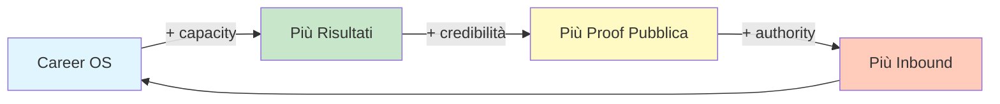
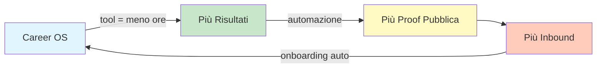
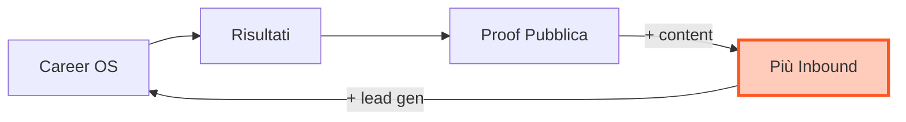
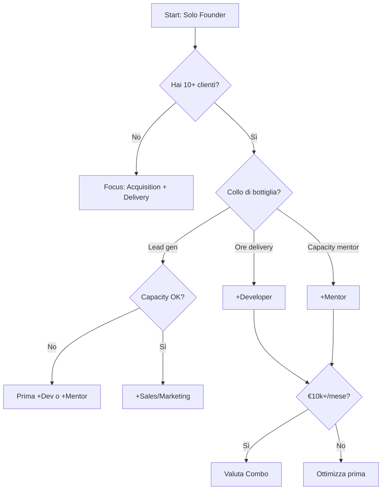

# Resource Impact Analysis — stAItuned GenAI Career OS

> **Tipo di analisi:** Human Capital Impact Analysis / Resource Leverage Analysis
> 
> **Obiettivo:** Valutare l'impatto di diverse risorse umane sul flywheel, unit economics, capacity e time-to-revenue del business stAItuned.

---

## Executive Summary

Questa analisi valuta **3 profili chiave** che potrebbero accelerare il business:

| Ruolo | Impatto Principale | Priorità | Gate di Ingresso |
|:------|:-------------------|:---------|:-----------------|
| **Mentor/Co-founder AI** | ↑ Capacity delivery, ↑ Credibilità | 🟡 Media | Post 10 clienti, processo validato |
| **Developer (Career OS Tools)** | ↓ Ore/cliente, ↑ Scalabilità | 🟢 Alta | Post validazione prodotto, backlog chiaro |
| **Sales & Marketing** | ↑ Lead gen, ↑ Conversion | 🔴 Bassa (ora) | Post product-market fit, funnel validato |

**Conclusione chiave:** L'ordine di priorità è **Developer > Mentor > Sales/Marketing**, ma il timing dipende dai gate strategici.

---

## 1) Profili Analizzati

### 1.1) Mentor/Co-founder AI

**Chi è:**
- Senior AI professional (3+ anni in ruoli Applied GenAI/ML)
- Esperienza diretta in hiring o leadership tecnica
- Credibilità pubblica (LinkedIn, pubblicazioni, talk)

**Cosa fa:**
- Co-delivery delle coorti (workshop, review, QA)
- Mentoring 1:1 premium
- Contenuti tecnici (proof, articoli, case study)
- Validazione tecnica dei progetti degli studenti

**Motivazione tipica:**
- Side income (€500-1500/mese part-time)
- Costruire personal brand
- Contribuire a un progetto con purpose
- Potenziale equity/partnership futura

---

### 1.2) Developer (Career OS Tools)

**Chi è:**
- Full-stack developer con competenze AI/LLM
- Familiarità con Next.js, Python, LLM APIs
- Può essere freelance, part-time, o contributor dal talent pipeline

**Cosa fa:**
- Sviluppo e manutenzione Career OS webapp
- Automazioni (JD tailoring, CV analysis, job targeting)
- Tool editorial planner (già esistente, da evolvere)
- Integrazioni (LinkedIn, ATS, calendly, payment)
- Dashboard analytics e monitoring

**Motivazione tipica:**
- Compenso orario/progetto (€30-60/h freelance)
- Esperienza su progetto AI reale
- Potenziale collaborazione continuativa

---

### 1.3) Sales & Marketing

**Chi è:**
- Professionista marketing B2C / growth
- Esperienza in EdTech, career services, o community building
- Competenze: content creation, funnel, LinkedIn, ads

**Cosa fa:**
- Content creation (LinkedIn, blog, SEO)
- Lead generation e nurturing
- Gestione funnel (audit → call → conversion)
- Community management
- Outreach e partnership (università, associazioni)

**Motivazione tipica:**
- Compenso fisso + performance bonus
- Interesse per AI/tech space
- Opportunità di crescita in early-stage

---

## 2) Impatto per Ruolo (Analisi Dettagliata)

### 2.1) Mentor/Co-founder AI

#### Impatto sul Flywheel



| Anello Flywheel | Impatto | Razionale |
|:----------------|:--------|:----------|
| **Career OS → Risultati** | ⬆️⬆️ Alto | Raddoppia capacity delivery (2 mentor = 2 coorti/mese) |
| **Risultati → Proof** | ⬆️ Medio | Più progetti QA, più articoli pubblicati |
| **Proof → Inbound** | ⬆️⬆️ Alto | **2 voci credibili** invece di 1 = più authority |
| **Inbound → Talent Pipeline** | ⬆️ Medio | Più studenti = più potenziali contributor |

#### Impatto su Unit Economics

| Metrica | Baseline (Solo Founder) | Con Mentor | Delta |
|:--------|:------------------------|:-----------|:------|
| **Coorti/mese** | 1 | 2 | +100% |
| **Studenti/mese** | 8-10 | 16-20 | +100% |
| **Revenue/mese (Cohort)** | €5k-6k | €10k-12k | +100% |
| **Ore founder/settimana** | 20-25h | 15-20h | -20% |
| **Costo mentor** | €0 | €800-1500/mese | +€800-1500 |
| **Margine netto aggiuntivo** | €0 | +€3.5k-5k/mese | ✅ Positivo |

#### Scenario Numerico: +1 Mentor (Part-Time, Rev Share 20%)

**Assunzioni:**
- Mentor gestisce 1 coorte/mese (8-10 pax)
- Revenue coorte: €300 × 10 = €3.000/mese
- Rev share: 20% = €600/mese al mentor
- Ore mentor: ~10h/mese

**Risultato:**
- **Revenue aggiuntiva:** +€3.000/mese
- **Costo mentor:** -€600/mese
- **Margine netto:** +€2.400/mese
- **€/h mentor:** €60/h (ottimo per part-time)

#### Gate di Ingresso

> [!IMPORTANT]
> **NON aggiungere un mentor prima del Gate:**
> - ✅ 10 clienti completati con deliverable
> - ✅ Processo documentato (SOP, rubriche, checklist)
> - ✅ Almeno 1 coorte pilota completata
> - ✅ Case study utilizzabili

**Perché:** Senza processo standardizzato, il mentor amplifica il caos invece di scalare la qualità.

#### Rischi e Mitigazioni

| Rischio | Probabilità | Impatto | Mitigazione |
|:--------|:------------|:--------|:------------|
| **Disallineamento qualità** | Media | Alto | QA obbligatorio, rubriche condivise |
| **Conflitto su ownership** | Bassa | Medio | Accordo scritto chiaro (rev share vs equity) |
| **Dipendenza da persona** | Media | Alto | Documentazione SOP, backup plans |
| **Diluzione brand** | Bassa | Alto | Il founder rimane "voce principale" |

---

### 2.2) Developer (Career OS Tools)

#### Impatto sul Flywheel



| Anello Flywheel | Impatto | Razionale |
|:----------------|:--------|:----------|
| **Career OS → Risultati** | ⬆️⬆️⬆️ Altissimo | Tool riducono ore/cliente del 50-70% |
| **Risultati → Proof** | ⬆️ Medio | Automazione QA e publishing |
| **Proof → Inbound** | ⬆️ Medio | Tool come lead magnet (freemium) |
| **Inbound → Pipeline** | ⬆️⬆️ Alto | Onboarding self-serve = più candidati |

#### Impatto su Unit Economics

| Metrica | Baseline (Solo Founder) | Con Developer | Delta |
|:--------|:------------------------|:--------------|:------|
| **Ore delivery/cliente** | 6-10h | 3-5h | -50% |
| **Capacity (clienti/mese)** | 10-15 | 20-30 | +100% |
| **€/h effettivo** | €90-112/h | €150-200/h | +50% |
| **Costo developer** | €0 | €1.500-3.000/mese | +€1.5k-3k |
| **Margine netto aggiuntivo** | €0 | +€3k-8k/mese | ✅ Molto Positivo |

#### Scenario Numerico: +1 Developer (Part-Time, 20h/settimana)

**Assunzioni:**
- Costo: €40/h × 80h/mese = €3.200/mese
- Riduzione ore delivery: da 8h a 4h/cliente
- Capacity aggiuntiva: +10 clienti/mese
- Revenue aggiuntiva: 10 × €600 (Pro Cohort) = €6.000/mese

**Risultato:**
- **Revenue aggiuntiva:** +€6.000/mese
- **Costo developer:** -€3.200/mese
- **Margine netto:** +€2.800/mese
- **ROI:** 87% (ottimo)

**Bonus nascosto:**
- Ogni miglioramento tool è **permanente** (compound effect)
- Tool può diventare prodotto standalone (revenue aggiuntiva)

#### Gate di Ingresso

> [!IMPORTANT]
> **NON aggiungere un developer prima del Gate:**
> - ✅ Prodotto validato (sai cosa costruire)
> - ✅ Backlog chiaro e prioritizzato
> - ✅ €3k+/mese di buffer per pagare senza stress
> - ✅ Tempo founder per gestire la collaborazione

**Perché:** Senza product clarity, il developer costruisce feature inutili. Invest in dev = invest in product vision.

#### Rischi e Mitigazioni

| Rischio | Probabilità | Impatto | Mitigazione |
|:--------|:------------|:--------|:------------|
| **Feature creep** | Alta | Medio | Backlog stretto, sprint 2 settimane |
| **Debito tecnico** | Media | Alto | Code review, standard, test |
| **Dipendenza da persona** | Alta | Alto | Documentazione, codice modulare |
| **Overbuilding** | Media | Medio | MVP mindset, validate before build |

---

### 2.3) Sales & Marketing

#### Impatto sul Flywheel



| Anello Flywheel | Impatto | Razionale |
|:----------------|:--------|:----------|
| **Career OS → Risultati** | ⬜ Nessuno | Non tocca delivery |
| **Risultati → Proof** | ⬆️ Medio | Può gestire publishing e distribution |
| **Proof → Inbound** | ⬆️⬆️⬆️ Altissimo | **Core skill:** content, SEO, LinkedIn |
| **Inbound → Pipeline** | ⬆️⬆️ Alto | Lead nurturing, call booking |

#### Impatto su Unit Economics

| Metrica | Baseline (Solo Founder) | Con Sales/Mktg | Delta |
|:--------|:------------------------|:---------------|:------|
| **Lead/mese** | 30-40 | 60-100 | +100-150% |
| **Conversion rate** | 15-20% | 20-25% | +25% |
| **Clienti/mese** | 5-7 | 12-20 | +100-200% |
| **Costo sales** | €0 | €1.500-2.500/mese | +€1.5k-2.5k |
| **Margine netto aggiuntivo** | €0 | +€3k-7k/mese | ✅ Positivo |

#### Scenario Numerico: +1 Sales/Marketing (Part-Time, Performance-Based)

**Assunzioni:**
- Base: €1.000/mese + 10% commission su closed
- Lead generati: +40/mese
- Conversion: 15% = 6 clienti extra
- Revenue: 6 × €800 (blended) = €4.800/mese
- Commission: €480/mese

**Risultato:**
- **Revenue aggiuntiva:** +€4.800/mese
- **Costo totale:** -€1.480/mese
- **Margine netto:** +€3.320/mese
- **ROI:** 124%

#### Gate di Ingresso

> [!WARNING]
> **NON aggiungere sales/marketing prima del Gate:**
> - ✅ Product-market fit validato (sai che converte)
> - ✅ Funnel testato e ottimizzato
> - ✅ Capacity delivery per gestire più clienti
> - ✅ Messaging e positioning chiari

**Perché:** Sales amplifica ciò che già funziona. Se il prodotto non converte, più lead = più spreco.

#### Rischi e Mitigazioni

| Rischio | Probabilità | Impatto | Mitigazione |
|:--------|:------------|:--------|:------------|
| **Lead non qualificati** | Alta | Medio | ICP chiaro, scoring lead |
| **Messaging sbagliato** | Media | Alto | Founder approva copy e positioning |
| **Burn cash senza ROI** | Media | Alto | Performance-based compensation |
| **Brand dilution** | Bassa | Alto | Voice guidelines, approval process |

---

## 3) Scenari Comparativi

### Scenario 0: Baseline (Solo Founder)

**Situazione attuale:**
- 1 coorte/mese (8-10 pax)
- 2-3 mentor 1:1 premium
- ~20-25h/settimana delivery
- ~15-20h/settimana acquisition + admin

| Metrica | Valore |
|:--------|:-------|
| **Revenue/mese** | €6.000-8.000 |
| **Margine lordo** | ~85% |
| **€/h founder** | €80-100 |
| **Capacity utilization** | 80-90% |
| **Growth rate** | Lineare, limitato dal tempo |

**Pro:** Full control, nessun costo fisso aggiuntivo
**Contro:** Ceiling chiaro, burnout risk, single point of failure

---

### Scenario A: +1 Developer (Priorità consigliata)

**Timing:** Mese 4-6 (post validazione prodotto)

| Metrica | Baseline | +Developer | Delta |
|:--------|:---------|:-----------|:------|
| **Revenue/mese** | €7.000 | €11.000 | +57% |
| **Costi fissi** | €1.000 | €4.200 | +320% |
| **Margine netto** | €5.000 | €5.800 | +16% |
| **€/h founder** | €90 | €140 | +55% |
| **Scalabilità** | ❌ Limitata | ✅ Alta | ⬆️ |

**Razionale:**
- Il developer crea **leverage permanente** (ogni improvement accumula)
- Riduce dipendenza dal tempo founder
- Abilita scenari futuri (tool come prodotto, automazioni)
- ROI più alto nel lungo termine

> [!TIP]
> **Best fit:** Contributor dal talent pipeline (costo più basso, allineato con vision)

---

### Scenario B: +1 Mentor

**Timing:** Mese 6-9 (post 20 clienti, processo rodato)

| Metrica | Baseline | +Mentor | Delta |
|:--------|:---------|:--------|:------|
| **Revenue/mese** | €7.000 | €10.000 | +43% |
| **Costi fissi** | €1.000 | €1.800 | +80% |
| **Margine netto** | €5.000 | €7.200 | +44% |
| **€/h founder** | €90 | €100 | +11% |
| **Credibilità** | ⭐⭐⭐ | ⭐⭐⭐⭐⭐ | ⬆️⬆️ |

**Razionale:**
- Raddoppia capacity delivery **senza** tool investment
- Aumenta credibilità brand (2 voci AI > 1)
- Costo variabile (rev share) = rischio basso
- Può diventare co-founder se fit è buono

> [!TIP]
> **Best fit:** Senior AI professional con personal brand, motivato da purpose + side income

---

### Scenario C: +1 Sales/Marketing

**Timing:** Mese 9-12 (post product-market fit chiaro)

| Metrica | Baseline | +Sales | Delta |
|:--------|:---------|:-------|:------|
| **Revenue/mese** | €7.000 | €12.000 | +71% |
| **Costi fissi** | €1.000 | €2.500 | +150% |
| **Margine netto** | €5.000 | €8.500 | +70% |
| **Lead/mese** | 40 | 80 | +100% |
| **Time founder su mktg** | 15h | 5h | -67% |

**Razionale:**
- **Solo** se capacity delivery è già scalata (con tool o mentor)
- Libera tempo founder per product e strategy
- Amplifica ciò che già funziona

> [!WARNING]
> **Rischio:** Se aggiungi sales prima di scalare delivery, avrai più lead che non riesci a servire = esperienza scadente = brand damage.

---

### Scenario D: Combo (Developer + Mentor)

**Timing:** Mese 9-12 (post product-market fit + €10k+/mese revenue)

| Metrica | Baseline | +Dev +Mentor | Delta |
|:--------|:---------|:-------------|:------|
| **Revenue/mese** | €7.000 | €18.000 | +157% |
| **Costi fissi** | €1.000 | €5.500 | +450% |
| **Margine netto** | €5.000 | €11.500 | +130% |
| **€/h founder** | €90 | €180 | +100% |
| **Capacity** | 10-15 | 30-50 | +200% |

**Razionale:**
- Developer scala **efficiency** (meno ore/cliente)
- Mentor scala **capacity** (più clienti in parallelo)
- Insieme = **moltiplicatore** non lineare

> [!CAUTION]
> **Gate critico:** Non entrare in questo scenario senza almeno €8k/mese di buffer cash e 30+ clienti completati.

---

## 4) Matrice Decisionale

### Quando aggiungere cosa?



### Scorecard Priorità

| Ruolo | Impatto Revenue | Impatto Scalabilità | Costo | Rischio | Timing | **Score** |
|:------|:----------------|:--------------------|:------|:--------|:-------|:----------|
| **Developer** | ⭐⭐⭐ | ⭐⭐⭐⭐⭐ | ⭐⭐ | ⭐⭐ | Mese 4-6 | **🥇 1°** |
| **Mentor** | ⭐⭐⭐⭐ | ⭐⭐⭐ | ⭐⭐⭐⭐ | ⭐⭐⭐ | Mese 6-9 | **🥈 2°** |
| **Sales/Mktg** | ⭐⭐⭐⭐⭐ | ⭐⭐ | ⭐⭐⭐ | ⭐⭐ | Mese 9-12 | **🥉 3°** |

---

## 5) Raccomandazioni Operative

### Fase 0-6 Mesi: Bootstrap + Validation

```
✅ Focus: Solo founder
✅ Priorità: Validare prodotto, costruire SOP, primi 10 clienti
❌ NON assumere nessuno
```

### Fase 6-9 Mesi: First Hire

```
✅ +1 Developer (part-time o contributor pipeline)
   - Obiettivo: Ridurre ore/cliente del 50%
   - Budget: €1.500-2.500/mese
   - KPI: Ore delivery per cliente
```

### Fase 9-12 Mesi: Scale Team

```
✅ +1 Mentor (rev share 15-20%)
   - Obiettivo: Raddoppiare capacity coorti
   - Costo: Variabile (rev share)
   - KPI: Clienti/mese, NPS coorti
```

### Fase 12+ Mesi: Growth Team

```
✅ +1 Sales/Marketing (base + performance)
   - Obiettivo: 2x lead qualificati
   - Budget: €1.500 base + 10% commission
   - KPI: Lead/mese, conversion rate
```

---

## 6) Template per Valutazione Candidati

### Per Mentor

| Criterio | Peso | Score (1-5) | Note |
|:---------|:-----|:------------|:-----|
| Esperienza AI/GenAI | 30% | | Min 3 anni |
| Credibilità pubblica | 25% | | LinkedIn, talk, pubblicazioni |
| Allineamento vision | 20% | | Purpose vs solo €€ |
| Disponibilità | 15% | | Min 10h/mese |
| Culture fit | 10% | | Comunicazione, affidabilità |

### Per Developer

| Criterio | Peso | Score (1-5) | Note |
|:---------|:-----|:------------|:-----|
| Stack tecnico (Next.js, Python, LLM) | 35% | | |
| Autonomia | 25% | | Può lavorare con spec loose |
| Velocità delivery | 20% | | MVP mindset |
| Comunicazione | 10% | | Async, proattivo |
| Costo/Disponibilità | 10% | | €30-50/h, min 15h/sett |

### Per Sales/Marketing

| Criterio | Peso | Score (1-5) | Note |
|:---------|:-----|:------------|:-----|
| Track record B2C | 30% | | EdTech, career, community |
| Content creation | 25% | | LinkedIn, blog, SEO |
| Funnel management | 20% | | Lead gen, nurturing, CRM |
| Fit con target | 15% | | Capisce junior AI pain |
| Performance mindset | 10% | | OK con variable comp |

---

## 7) Conclusioni

### Key Takeaways

1. **L'ordine conta:** Developer → Mentor → Sales/Marketing
2. **I gate sono critici:** Non assumere prima di validare
3. **Il developer crea compound effect:** Ogni improvement è permanente
4. **Il mentor scala linearmente:** 2x mentor ≈ 2x capacity
5. **Sales amplifica:** Solo se il prodotto converte già

### Next Steps

1. ✅ **Ora:** Focus su primi 10 clienti + SOP
2. ✅ **Mese 4-6:** Valutare developer (dal talent pipeline?)
3. ✅ **Mese 6-9:** Cercare mentor (networking AI community)
4. ✅ **Mese 9-12:** Testare sales/marketing (freelance before hire)

> [!NOTE]
> **Questa analisi assume il modello business attuale.** Se cambiano pricing, target, o strategia, ricalcolare gli impatti.
