# Sales, Marketing & Communication Strategy — stAItuned GenAI Career OS

> **Obiettivo:** Generare **30-40 lead qualificati/mese** per chiudere 5-7 clienti.
> 
> **Focus:** I primi 90 giorni di lancio con passi operativi dettagliati.

---

## Executive Summary

| Fase | Timeline | Obiettivo | KPI Target |
|:-----|:---------|:----------|:-----------|
| **Fase 0: Foundation** | Settimana 1-2 | Setup infrastruttura e asset | Asset pronti 100% |
| **Fase 1: Soft Launch** | Settimana 3-4 | Primi 3-5 clienti beta | 3-5 paid |
| **Fase 2: Authority Building** | Mese 2 | Costruire proof e testimonial | 10 clienti totali |
| **Fase 3: Scale Inbound** | Mese 3 | Funnel automatizzato | 30+ lead/mese |

---

## 1) Strategia Core: "Inbound-Led by Authority"

### Perché questa strategia?

```mermaid
flowchart LR
    A[Autorità AI stAItuned] --> B[Content LinkedIn + Blog]
    B --> C[Lead Magnet: Role Fit Audit]
    C --> D[Discovery Call]
    D --> E[Chiusura + Onboarding]
    E --> F[Risultati + Proof]
    F --> A
    
    style A fill:#e3f2fd,stroke:#1976d2
    style F fill:#c8e6c9,stroke:#388e3c
```



**Razionale:**
1. **No Ads iniziali:** Il target (junior GenAI) è su LinkedIn, non paid-first
2. **Authority > Volume:** 1 contenuto di qualità batte 10 contenuti generici
3. **Proof = Marketing:** Ogni cliente diventa case study
4. **Founder-led:** Inizialmente SEI il prodotto (AI Expert Guidance)

---

## 2) Fase 0: Foundation Setup (Settimana 1-2)

### 2.1) Checklist "Ready to Sell"

Prima di fare qualsiasi marketing, questi asset DEVONO essere pronti:

| Asset | Descrizione | Tool Consigliato | Priorità |
|:------|:------------|:-----------------|:---------|
| ✅ **LinkedIn Profile** | Headline ottimizzata + About | LinkedIn | 🔴 Critico |
| ✅ **Calendario Prenotazioni** | Link per discovery call | Cal.com / Calendly | 🔴 Critico |
| ✅ **Payment Link** | Stripe/PayPal per incassare | Stripe | 🔴 Critico |
| ✅ **Application Form** | Form audit/application | Typeform / Tally | 🔴 Critico |
| ✅ **Offerta PDF** | One-pager con tier e prezzi | Canva / Notion | 🟡 Importante |
| ⬜ **Landing Page** | Opzionale (LinkedIn è sufficiente) | Notion / Carrd | 🟢 Nice-to-have |

> [!WARNING]
> **Non perdere tempo su:** Logo perfetto, sito complesso, automazioni, CRM enterprise. Falli DOPO i primi 3 clienti paganti.

---

### 2.2) LinkedIn Profile Setup

Il tuo profilo LinkedIn È la tua landing page. Ottimizzalo così:

#### Headline (max 120 caratteri)

```
❌ "AI Enthusiast | Machine Learning | Data Science"
✅ "Aiuto neolaureati STEM a diventare GenAI Engineer | Ex-[Azienda] | stAItuned"
```

**Formula:** `[Cosa fai] per [chi] | [Credenziale] | [Brand]`

#### About Section (struttura)

```markdown
🎯 Ti aiuto a passare da "voglio lavorare nell'AI" a "sono un GenAI Engineer pronto".

Se sei:
• Neolaureato STEM che si candida a ruoli AI senza risposta
• Confuso tra Data Scientist, ML Engineer, GenAI Engineer
• Senza portfolio "da engineer" (solo progetti accademici)

Allora probabilmente stai sbagliando approccio.

---

Ho lavorato in [Azienda/Ruolo] e ho visto centinaia di candidature.
So cosa cercano gli hiring manager per ruoli Applied GenAI.

Con stAItuned Career OS ti porto da "CV generico" a:
✅ Role-fit chiaro (sai esattamente cosa candidarti)
✅ CV/LinkedIn ottimizzati per ATS e recruiter
✅ Proof pubblica "da engineer" (demo + repo + evaluation)
✅ Interview readiness GenAI (RAG, Agents, Eval, Tradeoff)

---

📩 Vuoi capire se sei sulla strada giusta?
→ Prenota un GenAI Role Fit Audit gratuito: [LINK CALENDLY]

#GenAI #CareerOS #AIEngineering #LLM
```

#### Featured Section

Mostra questi 4 elementi (in ordine):
1. 🎯 **Link al Role Fit Audit** (form o calendly)
2. 📝 **Articolo tecnico** più forte su stAItuned
3. 🎬 **Case study** o testimonial (quando disponibile)
4. 🔗 **Link al sito** stAItuned

---

### 2.3) Application/Audit Form

Il form serve a **qualificare** i lead prima della call.

#### Domande essenziali (Typeform/Tally)

| # | Domanda | Tipo | Perché |
|:--|:--------|:-----|:-------|
| 1 | Nome + Email | Text | Contatto |
| 2 | Qual è il tuo background? | Multiple choice: Studente magistrale / Neolaureato / Junior SWE (0-2y) / Altro | Segmentazione ICP |
| 3 | Qual è il tuo obiettivo tra 6 mesi? | Multiple choice: Primo lavoro AI / Pivot a GenAI / Promozione / Altro | Capire trigger |
| 4 | A quali ruoli ti stai candidando? | Text | Capire targeting |
| 5 | Quante candidature hai inviato nell'ultimo mese? | Multiple choice: 0 / 1-10 / 11-30 / 30+ | Urgenza |
| 6 | Qual è il tuo blocco principale? | Multiple choice: Non so quale ruolo / CV non converte / No portfolio / Interview anxiety | Pain principale |
| 7 | Hai budget per investire sulla tua carriera? | Multiple choice: Sì / Forse / No | Qualificazione WTP |
| 8 | Link LinkedIn (opzionale) | URL | Pre-review |

#### Scoring Lead

| Score | Criterio | Azione |
|:------|:---------|:-------|
| **A (Hot)** | Neolaureato/Junior + 10+ candidature + ha budget | Priorità 1, call entro 48h |
| **B (Warm)** | Studente magistrale + obiettivo chiaro + "forse" budget | Call standard |
| **C (Cold)** | Altro background / no budget / obiettivo vago | Email nurturing, no call |

---

### 2.4) Discovery Call Script (15-20 min)

#### Struttura Call

| Fase | Durata | Obiettivo | Domande/Azioni |
|:-----|:-------|:----------|:---------------|
| **1. Warm-up** | 2 min | Rapport | "Come stai? Dimmi di te in 30 secondi" |
| **2. Situazione** | 4 min | Capire contesto | "Dove sei adesso? A cosa ti candidi?" |
| **3. Pain** | 5 min | Far emergere problema | "Qual è il blocco? Cosa succede se non lo risolvi?" |
| **4. Vision** | 3 min | Dove vuole arrivare | "Tra 6 mesi, come vorresti essere posizionato?" |
| **5. Pitch** | 4 min | Presentare offerta | "Ecco come posso aiutarti: [Tier adeguato]" |
| **6. Close** | 2 min | Prossimi passi | "Ha senso procedere? Ti mando il link per pagare" |

#### Script Fase 5 (Pitch)

```
"Basandomi su quello che mi hai detto, il percorso più adatto per te è [Starter/Pro].

In [4/8] settimane lavoriamo insieme su:
1. Role-fit: definiamo esattamente a quali ruoli candidarti e perché
2. Candidabilità: CV, LinkedIn, 3/10 JD pack personalizzati
3. Proof pubblica: [articolo / progetto GenAI standard] che ti differenzia

Il costo è [€590 / €1.190], pagabile anche in 2 rate.

Ti interessa procedere?"
```

#### Gestione Obiezioni

| Obiezione | Risposta |
|:----------|:---------|
| "È troppo caro" | "Capisco. Quanto vale per te accorciare di 3-6 mesi la ricerca lavoro? Il costo è < 1 mese di stipendio futuro." |
| "Ci devo pensare" | "Certo, ti mando un recap via email. Quando posso risentirti? [Fissa follow-up]" |
| "Ho già un CV" | "Posso darti un feedback gratuito di 2 minuti adesso. [Fai mini-review live]" |
| "Non sono sicuro del ruolo" | "Esattamente il problema che risolviamo nella prima settimana. Role-fit è il primo step." |

---

## 3) Fase 1: Soft Launch (Settimana 3-4)

### 3.1) Strategia "Beta Offer" — Founding Member Exchange

> [!IMPORTANT]
> I primi 5 clienti sono **Founding Members** paganti. Lo sconto NON è "regalo" — è uno **scambio di valore**: tu dai prezzo ridotto, loro ti danno social proof che vale molto di più.

#### Il Principio: Discount-for-Proof Exchange

```
Tu offri:                          Loro offrono:
├─ Sconto 30-40%                   ├─ Testimonial scritto
├─ Attenzione extra (1:1)          ├─ LinkedIn post pubblico
├─ Flessibilità timeline           ├─ Video testimonial (opzionale)
└─ Accesso "insider"               ├─ Case study approvato
                                   ├─ Feedback strutturato
                                   └─ 1-2 referral attivi
```

#### Offerta Beta (Prezzi)

| Elemento | Standard | Beta (Founding Members - primi 5) |
|:---------|:---------|:----------------------------------|
| **Prezzo Starter** | €590 | **€390** (-34%) |
| **Prezzo Pro** | €1.190 | **€790** (-34%) |
| **Risparmio netto** | — | €200 / €400 |

#### Cosa Chiedere in Cambio (Esplicito)

| Proof Richiesta | Obbligatoria? | Quando | Come Chiedere |
|:----------------|:--------------|:-------|:--------------|
| **✅ Testimonial scritto** | Sì | Fine percorso | "Scrivi 3-4 righe su come è andata" |
| **✅ Case study** | Sì (se risultati ok) | Fine percorso | Tu lo scrivi, loro approvano |
| **✅ Feedback dettagliato** | Sì | Durante + fine | Form strutturato |
| **🟡 LinkedIn post** | Fortemente consigliato | A scelta del cliente | "Ti va di condividerlo?" |
| **🟡 Video testimonial** | Opzionale (bonus) | Fine percorso | Solo se entusiasti |
| **🟡 1-2 referral** | Opzionale (bonus) | 2-4 sett dopo | "Conosci qualcuno nel target?" |

#### Come Comunicarlo (Script)

**In call di vendita:**
```
"Il prezzo standard di [Starter/Pro] è [€590/€1.190].

Per i primi 5 Founding Members offro uno sconto del 34% — tu paghi [€390/€790].

In cambio ti chiedo solo una cosa: se il percorso ti è utile, mi dai un testimonial e mi permetti di usare la tua storia come case study (anonimo se preferisci).

È uno scambio: tu risparmi €200-400, io costruisco la proof che mi serve per crescere.

Ci stai?"
```

**Nel contratto/email di conferma:**
```markdown
## Founding Member Agreement

Accettando l'offerta Founding Member a €[PREZZO], ti impegni a:

1. ✅ Fornire un testimonial scritto (3-5 righe) entro 7 giorni dalla fine del percorso
2. ✅ Approvare l'uso della tua esperienza come case study (nome o anonimo, a tua scelta)
3. ✅ Completare un form di feedback strutturato (10 min)
4. 🟡 (Opzionale) Condividere un post LinkedIn sulla tua esperienza
5. 🟡 (Opzionale) Segnalarmi 1-2 persone nel target

In cambio ricevi:
- Sconto €[RISPARMIO] sul prezzo standard
- Attenzione prioritaria durante il percorso
- Accesso a eventuali update futuri del programma
```

#### Template Richiesta Testimonial (Fine Percorso)

**Email/Messaggio:**
```
Ciao [Nome]!

Complimenti per aver completato il percorso! 🎉

Come da accordo Founding Member, ti chiedo il testimonial promesso.

Puoi rispondere a queste 3 domande (2-3 righe ciascuna):
1. Com'era la tua situazione PRIMA del percorso?
2. Cosa hai ottenuto di concreto?
3. Cosa diresti a qualcuno che sta valutando?

Posso usare nome e cognome, o preferisci restare anonimo?

Grazie mille!
[Firma]
```

#### Template Richiesta LinkedIn Post (Opzionale ma Potente)

**Messaggio:**
```
[Nome], posso chiederti un favore extra?

Se ti va, un post LinkedIn sulla tua esperienza mi aiuterebbe tantissimo.

Non serve nulla di lungo — anche 5 righe tipo:
"Ho appena finito [Career OS] con @[Tu]. Mi ha aiutato a [risultato]. Se sei [target], lo consiglio."

Ovviamente solo se ti senti!
```

#### Perché Funziona

| Aspetto | Razionale |
|:--------|:----------|
| **Psicologia del commitment** | Chi paga (anche scontato) si impegna di più |
| **Reciprocità** | "Mi hai fatto uno sconto, è giusto che ricambi" |
| **Selezione naturale** | Chi non vuole dare proof probabilmente non è il cliente giusto |
| **Asset compounding** | 5 testimonial + 5 case study = marketing per i prossimi 50 clienti |

> [!TIP]
> **Pro tip:** I primi 5 clienti valgono 10x il loro revenue in proof. Non aver paura di dare sconto generoso — stai comprando marketing, non regalando soldi.

---

### 3.2) Content Calendar Settimana 3-4

Posta **3 volte a settimana** su LinkedIn. Ecco il piano:

#### Settimana 3: "The Problem"

| Giorno | Tipo | Topic | Hook |
|:-------|:-----|:------|:-----|
| **Lun** | Anti-Hype | Ruoli confusione | "Il 90% dei neolaureati AI si candida al ruolo sbagliato. Ecco perché." |
| **Mer** | Trap | CV errori | "Vedo 100 CV al mese. L'errore n.1? Scrivere 'AI/ML Expert' senza link a GitHub." |
| **Ven** | Personal | Il lancio | "Sto lanciando Career OS: il percorso che avrei voluto quando cercavo lavoro nell'AI." |

#### Settimana 4: "The Solution"

| Giorno | Tipo | Topic | Hook |
|:-------|:-----|:------|:-----|
| **Lun** | Role Clarity | GenAI vs DS | "GenAI Engineer vs Data Scientist: ecco cosa cambia davvero (e quale scegliere)" |
| **Mer** | Beta Offer | Call-to-action | "Cerco 5 profili per il primo batch Career OS. Prezzo beta + 1:1 intenso. DM 'GenAI'." |
| **Ven** | Social Proof | Update | "Abbiamo già 3 persone nel batch. Rimangono 2 posti." |

---

### 3.3) Outreach Strategico (DM caldi)

Non spam freddo. Contatta solo chi:
- Ha interagito con i tuoi post (like, commento)
- È chiaramente nel target (profilo neolaureato STEM)
- Ha postato su ricerca lavoro AI/ML

#### Template DM

```
Ciao [Nome]!

Ho visto che stai cercando opportunità nell'AI. Sto lanciando un programma per neolaureati STEM che vogliono posizionarsi come GenAI Engineer.

Se ti interessa, ho ancora 2 posti nel primo batch (prezzo ridotto + feedback intensivo).

Ti va una call di 15 min per capire se fa al caso tuo? [LINK]

A presto,
[Tuo nome]
```

---

### 3.4) Obiettivo Fine Settimana 4

| KPI | Target |
|:----|:-------|
| **Post pubblicati** | 6 |
| **Engagement rate** | >3% |
| **Application ricevute** | 15+ |
| **Discovery call fatte** | 8-10 |
| **Clienti beta chiusi** | 3-5 |
| **Revenue beta** | €1.500-3.000 |

---

## 4) Fase 2: Authority Building (Mese 2)

### 4.1) Content Strategy Mensile

#### Pilastri Contenuto

| Pilastro | % Contenuti | Esempio |
|:---------|:------------|:--------|
| **Role Clarity** | 30% | "RAG Engineer vs Agent Engineer: quale scegliere?" |
| **Proof Engineering** | 25% | "Come ho strutturato il mio repo GenAI per passare il primo screening" |
| **Interview GenAI** | 20% | "Le 5 domande che SEMPRE ti fanno su RAG in colloquio" |
| **Wins & Cases** | 15% | "[Nome] è passato da 0 risposte a 3 colloqui in 4 settimane" |
| **Personal/Behind** | 10% | "Perché ho lasciato [Azienda] per stAItuned" |

#### Calendario Tipo (1 settimana)

| Giorno | Formato | Pilastro |
|:-------|:--------|:---------|
| **Lunedì** | Post lungo (carousel o text) | Role Clarity |
| **Mercoledì** | Post breve (opinione/insight) | Interview o Proof |
| **Venerdì** | Case study / Win / Personal | Wins o Personal |

---

### 4.2) Blog/SEO Strategy

Il blog è l'**asset che compone** nel tempo. 1 articolo/settimana.

#### Keyword Target (GenAI Career)

| Keyword | Volume | Difficoltà | Tipo Articolo |
|:--------|:-------|:-----------|:--------------|
| "genai engineer cosa fa" | Basso | Basso | Pillar content |
| "come diventare ai engineer" | Medio | Media | How-to guide |
| "colloquio machine learning" | Medio | Media | Lista domande |
| "portfolio ai" | Basso | Basso | Tutorial |
| "rag tutorial italiano" | Basso | Basso | Technical guide |

#### CTA Standard in Ogni Articolo

```markdown
---

💡 **Vuoi posizionarti come GenAI Engineer?**

Con stAItuned Career OS ti aiuto a:
- Scegliere il ruolo giusto (Role-fit)
- Ottimizzare CV e LinkedIn
- Costruire una proof "da engineer"

👉 [Prenota un GenAI Role Fit Audit gratuito](LINK)
```

---

### 4.3) Case Study Template

Ogni cliente completato = case study potenziale.

#### Struttura Case Study

```markdown
# [Nome] — Da [Situazione Iniziale] a [Risultato]

## Il problema
[Nome] era [situazione]. Aveva [pain specifico].

## La soluzione
Con Career OS abbiamo lavorato su:
1. Role-fit: [cosa]
2. CV/LinkedIn: [cosa]
3. Proof: [cosa]

## I risultati
- [Metrica 1]: [Prima] → [Dopo]
- [Metrica 2]: [Prima] → [Dopo]
- [Quote testimonial]

## Takeaway
[Insight riusabile per il lettore]
```

---

### 4.4) Obiettivo Fine Mese 2

| KPI | Target |
|:----|:-------|
| **Post LinkedIn** | 12 |
| **Articoli blog** | 4 |
| **Case study** | 2-3 |
| **Testimonial** | 3-5 |
| **Clienti totali** | 10 |
| **Revenue totale** | €6.000-8.000 |

---

## 5) Fase 3: Scale Inbound (Mese 3)

### 5.1) Funnel Automatizzato


---

### 5.2) Email Nurturing Sequence

Per lead **B (Warm)** che non prenotano subito.

#### Email 1 (Giorno 0, post-form)

**Subject:** Ecco cosa ho visto nel tuo profilo

```
Ciao [Nome],

Grazie per aver compilato l'audit. Ho dato un'occhiata rapida e ho notato che:
- [Insight specifico basato sulle risposte]

Il passo successivo è una call di 15 min dove ti do feedback concreto.

→ [Prenota qui](LINK)

A presto,
[Firma]
```

#### Email 2 (Giorno 2)

**Subject:** L'errore n.1 che blocca i neolaureati GenAI

```
Ciao [Nome],

Il 70% dei neolaureati che vedo fa questo errore:
candidarsi al ruolo sbagliato perché non capisce la differenza tra DS, ML Eng e GenAI Eng.

Ho scritto un articolo che spiega tutto: [LINK ARTICOLO]

Se vuoi capire dove ti posizioni, sentiamoci: [LINK CALL]

[Firma]
```

#### Email 3 (Giorno 5)

**Subject:** Ultima chance (poi ti tolgo dalla lista)

```
Ciao [Nome],

Ti avevo scritto riguardo al Role Fit Audit.
Se non è il momento giusto, nessun problema.

Ma se vuoi accelerare la tua ricerca GenAI, la call gratuita è ancora disponibile: [LINK]

Se non rispondi, ti tolgo dalla lista (niente spam, promesso).

[Firma]
```

---

### 5.3) Referral Program

I clienti soddisfatti sono il miglior canale.

#### Meccanica

| Referral | Reward per chi referisce | Reward per nuovo cliente |
|:---------|:-------------------------|:-------------------------|
| **1° referral** | €50 sconto su add-on o prossimo tier | €50 sconto |
| **2° referral** | 1 mock interview gratis | €50 sconto |
| **3+ referral** | Accesso Elite gratuito (upgrade) | €50 sconto |

#### Quando chiedere

- Fine percorso (dopo feedback positivo)
- Email automatica 7 giorni dopo completamento
- Chiamata follow-up 30 giorni dopo

---

### 5.4) Obiettivo Fine Mese 3

| KPI | Target |
|:----|:-------|
| **Lead/mese** | 30-40 |
| **Conversion rate** | 15-20% |
| **Clienti/mese** | 5-7 |
| **Revenue/mese** | €4.000-6.000 |
| **Referral rate** | 20% |
| **Cost per Lead** | <€10 |

---

## 6) Metriche Dashboard

### Weekly Tracking

| Metrica | Formula | Target |
|:--------|:--------|:-------|
| **Lead generati** | Form compilati | 8-10/sett |
| **Show rate** | Call fatte / Call booked | >80% |
| **Conversion rate** | Paid / Call fatte | >15% |
| **€/cliente** | Revenue / Clienti | >€700 |
| **NPS** | Survey post-percorso | >50 |

### Monthly Review

- Quale contenuto ha generato più lead?
- Quali obiezioni sono ricorrenti?
- Conversion rate per tier (Starter vs Pro)
- Ore per cliente (efficiency)

---

## 7) Roadmap dei Primi 90 Giorni

### Gantt Visivo

```
Settimana      1    2    3    4    5    6    7    8    9   10   11   12
────────────────────────────────────────────────────────────────────────
Foundation    [████]
Soft Launch        [████████]
Authority               [████████████████████████]
Scale Inbound                              [████████████████████████]
```

### Milestone Chiave

| Settimana | Milestone | Checkpoint |
|:----------|:----------|:-----------|
| 2 | Asset pronti | ✅ LinkedIn + Form + Calendly + Stripe |
| 4 | Primi 3 clienti beta | ✅ €1.500+ revenue |
| 8 | 10 clienti totali | ✅ 2+ case study |
| 12 | Funnel automatizzato | ✅ 30+ lead/mese, 5+ clienti/mese |

---

## 8) Tool Stack Consigliato

| Categoria | Tool | Costo | Perché |
|:----------|:-----|:------|:-------|
| **Calendario** | Cal.com | Free | Open source, integrato |
| **Form** | Tally | Free | Bello, potente, gratis |
| **Email** | Resend + React Email | Pay-as-you-go | Developer-friendly |
| **Payment** | Stripe | 1.4-2.9% | Standard |
| **CRM (basic)** | Notion | Free | Tracker semplice |
| **Analytics** | Google Analytics | Free | Standard |
| **LinkedIn** | Shield | €8/mese | Analytics post |

> [!TIP]
> **Budget totale tool:** <€50/mese per i primi 3 mesi

---

## 9) Checklist Lancio Completa

### Settimana 1

- [ ] Ottimizzare profilo LinkedIn (headline + about + featured)
- [ ] Creare account Cal.com e configurare disponibilità
- [ ] Creare form application su Tally
- [ ] Creare payment link Stripe (Starter + Pro)
- [ ] Creare PDF offerta (Canva o Notion)

### Settimana 2

- [ ] Scrivere 3 post LinkedIn (schedulati)
- [ ] Configurare email (per follow-up manuali)
- [ ] Creare script discovery call
- [ ] Testare flow completo (form → call → pagamento)

### Settimana 3

- [ ] Pubblicare post "lancio" su LinkedIn
- [ ] Inviare DM a 10-15 contatti caldi
- [ ] Fare prime 3-5 discovery call
- [ ] Chiudere primi 1-2 clienti beta

### Settimana 4

- [ ] Follow-up su lead caldi
- [ ] Pubblicare update "slot riempiti"
- [ ] Iniziare delivery primi clienti
- [ ] Documentare primi feedback

### Mese 2

- [ ] Routine content (3 post/sett + 1 articolo/sett)
- [ ] Creare primi 2 case study
- [ ] Raccogliere 3+ testimonial
- [ ] Raggiungere 10 clienti totali

### Mese 3

- [ ] Automatizzare email nurturing
- [ ] Lanciare referral program
- [ ] Raggiungere 30+ lead/mese
- [ ] Validare funnel completo

---

## 10) Conclusioni Operative

### 💡 Key Takeaways

1. **Founder-led = Authority:** Inizialmente SEI il marketing (expert guidance)
2. **LinkedIn first:** È dove vive il target, zero ads iniziali
3. **Form = Qualificazione:** Non fare call con lead freddi
4. **Content compounds:** Ogni post e articolo accumula nel tempo
5. **Case study = Best marketing:** Ogni cliente è un asset

### 🚀 Azione Immediata (Questa Settimana)

1. ✅ Ottimizza LinkedIn (1 ora)
2. ✅ Crea Calendly/Cal.com (15 min)
3. ✅ Crea form Tally (30 min)
4. ✅ Crea Stripe link (15 min)
5. ✅ Scrivi primo post "lancio" (1 ora)
6. ✅ Invia a 5 contatti caldi

**Obiettivo fine settimana:** 3-5 call booked.
